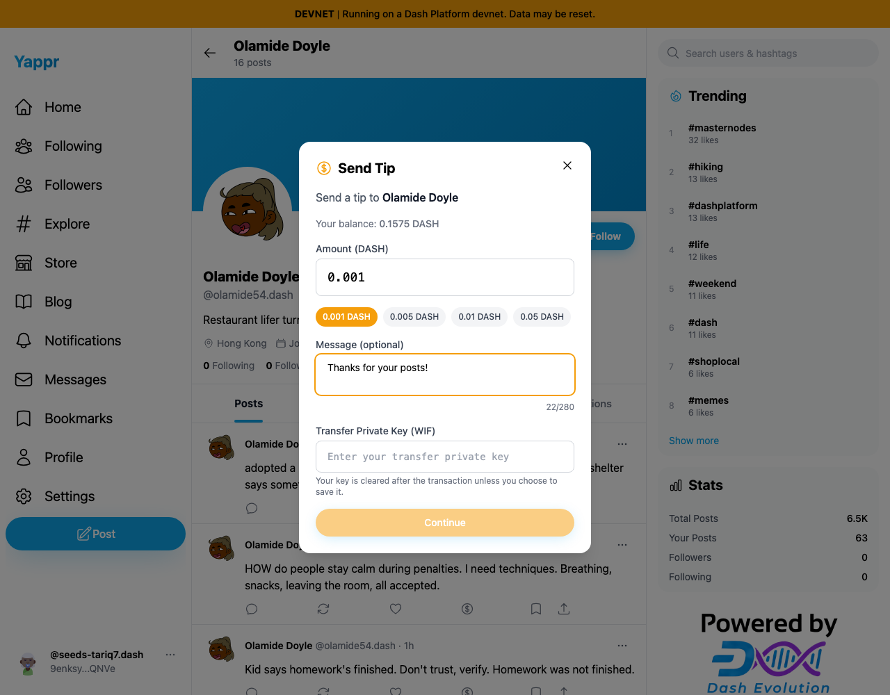
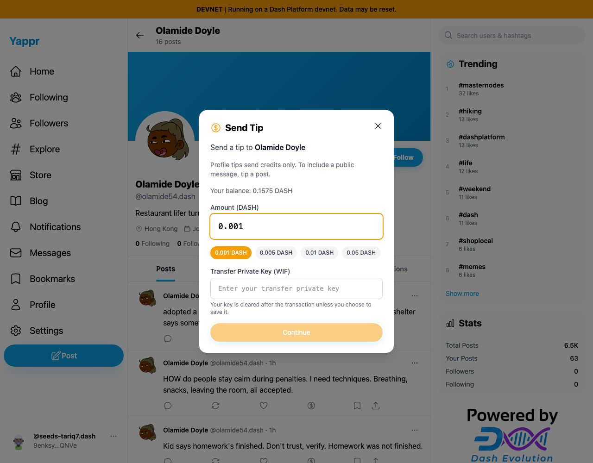
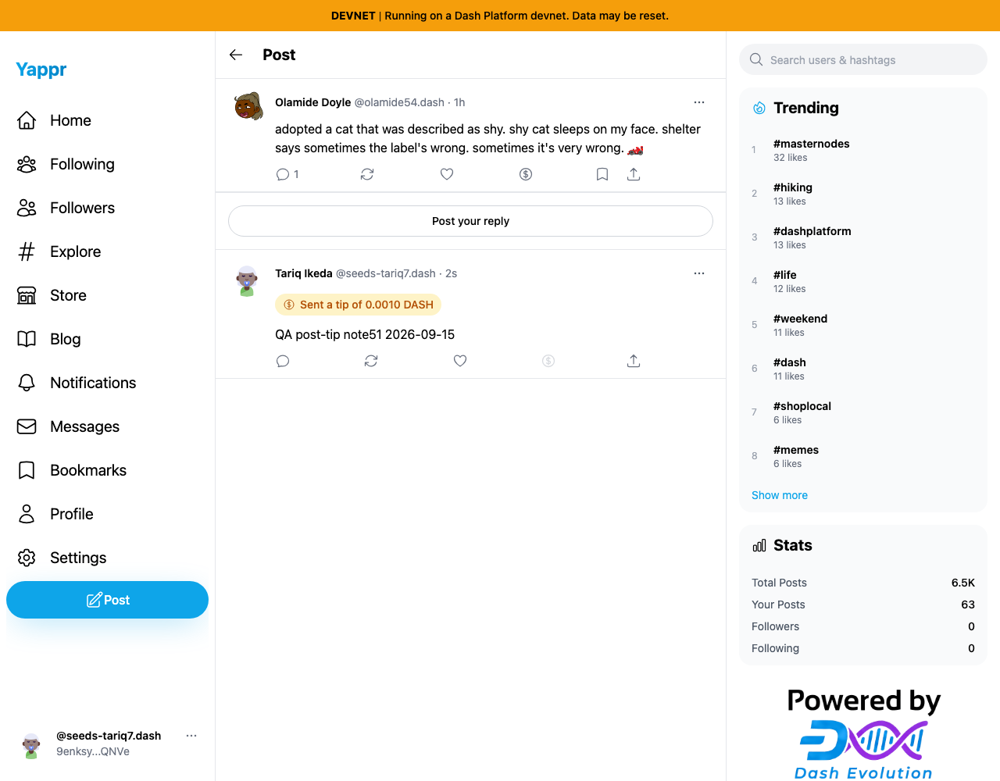

# Profile tips should not offer an unsent message

Before exact staging `4105c5d1c914f5d0838619da93c3b8d28b4a780e`; after full PR head `3d3046e8d43de6d884c8a5ea24a31fd68215bb92`. Both separately built with `.env.devnet`, same1280×1000viewport and identical static-export adapter.

The profile-tip form accepted an optional note and repeated it in confirmation. Profile tips only transfer credits, so this note was never sent or published. The fix removes the unsupported field and confirmation note, and explains that public messages accompany tips on posts.

| Before | After |
|---|---|
|  |  |

The confirmation also no longer promises a message. Both comparison actions were cancelled before sending; the original successful profile tip is independently recorded in the [functional QA](../qa-20260915-revalidation/token-tip-51-52/README.md).

Post-tip compatibility was tested on the full head by actually sending0.001devnetDASH with `QA post-tip note51 2026-09-15`, declining key storage, then reloading the post. IndependentSDK readback confirms the public reply and exactly100,000,000additional recipientcredits.

Source review, localdevnetbuild and zero-warninglint passed. Every image was inspected at original resolution. No filled secret input, private key or secret browser storage is included. Background live content can age between captures; the changed control and recipient are identical. See `provenance.json` and per-side records for timestamps and hashes.
