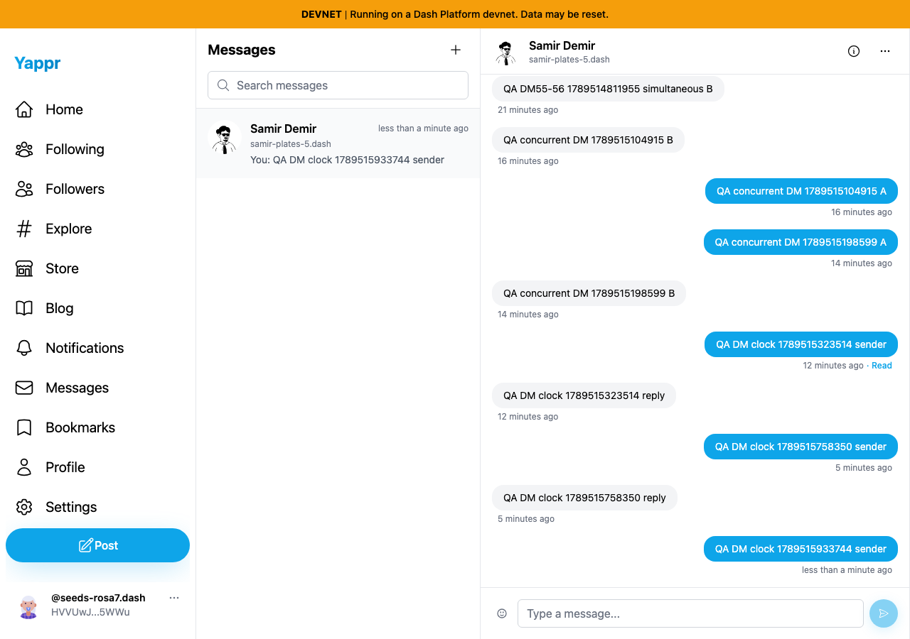
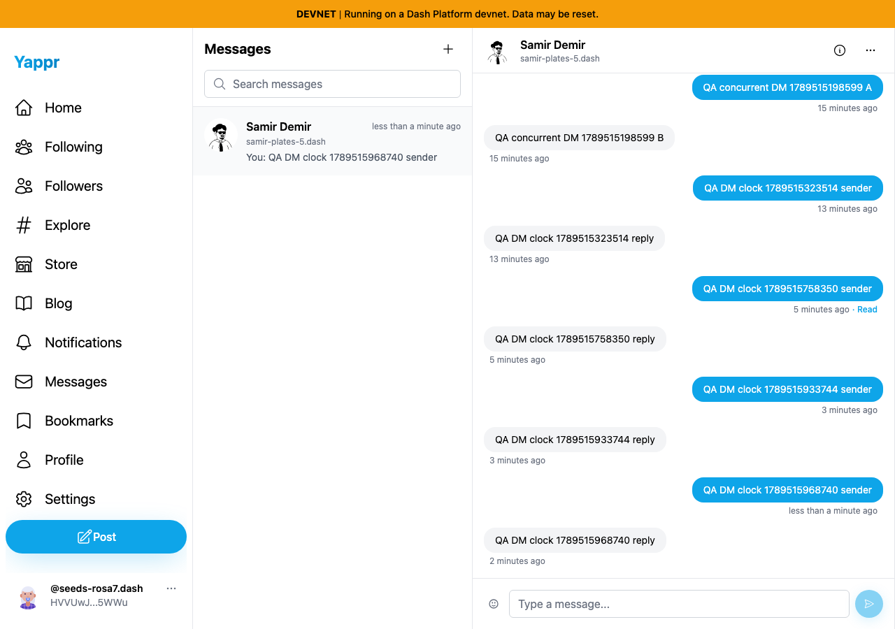
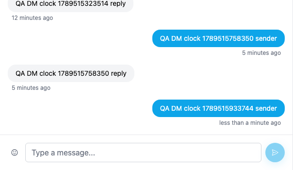
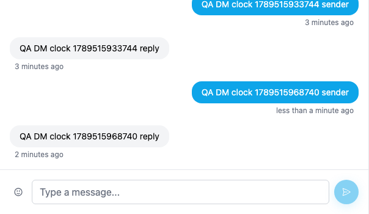
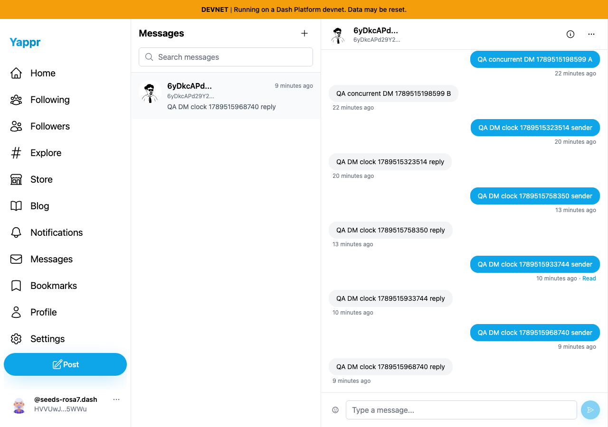

# Live DM reply polling

| Surface | Before — exact base | After — full PR head | Shared fixture | Expected visible change |
|---|---|---|---|---|
| Active Messages thread | eb895be71a7207c73fb9329ac9d9bb7b398f53da | 92103239f305cb7f61201c2627183817a25f404f | Personas55/56, sender clock +120 seconds, reply wait18 seconds | The corresponding reply appears without reopening the conversation |

Independent committed devnet production builds on ports3240/3248; fresh Chromium profiles,1280×900, light theme. Authentication is seeded from private QA fixtures; all messages are actual encrypted devnet writes sent through the UI. Playwright fixes only the sender browser clock two minutes ahead. No network responses or document content are mocked.

Sender `HVVUwJLhEngLH5LkZx8FgUkcso28xK7tn5gaaHke5WWu`; recipient `6yDkcAPd29Y24aLt1Ec1ZaRfwd4BCMJB6Swg9tgeYFmx`.

The two runs are sequential real writes in the same conversation, with distinct markers to avoid mistaking old replies for current delivery. Before marker **1789515933744**; after marker **1789515968740**. Read the newest exchange at the bottom. Older QA exchanges and elapsed labels differ. Both runs wait18seconds after the recipient submits its reply. The two-minute timestamp difference after the fix is expected from the disclosed clock fixture.

| Before — exact base | After — full PR head |
|---|---|
|  |  |
|  |  |

Details are unannotated crops at x676,y550,width604,height350 of the original images. Full-resolution originals are retained above. Polling continues from confirmed raw document IDs, so a locally optimistic timestamp cannot skip replies.

## Persistence control

Fresh readback later opens the same conversation on each revision with normal clocks. Both runs' replies are present exactly once in the actual message-thread container. The screenshots below were recaptured after both exchanges; they are persistence controls, not another before/after change. Initial loading-state captures were discarded before publication.

188 unit tests, lint, TypeScript, committed-head devnet build and independent review pass. Query-boundary tests cover102documents with one timestamp, empty-page continuity and retained cursor on network failure. The backend was not shown to lose messages. Six original/cropped PNGs inspected at original resolution before publication.
