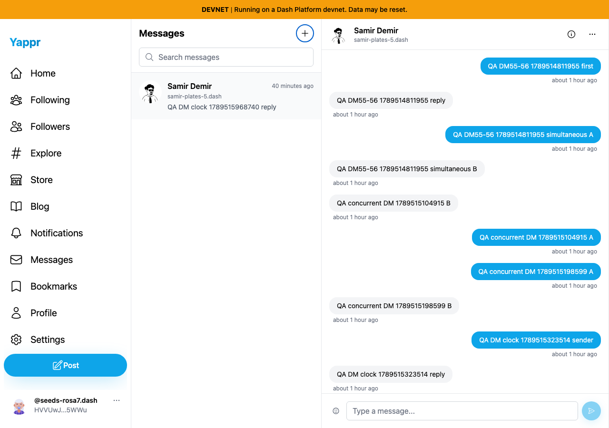
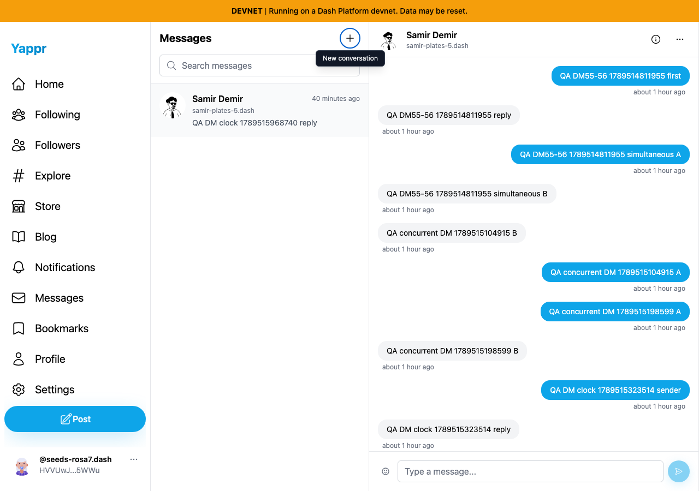
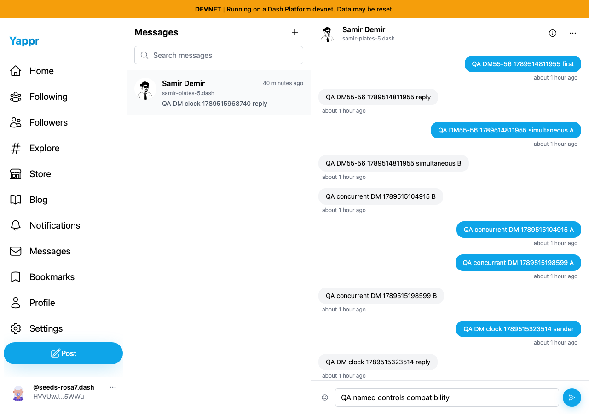
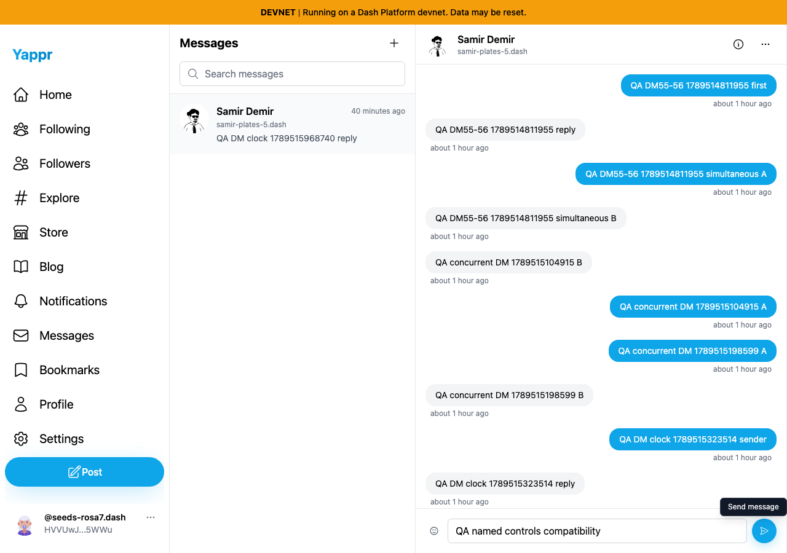
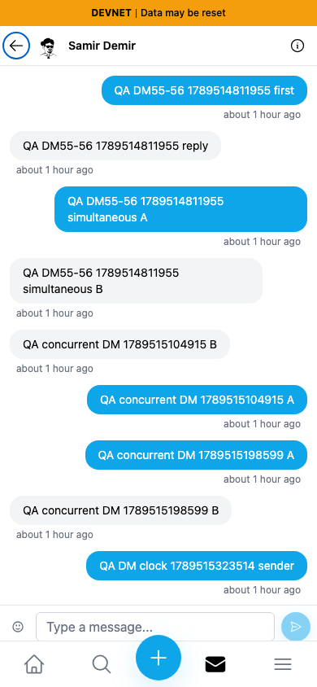
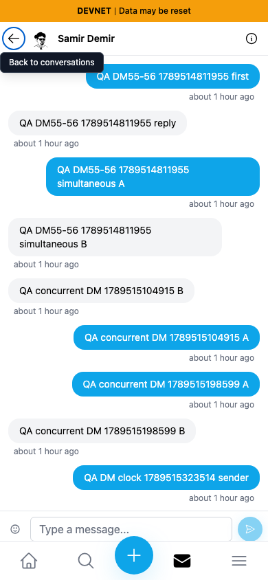

# Name message controls

| Surface | Before — exact base | After — full PR head | Shared fixture | Visible delta |
|---|---|---|---|---|
| New conversation, Send, mobile Back | eb895be71a7207c73fb9329ac9d9bb7b398f53da | 004fdd37008d2f92d8425f694b259ebe8ca9f512 | Same QA persona55/56 conversation and draft | Visible focused tooltips and accessible names |

Independent committed devnet production builds at ports3240/3254. Fresh private seeded sessions; Chromium, light theme, desktop1280×900/mobile390×844. Same sender `HVVUwJLhEngLH5LkZx8FgUkcso28xK7tn5gaaHke5WWu`, recipient `6yDkcAPd29Y24aLt1Ec1ZaRfwd4BCMJB6Swg9tgeYFmx`. Names are null before and New conversation / Send message / Back to conversations after (`before.json`, `after.json`). Existing browser focus outlines are not claimed as newly added.

| Before — exact base | After — full PR head |
|---|---|
|  |  |
|  |  |
|  |  |

Keyboard Enter on New opens the modal; Enter on Back returns to the conversation list. Empty Send remains disabled. A separate Enter activation on the named Send button wrote `QA named send 1789518455191`, which a fresh recipient session decrypted (`send.json`); this write happened after the comparison and is not fabricated in the images. ESLint and exact committed devnet production build/type check passed; independent review approved. All six final PNGs inspected at original resolution. Dialog focus trapping is a separate issue/PR.
