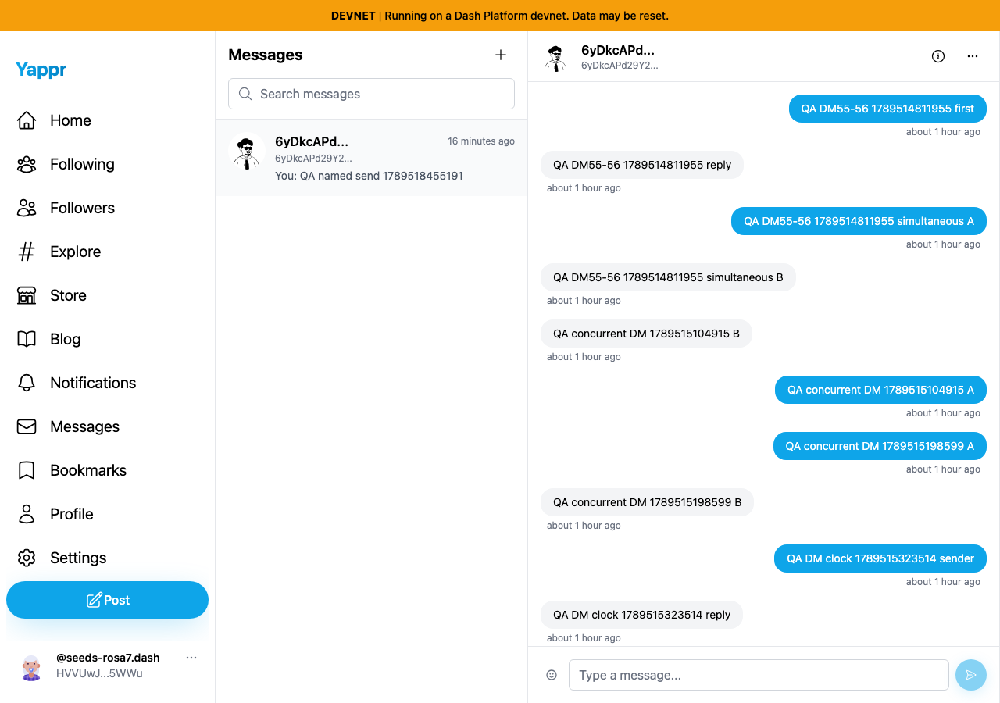
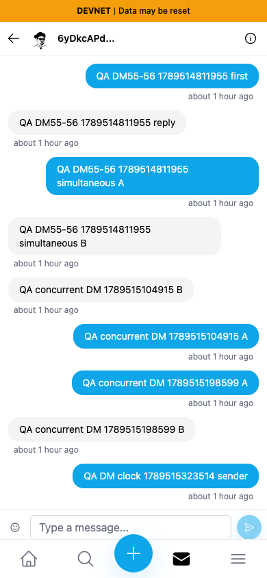

# Remove inactive message header actions

| Surface | Before — exact base | After — full PR head | Shared fixture | Visible delta |
|---|---|---|---|---|
| Conversation header, desktop/mobile | eb895be71a7207c73fb9329ac9d9bb7b398f53da | f188444521353d4868d29b958ab443b29aecd2a2 | Existing QA persona55/56 conversation | Inactive Info/More affordances removed |

Independent committed devnet production builds at ports3240/3252. Fresh private seeded sessions; Chromium, light theme, desktop1280×900/mobile390×844. Same sender `HVVUwJLhEngLH5LkZx8FgUkcso28xK7tn5gaaHke5WWu`, recipient `6yDkcAPd29Y24aLt1Ec1ZaRfwd4BCMJB6Swg9tgeYFmx`, and actual QA messages. Both final captures show the same identity-ID fallback; no profile-name change is claimed. Earlier locally mismatched captures were replaced, not published.

| Before — exact base | After — full PR head |
|---|---|
|  |  |
|  |  |

Before, pointer activation of both desktop buttons changes neither URL nor visible text and opens no dialog/menu (`before.json`). Source has no action handlers. Screenshots show the affordance removal; they do not on their own establish the missing click behavior. Mobile Back and participant profile link are retained. No messages were sent during capture. ESLint and exact committed devnet production build/type check passed; independent diff review approved. All four final PNGs inspected at original resolution; full files and checksums are retained here.
