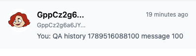
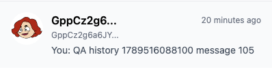
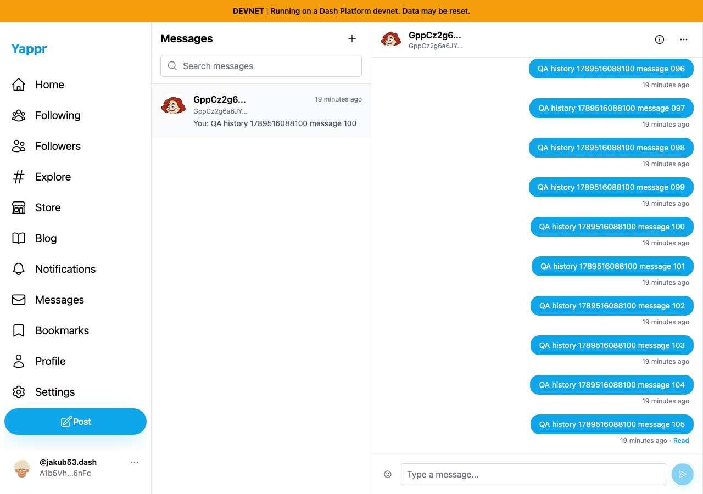

# Latest conversation preview

| Surface | Before — exact base | After — full PR head | Shared fixture | Visible delta |
|---|---|---|---|---|
| Messages conversation list | eb895be71a7207c73fb9329ac9d9bb7b398f53da | 8ce0b20ae1055c0f9031c6c3475b3c133545a3a4 | Same existing 105-message conversation, persona59 viewing persona60 | Preview shows message105 instead of message100 |

Independent committed devnet production builds, ports3240/3250, fresh private seeded auth sessions, Chromium1280×900, light theme and normal clocks. No writes or mock responses were used for this comparison. Original105messages were real ordinary UI sends. Sender `A1b6VhEArph6vYnvMdVVm8Wc4e4bkfcA3CeXjMoa6nFc`; recipient `GppCz2g6a6JYr7rGtwpEc4VgDX7b7wifz8uWXM1CTx1m`; marker `QA history 1789516088100`.

The full thread reaches105 in both screenshots. Before, the sidebar shows100 because it selects the last document in the earliest100-message page. After, it selects the first document in the newest100-message page. This also updates conversation sorting to use the actual latest timestamp. Elapsed-time labels differ by one minute between sequential captures. Unread counts remain bounded by the existing100-message window; this PR does not claim unbounded unread totals.

| Before — exact base | After — full PR head |
|---|---|
|  |  |
|  |  |

Details are unannotated crops x277,y151,width398,height115 from the full images. All four final PNGs inspected at original resolution. An earlier local experiment on the historical baseline and a failed startup produced no authoritative evidence; only the exact revisions above are published.

Three focused service tests, ESLint and exact committed production build/type check passed. A130-record query-boundary test fails on the base by returning the100th message instead of the130th, and passes with the fix; quiet-conversation/fallback preview and unread compatibility also pass. Independent review approved the actual diff; its fallback assertion suggestion was applied. Product worktree is clean; capture artifacts are kept outside product commits.
