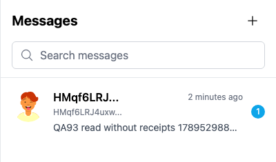
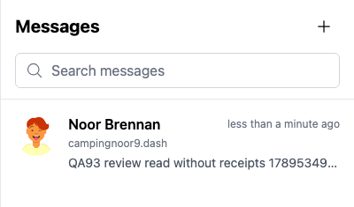
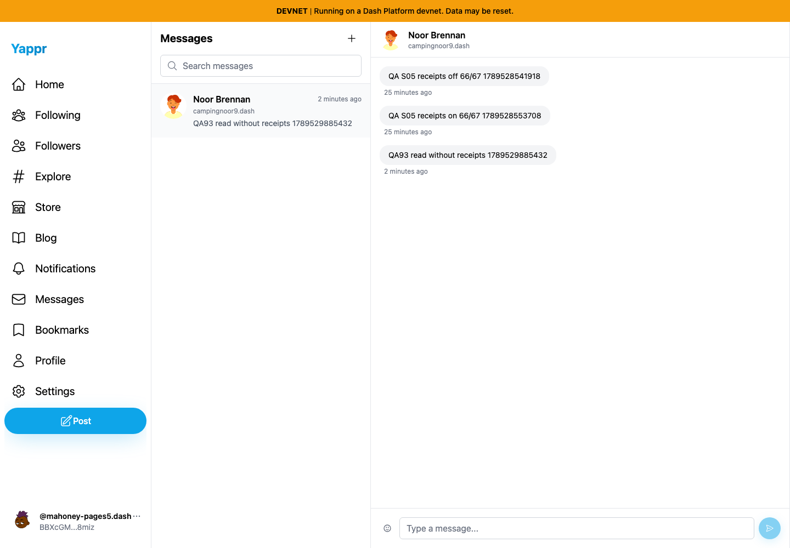
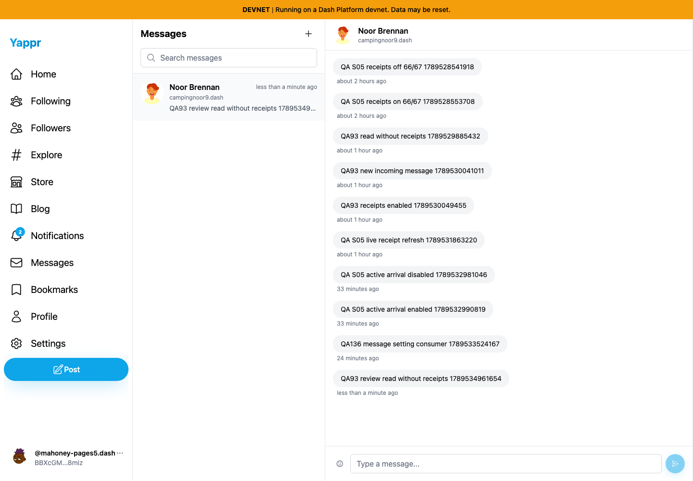
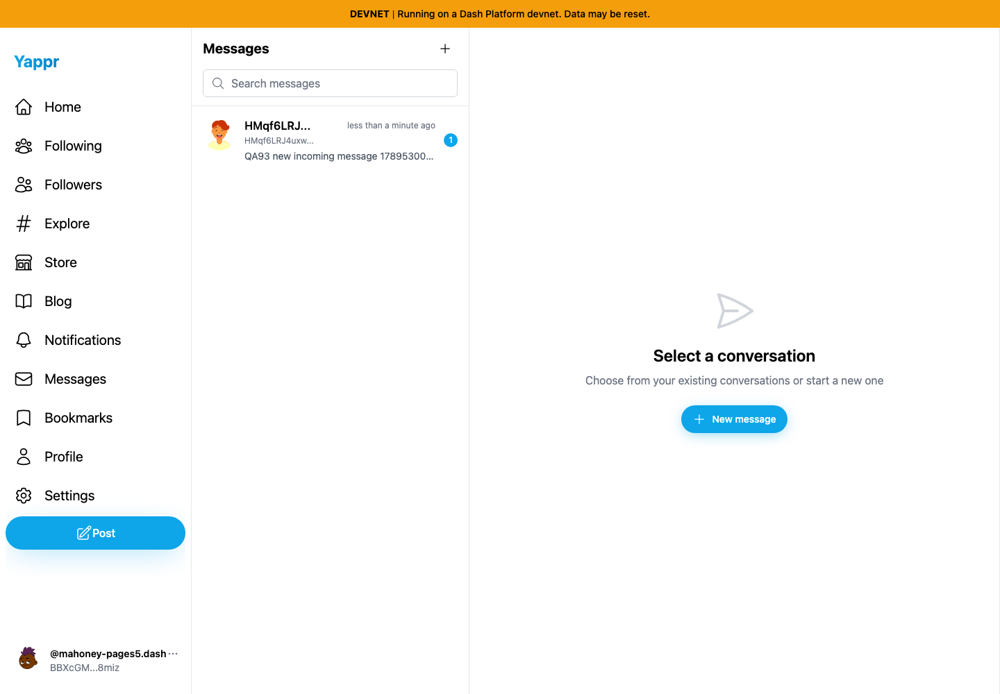
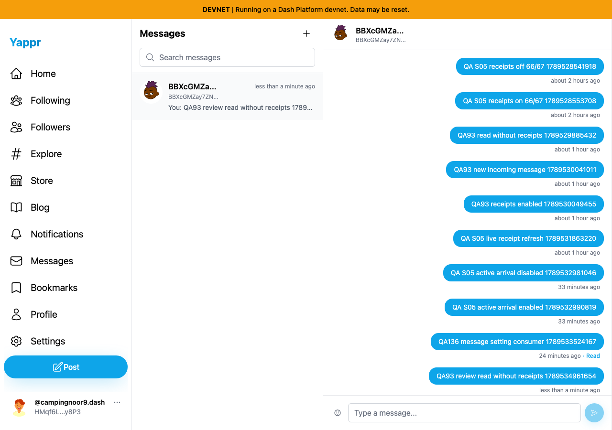
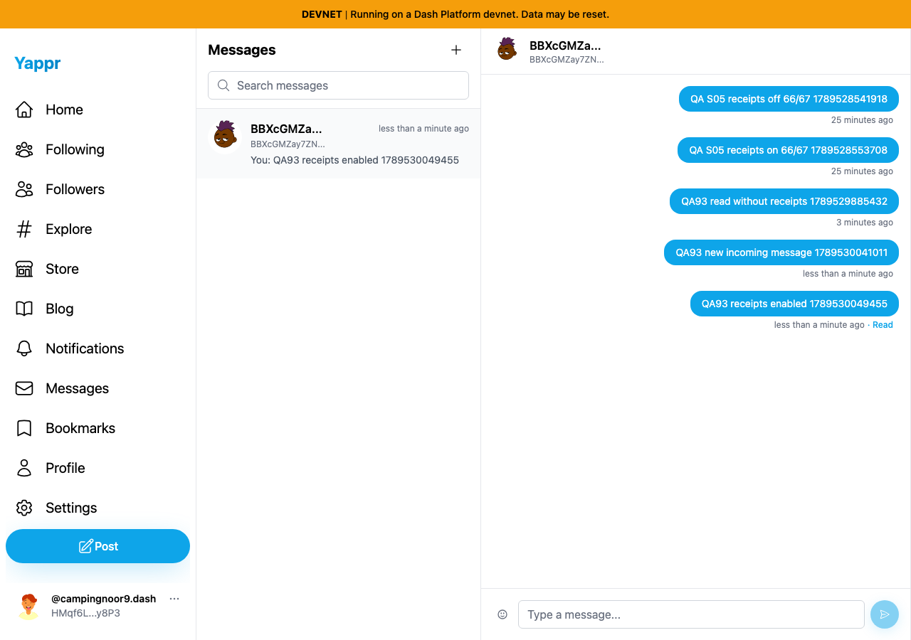

# QA93: local DM read state with receipts disabled

Before: `cf0efbc10b8757137063113ebbd2061e8b87d8f7` (frozen staging base), independently built and served at port 3288. After: full PR head `546bd62d4e4ff2ddee414b6b1837b2ae94bff241`, built after the signed commit and served at port 3296. Both use `/devnet`, a production static export, Chromium, light theme, and a 1440×1000 recipient viewport. Source worktrees were clean at capture.

The same real incoming message `QA93 read without receipts 1789529885432` and conversation were used in independent disposable browser contexts. Recipient: Nils Mahoney, `BBXcGMZay7ZN6r71CK14VaGxwDn6CJCQcvFgrFpg8miz`; sender: Noor Brennan, `HMqf6LRJ4uxwjQqNYdJXrENQNFSuLbB91hfj7j8zy8P3`. The QA harness supplies dedicated identity sessions; this is not evidence of login correctness. Messages were sent and opened through ordinary UI. No response, notification, or read-state result was mocked.

| Surface | Before state | After state | Expected delta |
| --- | --- | --- | --- |
| Opened conversation | Receipts off, message opened | Same message and preference | Both clear the badge |
| Inbox after full reload | Same browser rereads inbox | Same browser rereads inbox | Base restores unread 1; head retains read state |
| New incoming message | Compatibility check on head | New real message after local read | New message still increments unread 1 |
| Sender receipt | Receipts off, then enabled for a new message | Actual public receipt readback | No write while disabled; normal update when enabled |

## After reading, then reloading

| Before — exact base | After — full PR head |
| --- | --- |
|  |  |
| [Full-resolution overview](before/reloaded.png) | [Full-resolution overview](after/reloaded.png) |

Focused images are unannotated crops of `(x275,y40,width400,height235)` from the original overviews. Both reload states show the same participant ID fallback; name hydration after reload is a separate observed issue and is not changed by this PR.

## Both versions opened the message before reload

| Before — exact base | After — full PR head |
| --- | --- |
|  |  |

## Additional live checks

The sender stayed on the base revision at 1280×900 for both compatibility checks. With receipts disabled, the new message has no Read indicator; the older S05 message retains its earlier receipt:

After enabling receipts and opening a newly sent message, the fresh sender thread shows Read on that new message:

Read-only SDK queries independently verified receipt `Gy21nqRZ66zuH6eA7UrWzbUQmAYKzRhmrFZJJ8fpVHg` remained at `$updatedAt=1789528557942` after the disabled-receipt comparison; after enabling receipts and opening the third QA93 message it advanced to `1789530053095`. Full public identifiers and assertions are in [result.json](result.json).

## Validation and limits

Two service regression cases failed against the unchanged base integration; all 11 focused service/storage tests pass on head. Type checking, full lint, and production build pass. Independent source review approved. The local history is bounded to 1,000 confirmed incoming message IDs per deployment, DM contract, viewer, and conversation; no cross-device persistence is claimed. Corrupt/unavailable storage, independent scopes, own/optimistic messages, and equal message timestamps are covered by unit tests rather than screenshots.

All nine final PNGs were opened and visually inspected at original resolution, including both crops. No keys, seed phrases, authentication state, or populated secret inputs are included. Disposable browser contexts were closed. Three dedicated QA93 messages remain because ordinary DM deletion is not available; preferences were restored in the head context before disposal. Two earlier S05 QA messages remain visible and unchanged.
