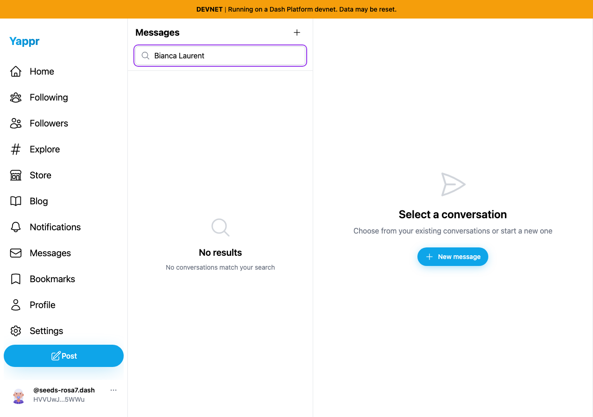
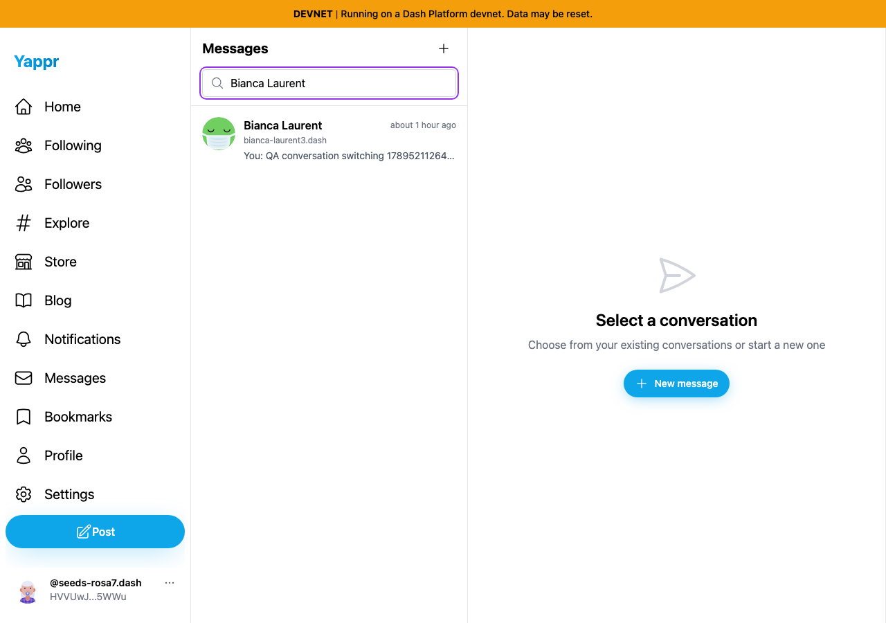
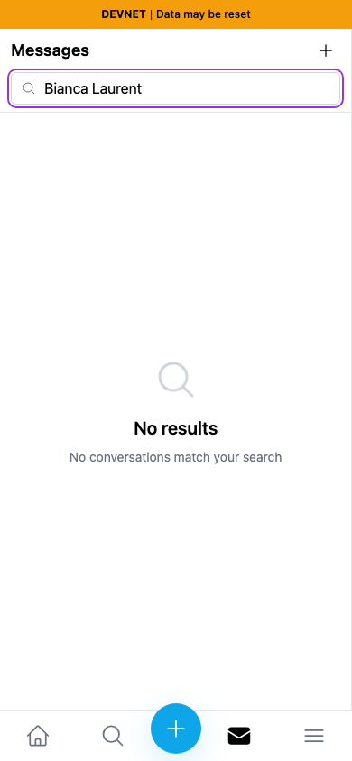
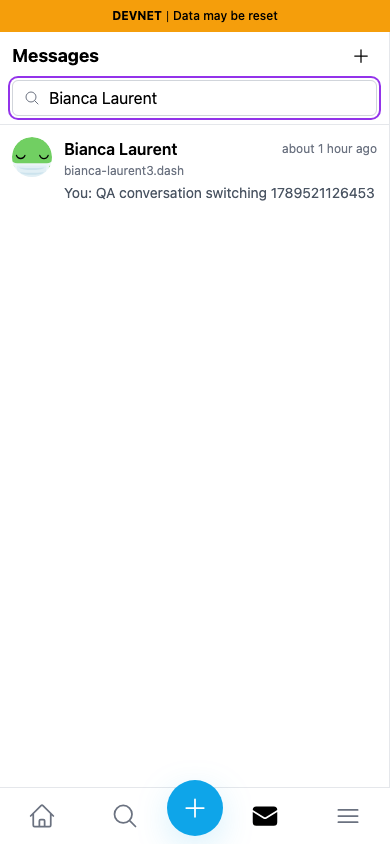

# Conversation search by displayed name

Exact base `c98a6ecd7e26ae5bc9fc8e400e6011eb8465b3a0`; full head `8220446f` (full hash in PLAN.md). Separate committed production devnet exports at3260/3272, seeded persona55, fresh Chromium contexts, matching1280×900and390×844viewports/light theme. Same real conversation with persona57 Bianca Laurent, last marker `QA conversation switching 1789521126453`. The selected thread is empty in both images; only conversation filtering changes. Relative timestamps may advance.

The harness first waits for the actual row's displayed name, then searches that exact name. Two early head attempts only resolved identity fallbacks and were rejected before capture; a later independent inspection and fresh capture resolved names normally. No profile names/content or server responses were injected. The final head capture passed case-insensitive partial name, username, ID prefix, unmatched query, clear and opening the returned real thread.

| Surface | Before — exact base | After — full PR head |
|---|---|---|
|Desktop|||
|Mobile|||

All four final PNGs inspected at original resolution. Source lint/full TypeScript, committed build and independent review passed. First build attempts had a missing local vendor output/stale build cache; dependency source equality was checked and clean build succeeded. No new message or profile writes by this comparison. The wider DM switching QA independently verifies six thread switches, isolation and mobile Back; that is separate from this search fix.
