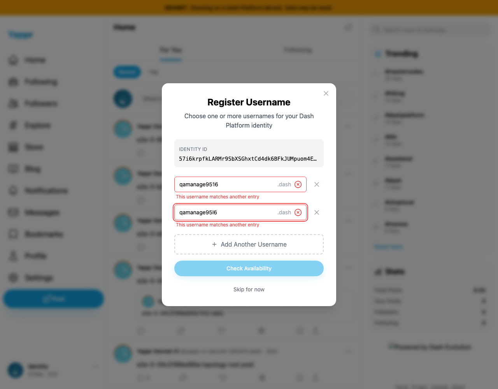
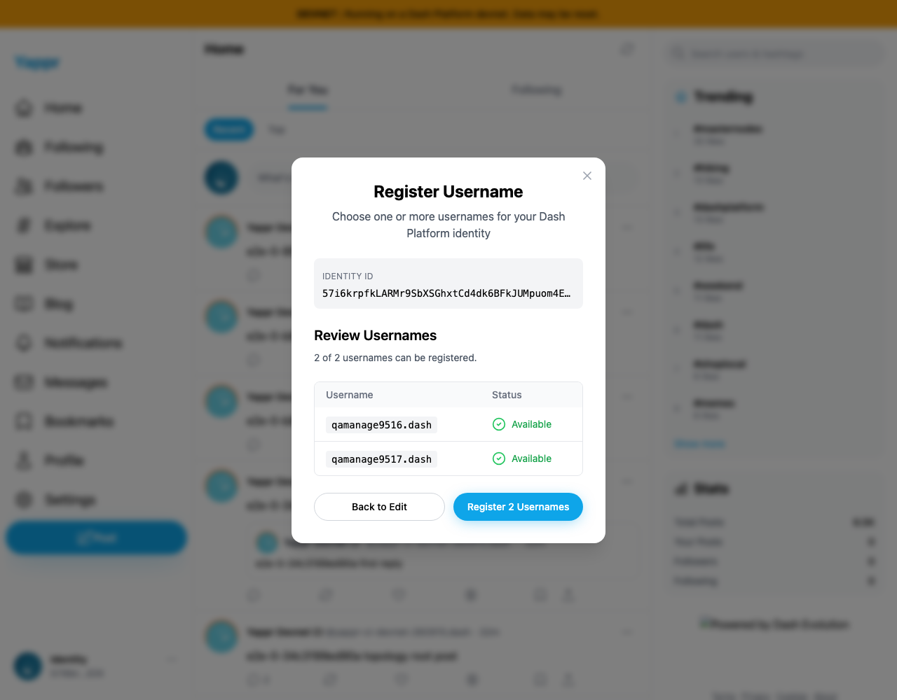
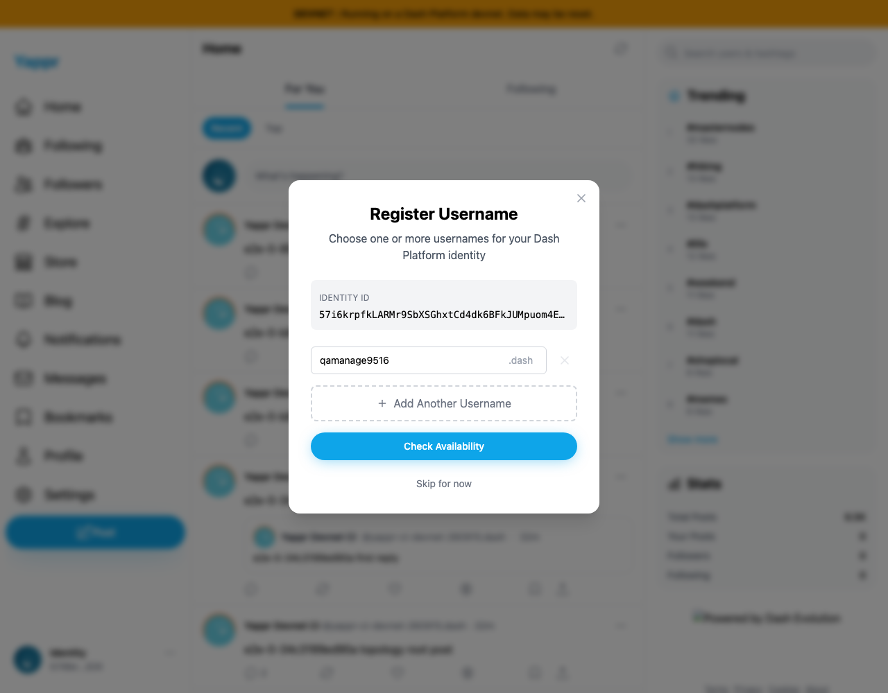

# Duplicate DPNS usernames — PR459

Entering identical names or DPNS-equivalent spellings offered two registrations. The fix marks every matching row and blocks availability until the duplicate is edited or removed.

This comparison supersedes the previous staging comparison after stacking PR459 on PR497. **Before exact parent497: `bcd859dcac2e5d089d61857d8585548614b21cd5`. After full head: `0d0358fc531511ddcdec78331f1be741a245e303`.** Both images were freshly captured from independent exact-revision production devnet builds.

Same unnamed identity `57i6krpfkLARMr9SbXSGhxtCd4dk6BFkJUMpuom4EiiX`, actual key login, Chromium1280×1000, fresh contexts, matching Node static adapters and live reads. No storage injection or registration/vote submission. No traces retained. The adapter's unrelated footer-logo omission is not a product claim.

| Before — exact parent497 | After — full head |
| --- | --- |
|  |  |
|  |  |

Distinct names still pass the live availability check, and deleting the duplicate restores entry immediately.

All seven final PNGs were inspected at original resolution. Safe run details are in `before/result.json` and `after/result.json`.

## Regression and restack validation

All four checked-in Playwright registration-entry cases pass on the rebuilt full head (5.8s): identical, case-equivalent, i/l/1 and o/0 groups, every matching row, edit/removal recovery, and empty input. Tests edit the real form with the dedicated CI fixture; they never check availability or register names. Capture separately verifies live availability recovery and invalid text without page errors. Full lint, E2E TypeScript and devnet build pass.

Range-diff preserves three commits: first two identical; the CI commit changes only to retain parent497's `--trace=off`. The combined command runs `topology dpns-username-entry`; dedicated devnet secret mapping/public pool are preserved, testnet mapping unchanged. Topology results are owned by the central serialized CI monitor and are not claimed by this four-test run. The historical exact pre-fix baseline regression failed at the expected missing duplicate-warning assertion.
