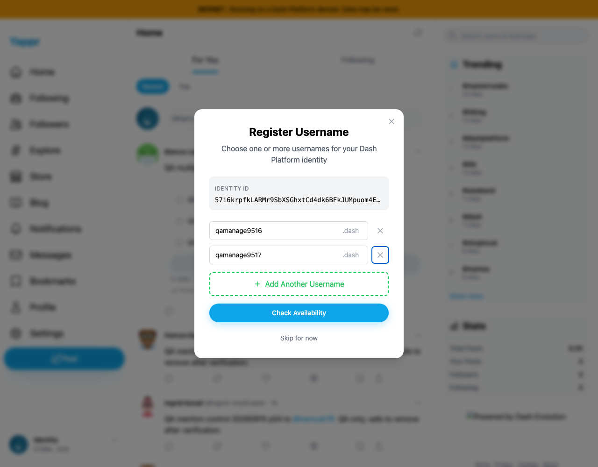
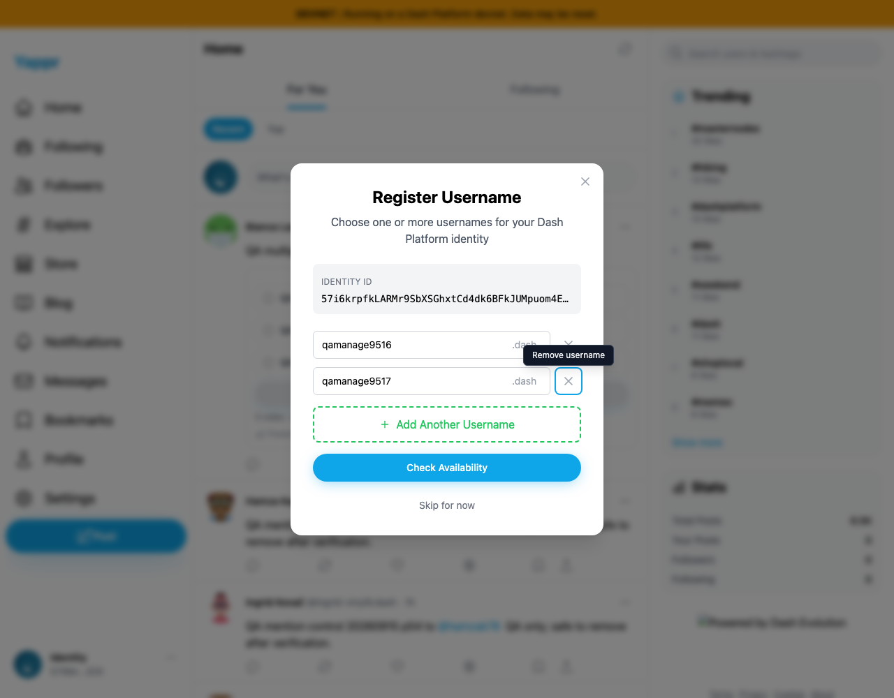

# Name DPNS remove controls

The X button for removing a username had no accessible name and no tooltip. The fix adds a row-specific accessible name, visible tooltip on keyboard focus/hover, and explicit focus styling. The original browser default focus outline was already visible; absence of a focus indicator is not the reported defect.

Captured from separate exact-revision local devnet builds using the repository's unchanged Node static adapter and live devnet reads. Baseline `eb895be71a7207c73fb9329ac9d9bb7b398f53da`. Chromium, 1280 × 1000, matching unnamed identity and actual private-key login; no storage injection. No username registration or vote was sent. Screenshots are unmodified browser captures, reviewed at original resolution. An unrelated footer-logo omission is an adapter artifact, not a claimed product issue.

Head `75212692e6f031f02afc701c230b3152a5cd997c` (build ID `75212692`). Build, lint and independent source review passed. Both captures focus the second remove button using Tab from the second input.

Before: no explanation appears; accessibility snapshot is `- button`.

After: tooltip explains the action; accessibility snapshot is `- button "Remove username qamanage9517"`.

Enter removes only that row. The remaining row cannot be removed. A new blank row is named "Remove username" and also shows the tooltip. Structured checks and extra screenshots are included in the before/after directories.
