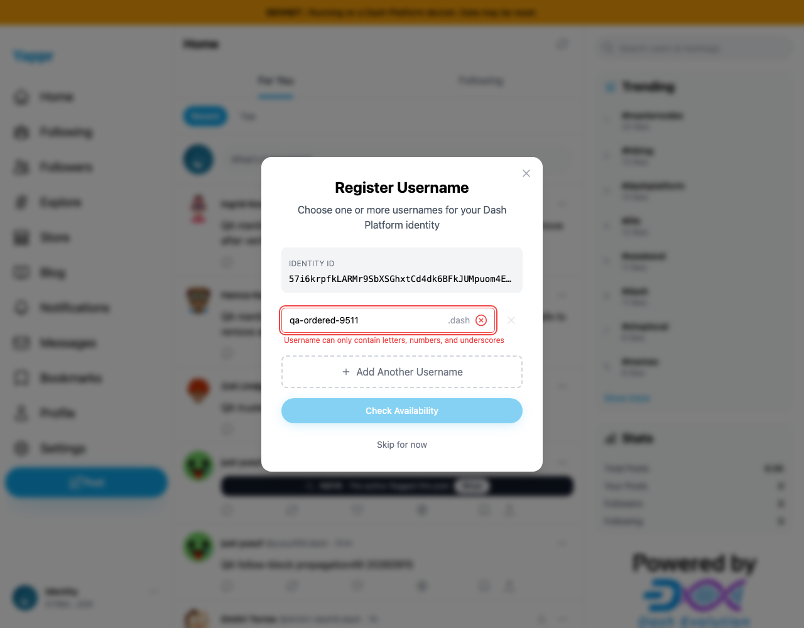
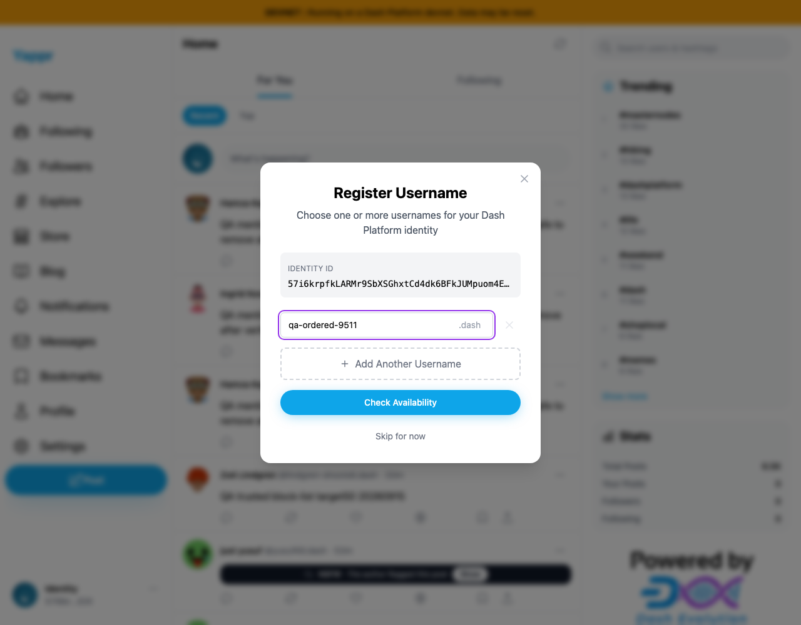
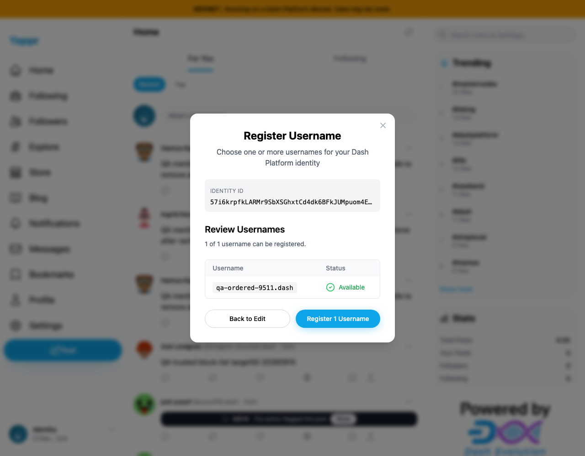
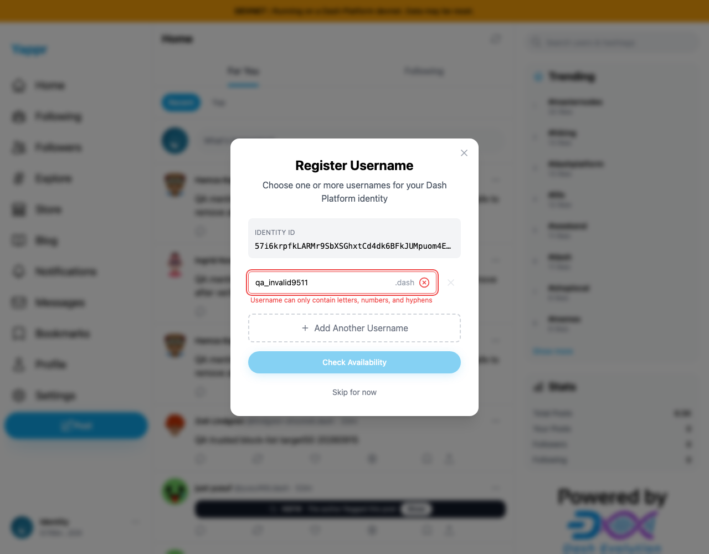
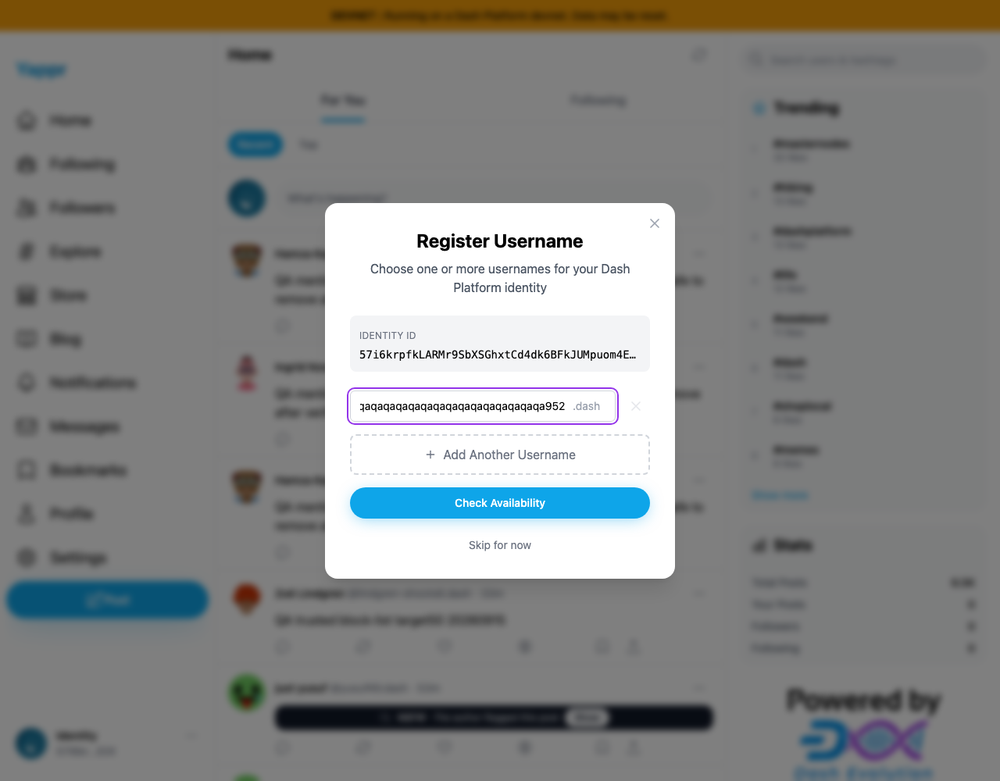

# Validate usernames against DPNS rules

Exact staging before: `4105c5d1c914f5d0838619da93c3b8d28b4a780e`. Full head after: `55e3dbccfcce26f36a126521c46d903fad99d1aa` (build ID `55e3dbcc`). Both are production devnet builds using identical static-export adapters, viewport 1280×1000, and a dedicated unnamed QA identity signed in through the real key-login form. Secret entry was not captured.

Enter `qa-ordered-9511`, then wait 800ms (beyond the existing 300ms validation debounce). Before, the form rejects a valid hyphenated DPNS name and disables Check Availability. After, the same input is allowed:

| Before | After |
|---|---|
|  |  |

Clicking Check Availability on the head reaches the live Available result:

The head also rejects underscores and retains a full 63-character value (`qa` repeated 30 times, followed by `952`):

| Invalid underscore rejected | 63-character input accepted |
|---|---|
|  |  |

The long input scrolls horizontally; its full DOM value and enabled button were asserted. The screenshot alone does not display all 63 characters. `sdk-rules.json` records independent SDK checks, and `current-contract.json` records the current devnet DPNS label schema. SDK 4.2.0-dev.11 rejects edge/consecutive hyphens as well as unsupported characters. Current contract label range is 3–63 and permits interior hyphens, not underscores.

No username registration was submitted in this comparison. Dedicated fixture identity remains unnamed. Existing early-click/debounce behavior is separate and is not changed by this PR.

Validation: all 20 focused tests pass on head; the same tests fail 3 cases on exact baseline (hyphen,63 characters,underscore). Full devnet build and zero-warning lint pass. Independent review approved. All five final screenshots inspected at original resolution.
