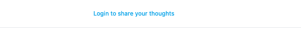
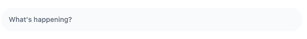
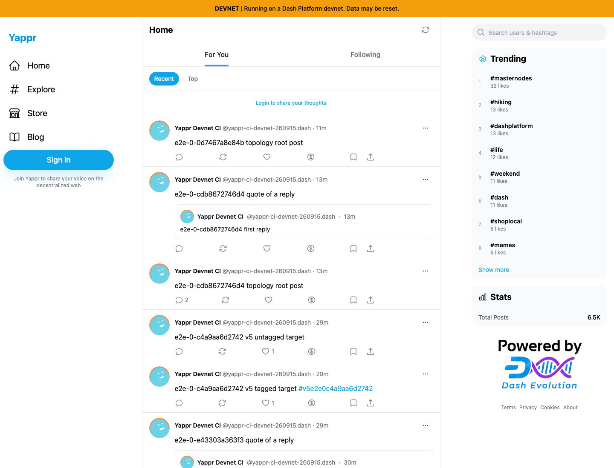
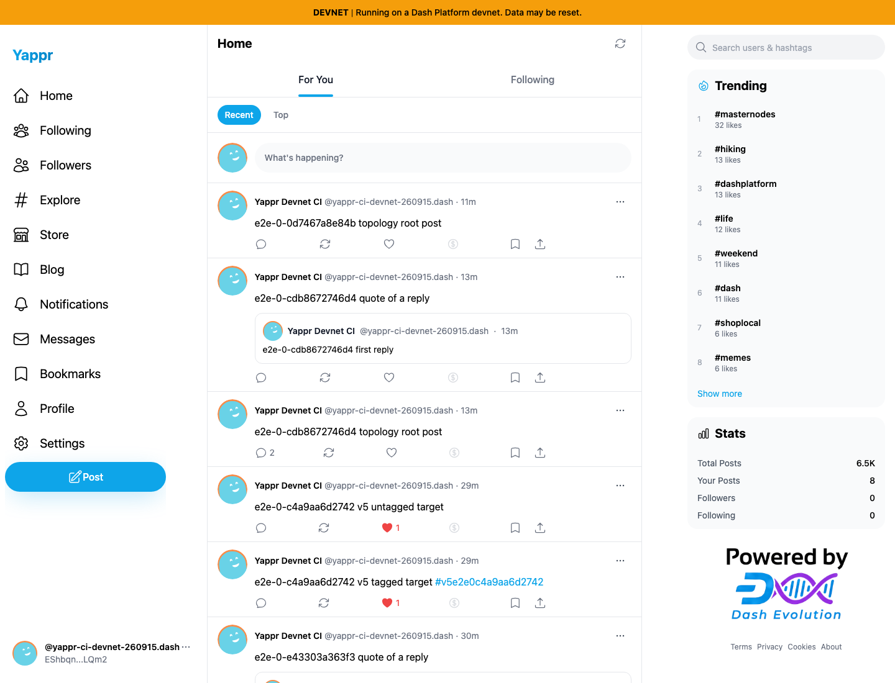
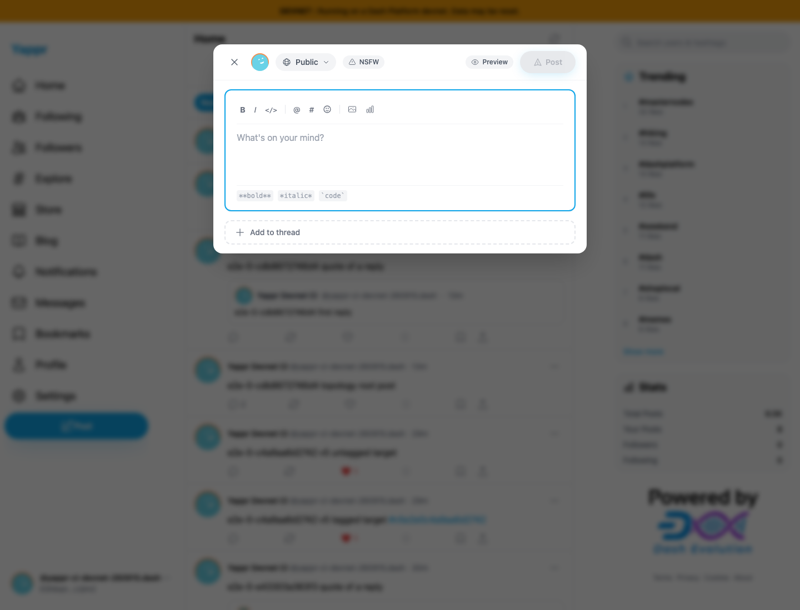

# Authenticate the manually created v6 topology setup context (QA112)

The v6 topology `beforeAll` creates a browser context directly, bypassing the authenticated `context` fixture. Its feed is a guest view: **Sign In**, **Login to share your thoughts**, and no `open-compose-btn`. The hook consequently waits for a control that does not exist. A previously observed full run exhausted its normal 420-second beforeAll budget.

The fix extracts the existing init script into typed `seedContext(context, bot)`. The ordinary fixture reuses it; the v6 hook calls it before opening a page, inside its cleanup `try/finally`. Identity derivation, deployment scoping, session preservation, private-key encoding and DPNS-gate behavior remain unchanged. This changes E2E setup only; there is no production UI or authentication change.

## Exact provenance

- Before: exact staging base `cf0efbc10b8757137063113ebbd2061e8b87d8f7`, independent devnet export, port3288. Capture replays the hook's original `browser.newContext()`/`context.newPage()`/feed-navigation prefix.
- After: full PR head `7a50a04656d18a34c46da11bb85c76a46ce8c4a7`, independent devnet export, port3306. Capture imports and calls this revision's actual `seedContext` before the same page creation/navigation.
- Same Python export adapter, Chromium1440×1100, light appearance, en-US locale, America/Chicago timezone and live devnet. Fresh contexts are used. Feed content is not mocked or modified; global activity may advance during concurrent QA, and feed ranking/content is not the comparison claim.
- Dedicated CI bot: `EShbqnfLdmctGWaUCnU3FNKMenYmxiQEiawY3q2pLQm2`, **yappr-ci-devnet-260915.dash**. The private QA fixture is scoped to the capture process; no key or mnemonic is displayed, logged, traced or published. The before hook never seeds the selected bot, which is precisely the defect.
- These captures replay the setup prefix only, with **zero remote writes**. They do not claim that all topology assertions passed. Full live topology execution is separately serialized by the CI identity owner.

## Before and after: the missing compose control

The focused screenshots below are equal-size crops of the full page captures. Before, the test is still a guest. After, the selected bot has the expected compose trigger.

### Before — exact base

### After — full PR head

## Full browser context

| Before — exact base | After — full PR head |
| --- | --- |
|  |  |

## The next setup action is reachable

The after run clicks the real compose trigger and opens the empty **Create a new post** dialog. It closes the dialog without filling or submitting anything, then reloads and verifies that the same bot remains authenticated.

## Standalone live v6 regression

After replenishing the dedicated CI identity's credits, the serialized run against **exact PR head `7a50a04656d18a34c46da11bb85c76a46ce8c4a7`** passes both selected v6 tests in **15.3 seconds**. The actual beforeAll created and liked a real post, then the tag **Top → Today** and profile **Top → Today** tests verified the persisted result. The run used the dedicated CI bot through a runtime identity-pool override, retries0 and trace off; no QA108 readiness change was included. Its successful exit was recorded at `2026-09-16T04:04:24.263Z`.

This proves the fixed authenticated setup proceeds through its real writes and the two selected readbacks. It does not claim that all four v6 assertions or the entire topology suite passed. The three-fix integration run is separate. See [safe live-run summary](live-v6-results.json).

## Validation

- Three real-browser checks pass: the base reproduces the guest/missing-control state; the fixed manual context authenticates, opens the composer and survives reload; the ordinary authenticated page fixture still restores the same bot before and after reload. The compatibility check imports the actual exported fixture and overrides only its bot provider with the dedicated private fixture.
- TypeScript AST comparison confirms that the original and extracted `context.addInitScript` calls are identical, including callback body and argument construction.
- Full application lint, targeted E2E lint, E2E TypeScript and the exact-head devnet build pass. The build checks app types and retains existing static-export warnings. Independent review of the actual diff is approved.
- All five final PNGs were inspected at original resolution. The focused views only crop original browser images; no state is reconstructed. Capture traces, videos and automatic failure screenshots are off. Initial transition/loading captures were discarded before publication.
- Safe public setup results are in [before-setup.json](before-setup.json), [after-setup.json](after-setup.json), and [fixture-compatibility.json](fixture-compatibility.json). Keys, storage snapshots, fixture files and private CI failure artifacts are deliberately absent.

The historical 420-second failure came from a normal full v6 run on QA98 head `bcd859dcac2e5d089d61857d8585548614b21cd5`, whose topology/auth fixture source matches staging. It corroborates the setup diagnosis; it is not mislabeled as this PR's exact-base capture. This issue does not establish a Dash Platform or GroveDB defect.
