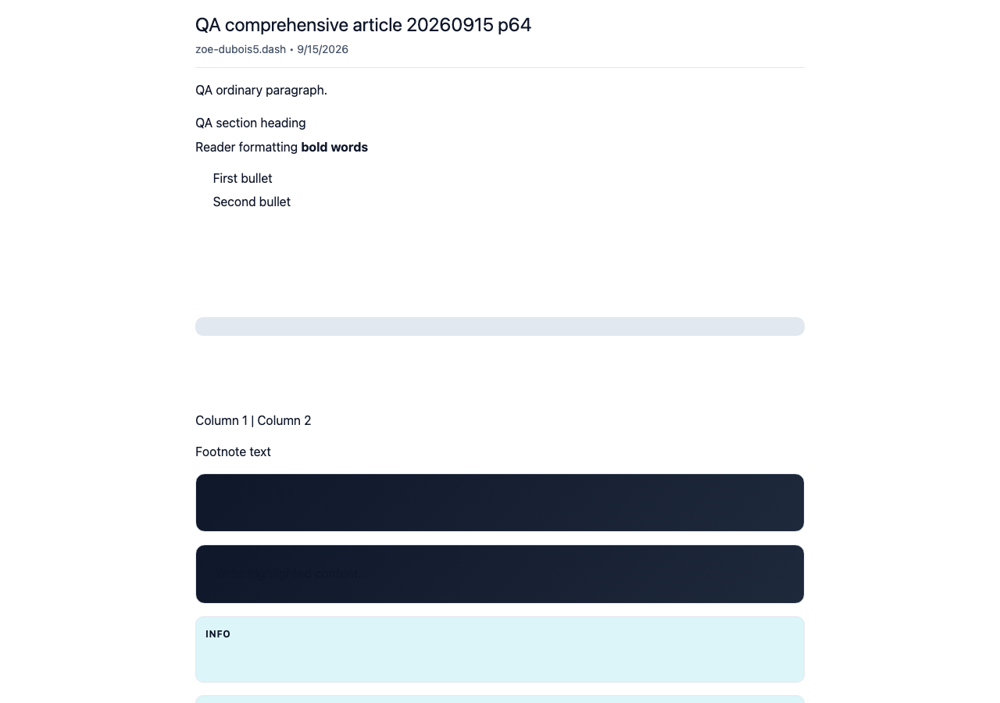
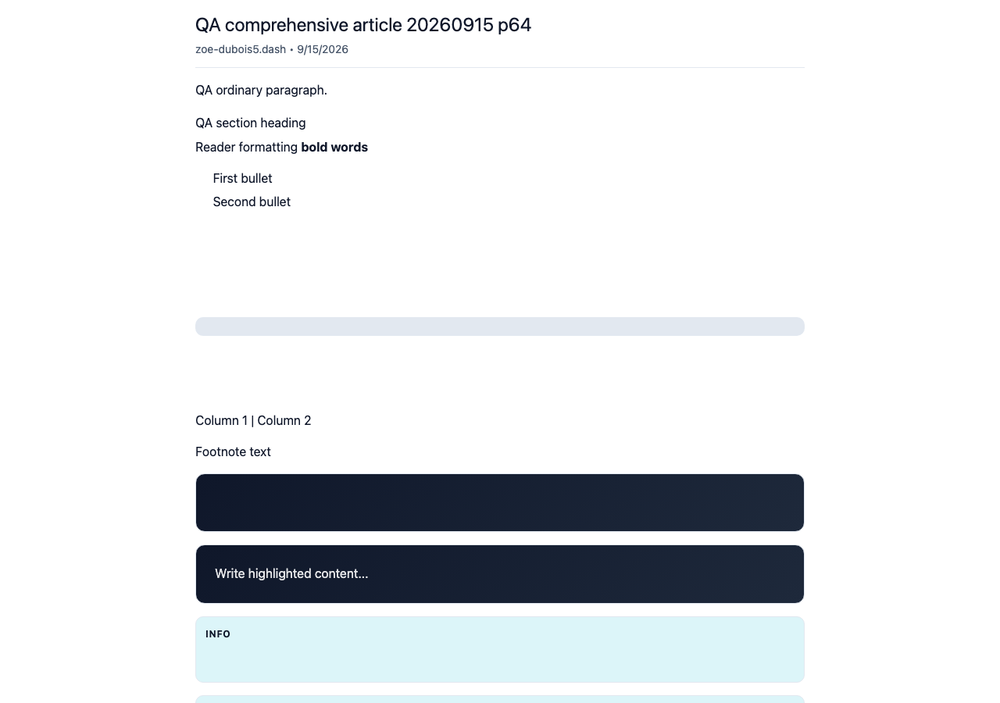
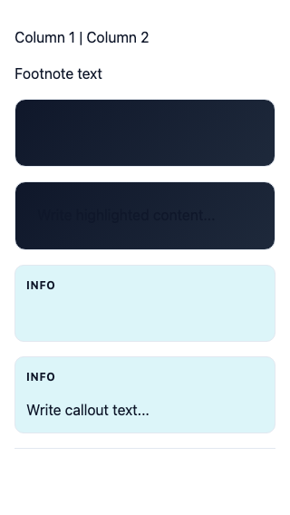
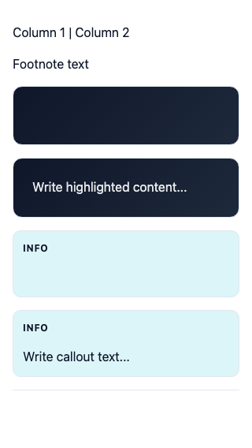
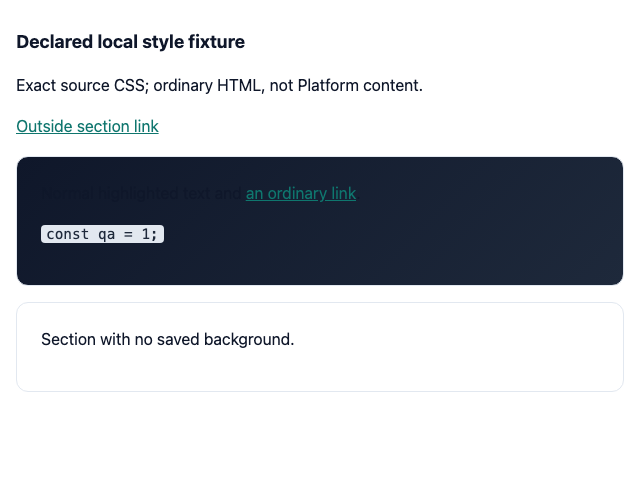
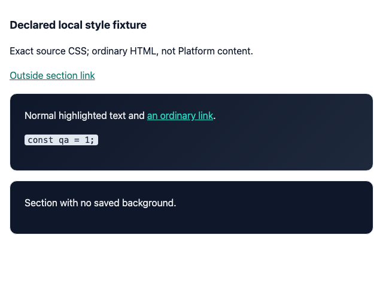

# QA100 — readable background sections in Light embeds

Background sections created by the normal editor use a dark gradient and light text. Light embeds inherited the page's dark foreground, making that text almost invisible. The fix gives these panels the reader's white/90 foreground, a readable scoped link color, and a dark fallback background when the saved background is absent. Existing inline backgrounds still take precedence.

Base **cf0efbc10b8757137063113ebbd2061e8b87d8f7**, final signed head **70e8836a613132950e505525d38524aee383ee04**. Separate production builds, fresh guest Chromium, same actual article `66syyLM2ZAakx2JNZuMJw4PY896cphx8Q2vc1kVCNTK`, owner `CNARhSLcQRfdxLZXTrvDVtVGKg1RHXjwJTpGSd2DXLGw`. No public edits or substituted product responses.

| Surface | Before — exact base | After — full head |
|---|---|---|
|Actual Light article overview,1280×900 |  |  |
|Actual Light article at320px, same panel y200 |  |  |
|Declared local style fixture — not Platform content |  |  |

The last pair uses ordinary HTML with each exact revision's `EMBED_STYLES`: normal text/link/code on the default gradient and a section without a saved background. Source hashes and both fixture HTML files are included. This supplements the actual article screenshots; it is not a claim that those variants were published to Platform. No new playback, article content, or table rendering behavior is claimed; code/table omissions on this base are separately fixed by QA99.

Validation: targeted lint, full TypeScript, committed production devnet build, independent actual-diff approval. Actual Light and Dark article colors read from computed styles; foreground contrast against both gradient endpoints increases from1.00–1.22 to12.10–14.54 in Light after alpha blending. Fixture links rise from2.67–3.26 to7.86–9.59; inline code retains its own readable color pair, and the outside Light link stays rgb(15,118,110). All six final screenshots inspected at original resolution. These measurements cover the editor's normal dark background section, not arbitrary author-selected light CSS backgrounds (which the current block UI does not expose).
