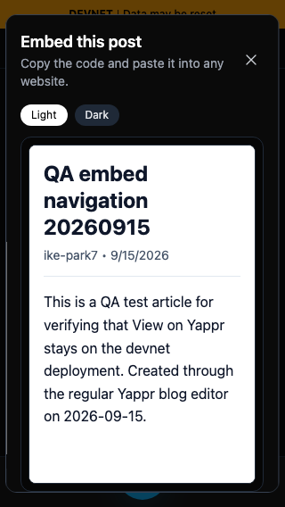
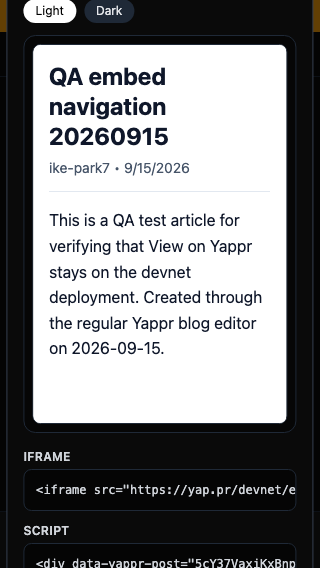
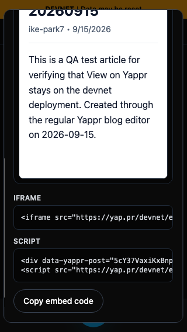
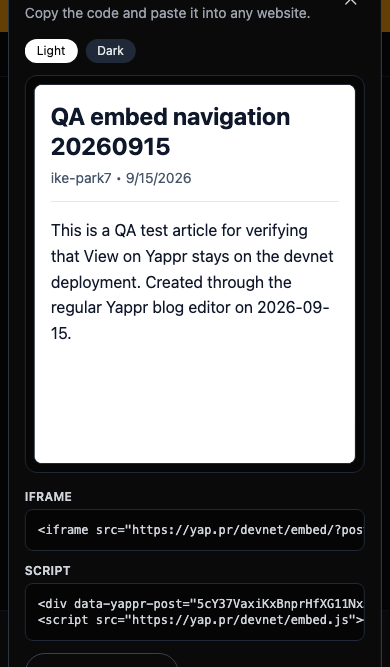
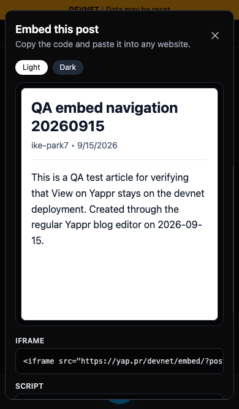

# QA95 — mobile embed dialog

At320x568, opening More actions → Embed produced a772px dialog: Close was above the screen and Copy below it; scrolling could not reach either. The fix limits dialog height to the dynamic viewport minus32px and allows vertical scrolling.

- Before exact base: **cf0efbc10b8757137063113ebbd2061e8b87d8f7**.
- After signed source: **b6fba4c2b0c4ce9444649993c1be90f64dd4070f**.
- Both independent production builds; guest Chromium; same actual article `5cY37VaxiKxBnprHfXG11Nx37eDv6Jb8RHYDMCmWWi8G`, blog `BkqjYQ95Mm2vNGEaoKbE473jodp7ZPFQr1Mj3jmqw6wA`, slug `qa-embed-navigation-20260915`; Light preview. No product writes or injected product content.

| State | Before — exact base | After — full PR head |
|---|---|---|
|320x568, initial opening |  |  |
|320x568, after same downward wheel scroll |  |  |
|390x667, initial opening |  |  |

At320px the fixed dialog is536px tall with16px margins; scrollTop236 reveals Copy. At390px it is635px tall, scrollTop117 reveals Copy. Desktop1280x900 remains896×760 at x192/y70. The initial and scrolled pairs separately show access to Close and Copy; they do not imply both remain visible simultaneously on short screens.

Validation: targeted lint, full TypeScript, committed production devnet build; actual Light/Dark preview and clipboard equality;16Tab presses stay in dialog; Escape restores Embed focus and another Escape restores More actions; copy reachable/clickable at320/390. Detailed numeric assertions in `results.json`, source capture script in `capture.cjs`. All six final screenshots inspected at original resolution before publication.
