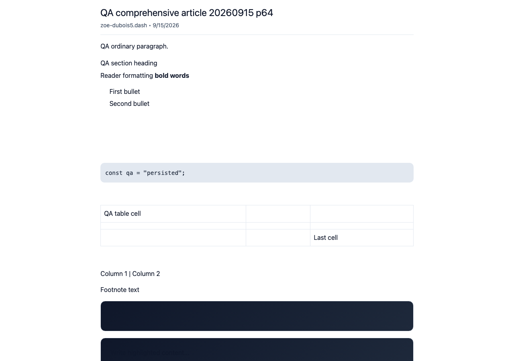
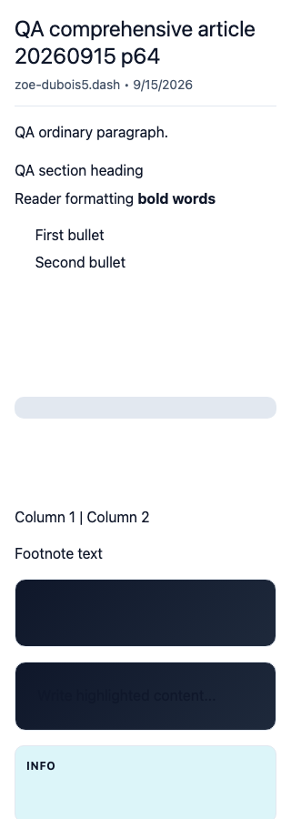
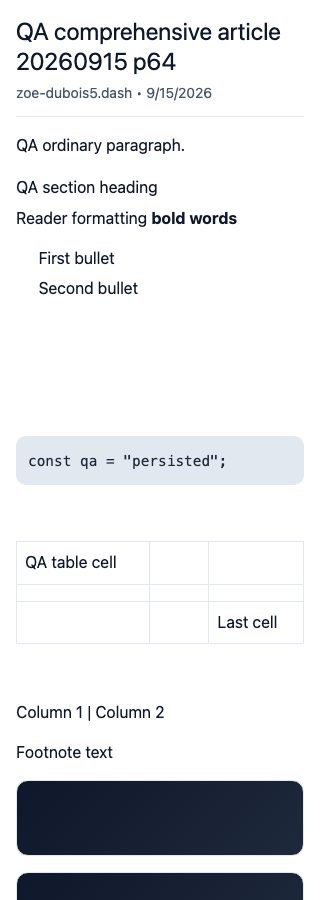
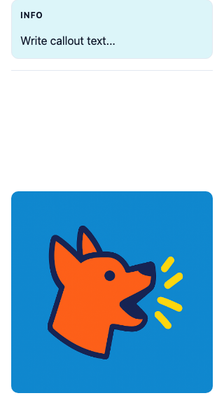
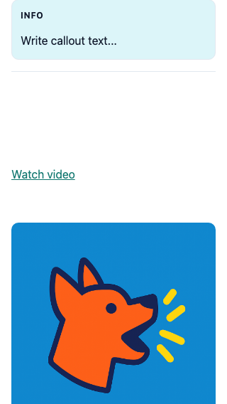

# QA99 — retain saved code, table cells, and video links in embeds

The regular blog reader displayed saved code and table text, but the static embed read the wrong code field and omitted simple-table and video blocks. The fix reads the editor's `props.code` with a legacy inline fallback, renders saved table cells, and provides a labeled link to each saved video URL.

Before exact base: **cf0efbc10b8757137063113ebbd2061e8b87d8f7**. After signed source: **8a92a610c011a9e7ff9fb181801f6e6226540357**. Separate production devnet builds and fresh guest Chromium contexts. Shared UI-created article `66syyLM2ZAakx2JNZuMJw4PY896cphx8Q2vc1kVCNTK`, owner `CNARhSLcQRfdxLZXTrvDVtVGKg1RHXjwJTpGSd2DXLGw`, blog `BdMQRKM6xT8jx4bKbkhP3wYo7V835pDjcEWTbN5PMNRU`, slug `qa-comprehensive-article-20260915-p64`. Product responses/content were not injected and this task made no article writes.

| Surface | Before — exact base | After — full PR head |
|---|---|---|
|Desktop article top: code and table |  |  |
|320px article top: code and table |  |  |
|320px, divider before inline image: saved video |  |  |

The video pair uses the same divider scroll anchor. The fix adds the link above the existing image; it does not claim embedded playback. The Light background-section contrast problem visible in both top pairs is separately tracked as QA100.

Validation:10renderer regression cases, with8failing the exact base and all10passing head;21total embed tests; targeted lint, full TypeScript, and committed production devnet build. The original eight PNGs were inspected at original resolution. Actual browser checks confirm saved `const qa = "persisted";`, first `QA table cell` and last `Last cell`, and correct video destination. The320px document stays320px wide.

A disclosed separate localhost host loaded the actual head's embed.js and created its normal sandboxed Dark iframe. It retained code/table content. A real click on Watch video generated a top-frame request to the saved YouTube URL. Only that external destination response was deliberately aborted after observing navigation; no third-party playback or successful external load is claimed. Details are in `host-results.json`.

Scope: static representation preserves the saved content. Column text remains a flat fallback, and table-of-contents navigation is outside this change. The existing URL normalization and escaping paths are reused. Simplification review kept the small renderer branches inline; introducing shared abstractions or refactoring the editor would add coupling without simplifying this bounded fix.

The320px video pair is used inline so the Watch video link remains readable in the rendered comparison. [Desktop video before](before/video-1280.png) and [after](after/video-1280.png) remain available at full resolution. Both pairs use the divider scroll anchor.
