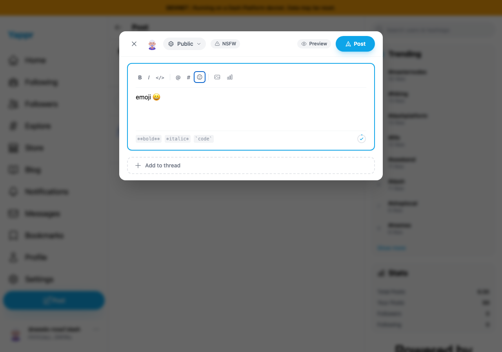
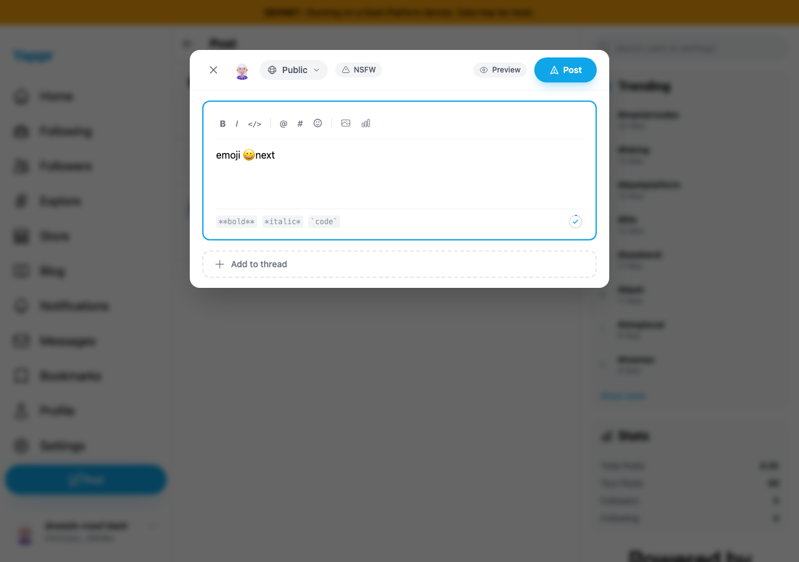
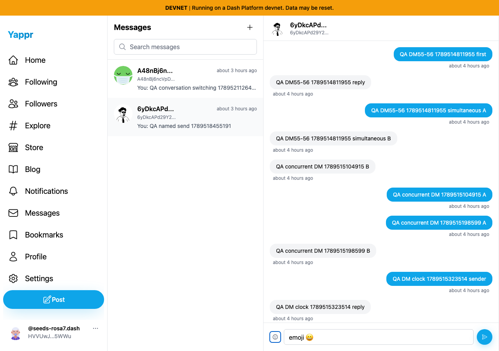

# Restore typing focus after choosing an emoji

This PR is explicitly stacked on Yappr #469 (`fix/new-message-dialog`). Before is its full head `7f259cfef8df477a7763c9c9d4680defb55a76f1`; after is full emoji-fix head `8ff92b65f562135cea6712bd359ec83c1fc66780`. Both are separately built committed devnet revisions.

For each surface, enter `emoji `, select 😀, then type `next` without another click. Before, focus stays on Add emoji and the text remains `emoji 😀`. After, the intended editor receives focus and reads `emoji 😀next`.

| Surface | Before — exact stack base | After — full fix head |
|---|---|---|
| Post composer |  |  |
| Direct-message composer |  |  |

Fresh independently seeded persona55 sessions use identity `HVVUwJLhEngLH5LkZx8FgUkcso28xK7tn5gaaHke5WWu`; the same existing DM recipient is `6yDkcAPd29Y24aLt1Ec1ZaRfwd4BCMJB6Swg9tgeYFmx`. The seeded session is not login evidence. Real existing devnet thread data is shown; no posts or messages were submitted. Chromium, light theme,1280×900. Images are unaltered, full resolution and visually inspected. The mobile390px cases and both cancellation paths are assertion-backed in the JSON ledgers; screenshots show the desktop typing result. Escape and trigger-toggle cancellation still return focus to the picker trigger in both surfaces and widths.

Validation: committed devnet production build (including type/lint checks),265 passing unit tests, and independent code review. See PLAN.md and before/after JSON for exact revision and fixture provenance.
