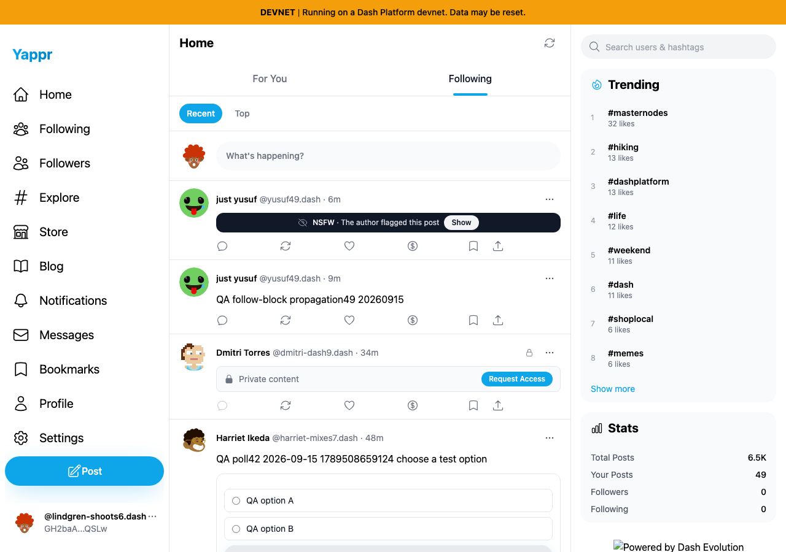
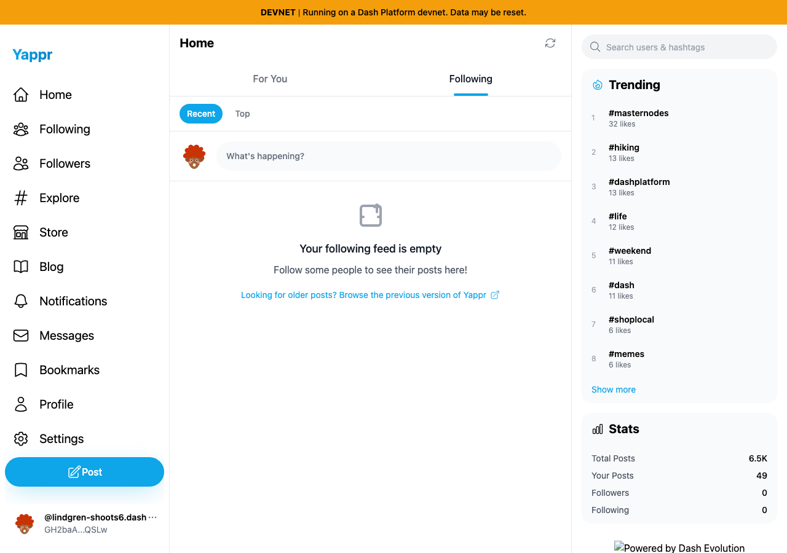

# Rapid For You→Following switch

| Surface | Before | After | Shared fixture | Expected delta |
|---|---|---|---|---|
| Following tab after immediate switch on entry | 4105c5d1c914f5d0838619da93c3b8d28b4a780e | 0913a30906fc07b0c333d267e170712b4c1bcc59 | Persona50 GH2baAjjMokUyzj5KNQbzbsf4QnaPhRjtUPCqSBnQSLw follows nobody | Before stale For You posts; after correct empty feed without refresh |

Actual live devnet data, same seeded viewer, disposable independent contexts,1280×900. Fresh following-list UI proves zero follows first. No responses or DOM content mocked. Capture waits18seconds after switch; explicit manual refresh is a control. Public feed content/relative timestamps may change between sequential captures.

Exact base produces38unrelated posts, then0after manual refresh. Full head produces0without requiring refresh and stays0after refresh. Independent source review approved, source lint/TypeScript/devnet build and145unit tests passed. Normal For You population, pagination without duplicates, Following empty state and return to For You passed on the final head.

| Before — exact base | After — full PR head |
|---|---|
|  |  |

Both images inspected at original resolution. Footer branding is missing only in the local base-path-only server; live root branding loads normally. No deployment branding issue is claimed. Identity public metadata is the same; relative timestamps differ.
