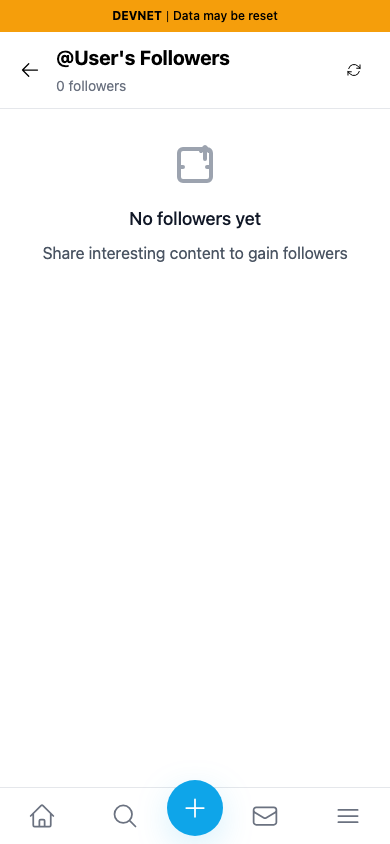
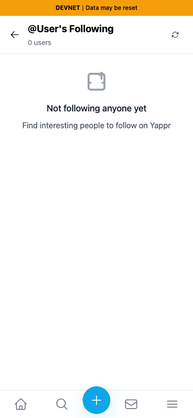
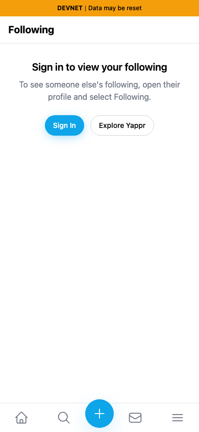
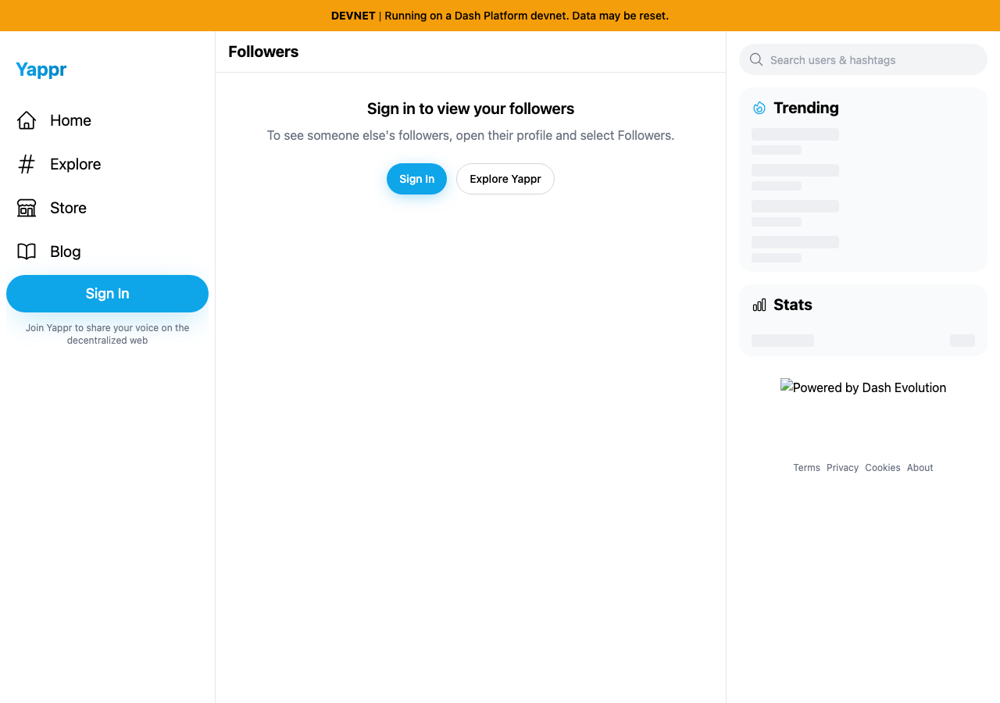
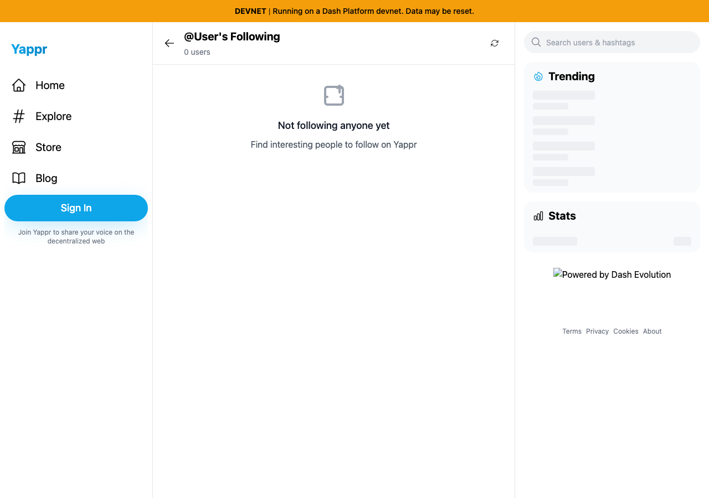

# Guest connection-page recovery

Product repository: PastaPastaPasta/yappr, branch `fix/guest-connection-context` targeting `staging`.

- Before: `4105c5d1c914f5d0838619da93c3b8d28b4a780e` (independent clean production devnet export; HTTP build ID checked as `4105c5d1`).
- After: `980ab21326c76ae3649980f3510d3d9116b22428` (independent clean production devnet export; HTTP build ID checked as `980ab213`).
- Shared fixture: fresh signed-out Chromium contexts, no target id, same live devnet configuration, light appearance, en-US locale, America/Chicago timezone, scale 1. Desktop 1280×900; mobile 390×844.
- Live social contract: `CdUkSHkQwGXXAkzKqrcrjUWLsj7qErK9XAZmLzJEhirU`.
- No UI, network response, or browser storage is mocked for screenshots. Every image captures the actual viewport. Desktop trending/stats are unrelated live panels; screenshots compare the center connection pane.
- All eight final PNGs were opened and inspected at original resolution. They contain no credentials. SHA-256 hashes, exact routes, viewport sizes and build IDs are in `before-assertions.json` and `after-assertions.json`.

The base renders a fictional `@User` list with zero followers/users even though no identity was selected. The head explains that sign-in or a profile target is needed and provides working Sign In and Explore Yappr actions. `after-assertions.json` records successful navigation/login-dialog checks for both viewports.

| Surface | Before — exact base | After — full head |
|---|---|---|
| Followers, mobile |  |  |
| Following, mobile |  |  |
| Followers, desktop |  |  |
| Following, desktop |  |  |

Validation on the final source:

- `npm run build:devnet` passed; committed head rebuilt before capture.
- `npm run lint` passed with zero warnings/errors.
- `node_modules/.bin/tsc --noEmit -p e2e/tsconfig.json` passed.
- `E2E_PORT=3222 E2E_BASE_PATH=/devnet E2E_ENV_FILE=.env.devnet node_modules/.bin/playwright test e2e/smoke/connection-context.spec.ts --project=smoke`: 6 passed, including absent/empty target, both recovery actions and explicit-id public access.
- Two ordinary restored-session browser probes with a provisioned devnet identity confirmed that no-id routes still show the signed-in account's own Followers/Following pages. A MutationObserver recorded no guest recovery prompt during restoration. See `restored-session-assertions.json`. The committed authenticated regressions use the standard seed-backed repository fixture and cover the same assertion; these local probes used the existing provisioned QA identity pool.
- Independent review by the parent agent approved the focused source/test diff.

`capture.cjs` is the reproducible guest screenshot/assertion script. `evidence-matrix.md` records the pre-capture claims. Artifact files are hosted only in the separate evidence repository and are not included in product commits.
