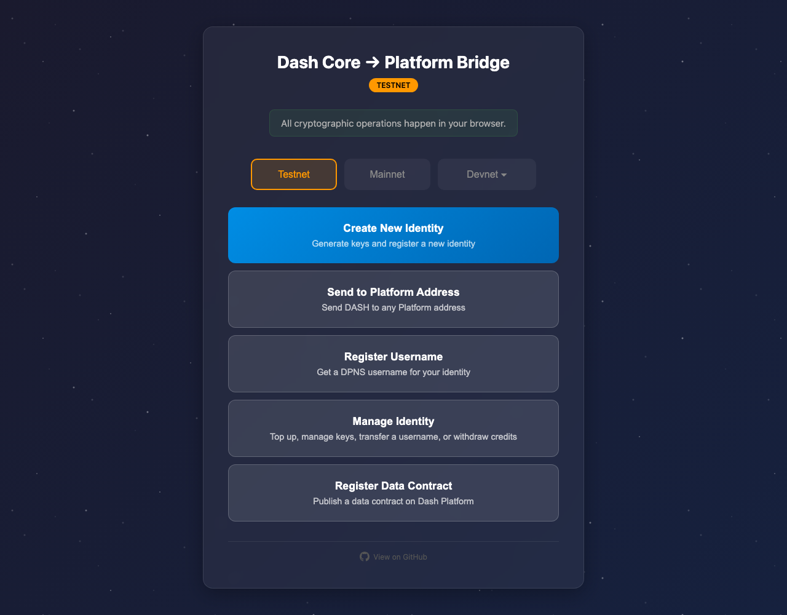
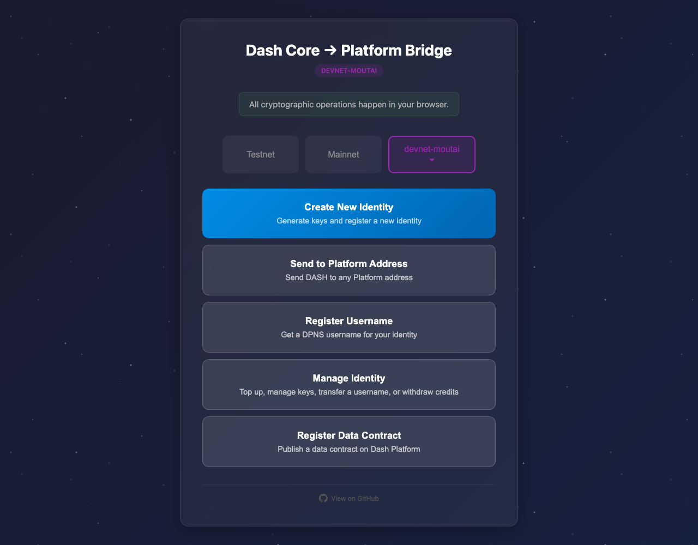

# Identity signup preserves the network

Before exact staging `4105c5d1c914f5d0838619da93c3b8d28b4a780e`; after full PR head `ea277d0bfe90c0c7125c4615dfb377a2cee88201`. Both clean product revisions were independently built with `npm run build:devnet` and served with the repository static server (ports3211/3228, respectively).

In each fresh guest browser context, open Yappr `/devnet/login/`, then click its real **Create an identity** link. No URL substitution, identity creation or credential entry occurs in these comparison captures. Chromium1280×1000, en-US, UTC; the shared fixture is the same external bridge home page.

| Before — exact base | After — full PR head |
|---|---|
|  |  |

Before href: `https://bridge.thepasta.org`. After href: `https://bridge.thepasta.org/?network=devnet-moutai`. Each JSON capture records the source URL, actual link href, opened popup URL, network label, viewport and time.

The destination is the real external bridge as served at capture time; its build revision was not independently established. The bridge source inspected for URL-parameter support was `PastaPastaPasta/dash-bridge` commit `ab04c2f3316f573131673bf66fd682cf3ecc22a0`; this is not a claim that the served bridge is that revision. The comparison proves network selection, not successful identity creation. Unknown custom devnets require configuration in the bridge; the live Moutai built-in was verified.

Both final images were inspected at original resolution. Validation:4unit cases cover testnet/mainnet/default/Moutai mapping; full devnet build and zero-warning lint passed; independent source review approved. The actual browser clicks demonstrate the Moutai mapping in the live external UI.
