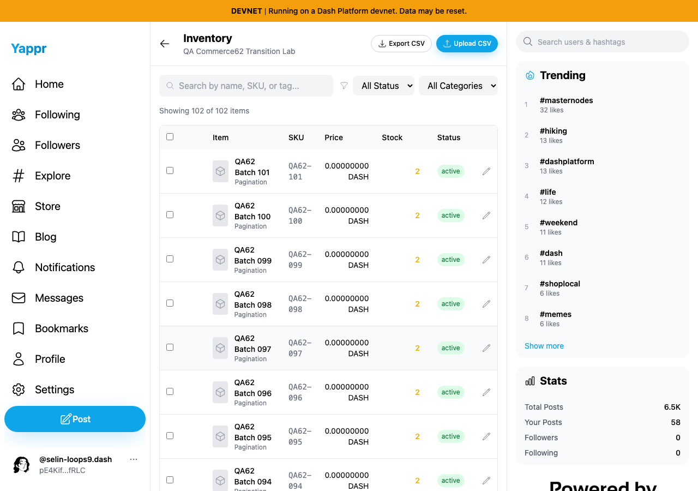
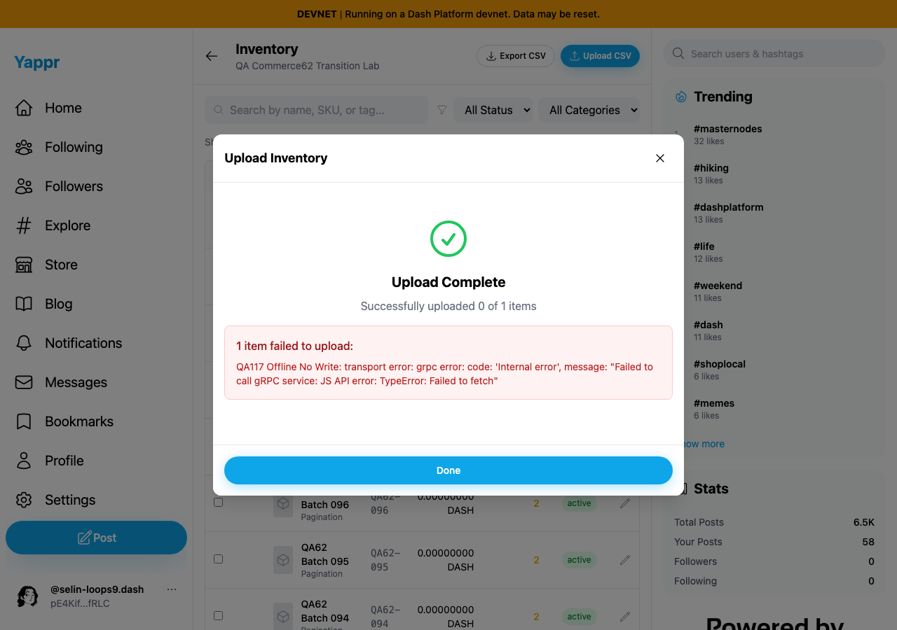
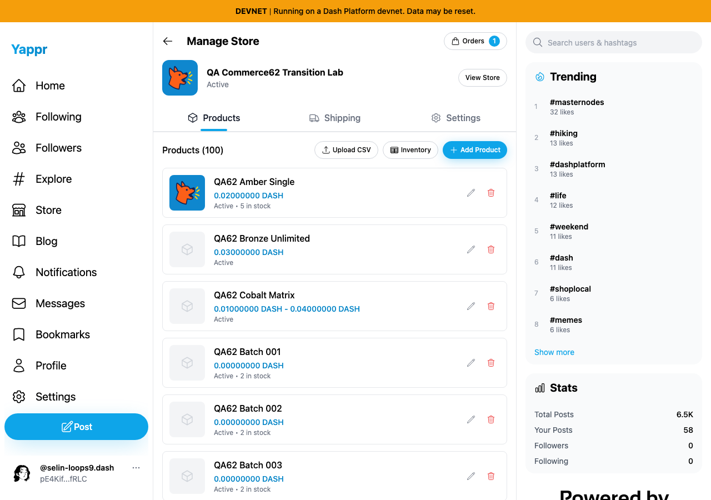
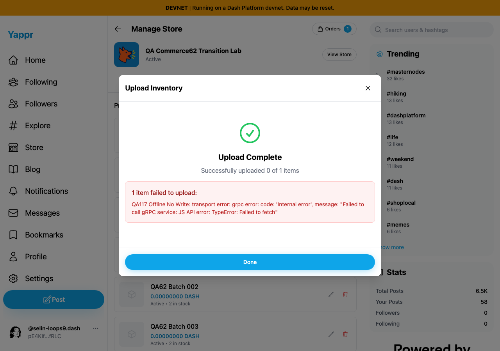
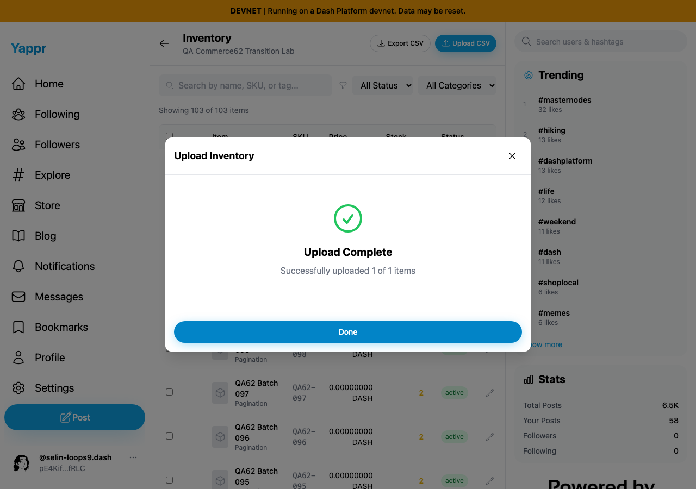
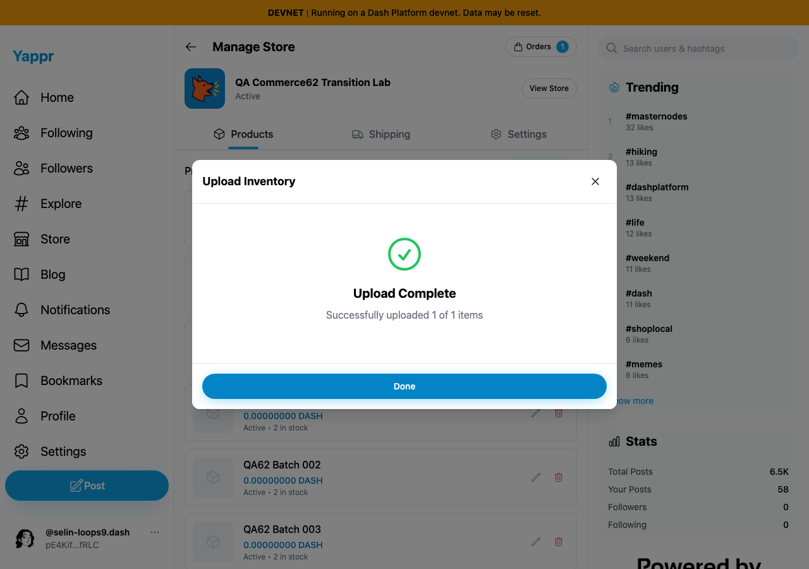

# Inventory upload results remain available

Exact base `cf0efbc10b8757137063113ebbd2061e8b87d8f7`; full signed head `ad1af47f7bd977834e6758365aa3828c85f6d4e0`. Independent committed production devnet builds, unchanged Python static adapter, Chromium1280×900, light theme. Same actual merchant62/store `CP3dEXrdMEbbiFNHakoRkC86DonfVftuzUyaY4ngrnQb`; scoped auth fixture is not fresh login evidence.

Each failure comparison uses the same harmless CSV row `QA117 Offline No Write`, price0, after setting Chromium offline at the parsed preview. No failed-row product is written. Base parents immediately unmount the completion screen; head preserves count and transport error until Done. This controlled offline transport error does not establish a Platform or GroveDB defect.

| Route | Before — exact base | After — full head |
|---|---|---|
| Full Inventory |  |  |
| Manage Products |  |  |

Successful compatibility captures (head only):

| Inventory | Manage |
|---|---|
|  |  |

One disposable actual product was successfully created from each head route. Both result dialogs remained open through the parent refresh; Done closed and reopening reset the dialog. Inventory began with102 products and then103 after its success; Manage's failure/success runs follow that first upload and its background still shows its pre-existing100-item limit. Final total104 independently verified by paginated SDK and fresh Full Inventory. Exact success IDs: inventory `2j26J7FfWDtFDntxs9rPLgQ6rx1QNEGwHL35rKdigNSL`; manage `AnUnxLK1UgWCarrxV9aabGdKG8UsFXwQBXaFDdqx7Qmp`. These are retained temporarily for a separate pagination comparison then queued for cleanup.

The initial head harness expected the new product in Manage's oldest100 list and timed out. Raw after.json preserves that result. The separate success-readback.json verifies both actual documents in Full Inventory; Manage's missing pagination is tracked independently as QA122. This PR's scope is completion visibility/Done, and all those checks passed.

All six final images inspected at original resolution. Targeted ESLint, full TypeScript, clean committed devnet build and independent actual-diff review passed. No response, DOM or service mocks. No payment.
