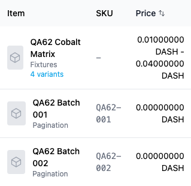
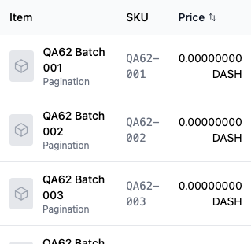
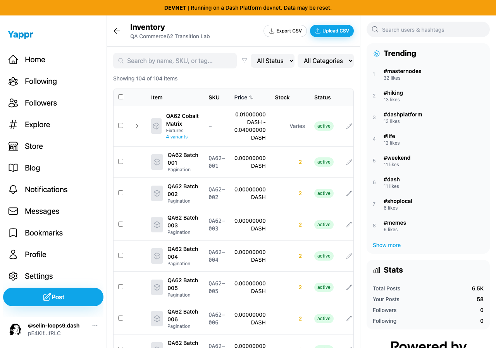
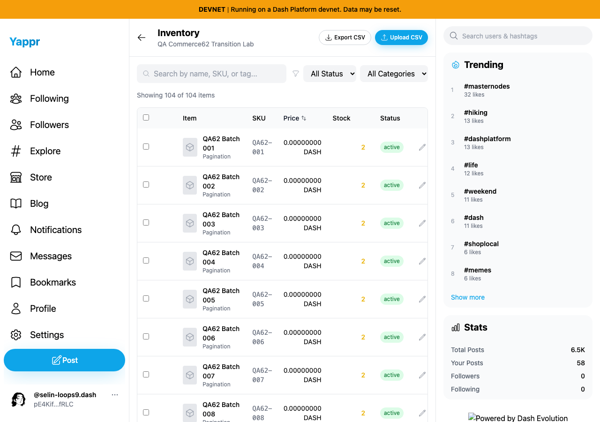
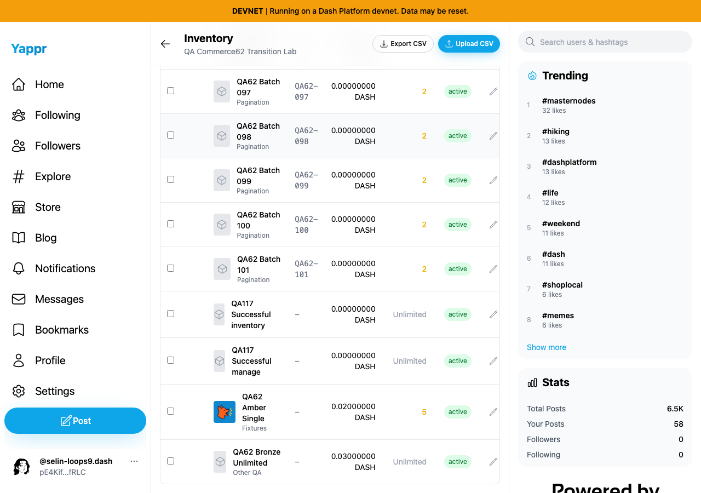
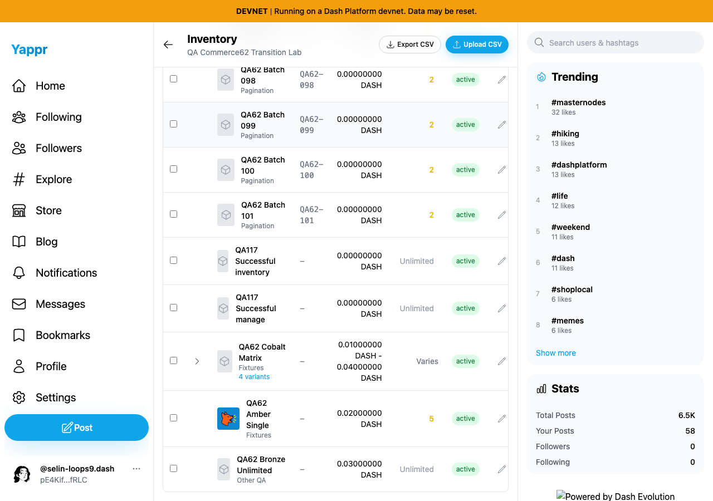

# Inventory Price sorting uses the displayed minimum variant price

QA128. Exact base `cf0efbc10b8757137063113ebbd2061e8b87d8f7`; full signed head `90307f6ff7f4359d422547268139d629d70598a9`. Each revision ran from its own committed devnet production build. Source change: use the same minimum-price calculation for sorting that already supplies the displayed price range.

The before ascending order incorrectly places Cobalt (0.01–0.04 DASH) before zero-price products because the product has no basePrice. After sorting by minimum variant price, all 101 zero-price products precede Cobalt, followed by Amber (0.02 DASH) and Bronze (0.03 DASH).

| Ascending Price, desktop 1280×900 | Before — exact base | After — full PR head |
|---|---|---|
| Focused top rows |  |  |
| Top context |  |  |
| Bottom context |  |  |

The focused pair makes the price-order defect readable. The bottom pair locates the corrected Cobalt row among the three positive-price products. Footer branding differs because of local static-asset mounting; it is unrelated to the price comparator. All six final PNGs were inspected at original resolution before publication.

## Shared fixture and provenance

The existing dedicated QA merchant persona62 and store `CP3dEXrdMEbbiFNHakoRkC86DonfVftuzUyaY4ngrnQb` supplied the same 104 real devnet products to both revisions. This constructed QA catalogue contains 101 zero-price rows and three positive-price controls:

| Product | Document ID | Minimum price |
|---|---|---|
| QA62 Cobalt Matrix | `6D8xaKcFCkhaNdVELKvyWHCNrfMBSmoSmzjEMZu5sqFF` | 0.01 DASH; variants span 0.01–0.04 DASH; no basePrice |
| QA62 Amber Single | `GWgJbLzxK5XfyNnVNdy7k8fyiBmUziSTSRQ5XtkExCWK` | 0.02 DASH |
| QA62 Bronze Unlimited | `DLZ575aDqnjkq99FFvxk3mTiSnZoZP8Av4LbmdQKokVB` | 0.03 DASH |
| QA62 Batch 001 | `BJ9445Ku8y3Ckyy4FhkmnaqRxFcFQpfXJq4ePMm4ZHkR` | 0 DASH; representative zero-price row |

[fixture.json](fixture.json) contains the sanitized public SDK snapshot used to map every observed row to its real document ID and minimum price. Private restored browser sessions were used in fresh Chromium contexts; this is not fresh-login evidence. Both contexts used light theme and matching desktop 1280×900 or mobile 390×844 viewports. Capture performed no product writes, response fabrication, or DOM/app-state injection.

## Functional controls

[Before results](before/results.json) and [after results](after/results.json) record the complete observed 104-row ascending and descending orders for both desktop and mobile. Every row mapped uniquely to the public snapshot. Before ascending order fails on both viewports; after ascending order is monotonic across all 104 products, with Cobalt at index 101 (zero-based). Descending order already passed on this fixture and remains correct: Bronze, Amber, Cobalt, then zeros. It is a compatibility control, not a claimed visible change.

Mobile sorting was exercised through the real Price control and all 104 DOM rows were checked. Mobile screenshots are omitted because the existing wide table clips prices at 390px; those images would not clearly prove this sorting correction.

Targeted ESLint, full TypeScript check and the committed devnet production build passed. A new unit test was not added for this one-line comparator; the complete real-data ordering checks cover the bug and unchanged descending behavior. The shared commerce fixture is preserved for other agents' QA and coordinated cleanup.

[SHA256SUMS](SHA256SUMS) records the final publication files. Public status, content type, byte length and SHA256 are verified after publication; the rendered PR and evidence index are also inspected.
