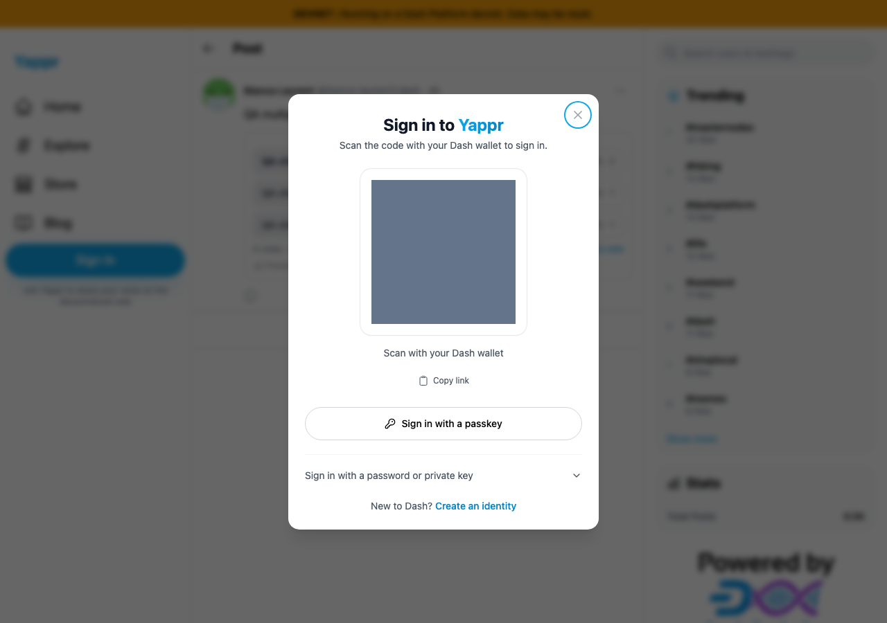
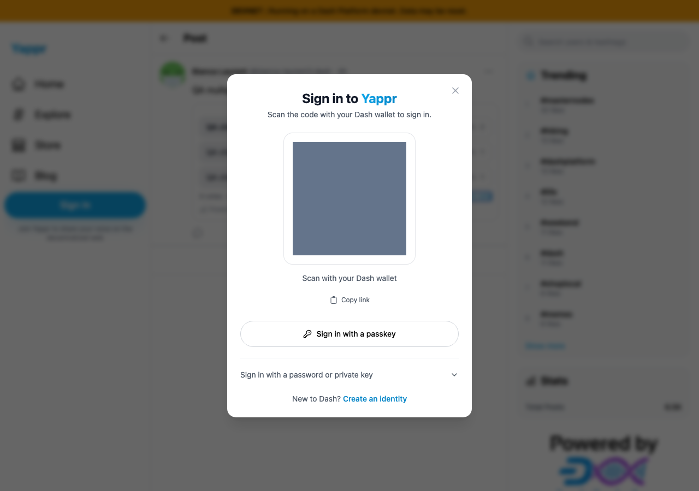
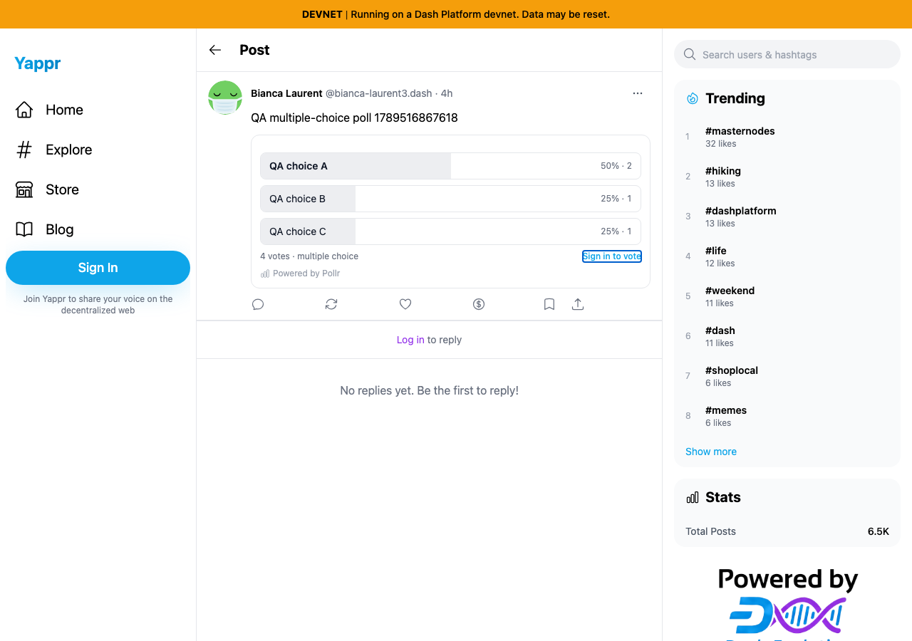

# Sign-in dialog keyboard focus and Escape

Exact staging base `cf0efbc10b8757137063113ebbd2061e8b87d8f7` → full signed fix head `d0a3832dc834a4e7ca8961854cf241dd69f9317f`, independently built in devnet mode. Guest contexts open the same poll post `A97wUuDzx6uxJAKKxicTJZHrhL4huq8w58uiSXZM7tHa`, focus **Sign in to vote**, then press Enter. No credentials or votes submitted. Light theme, Chromium, 1280×900.

| Sequence | Before — exact staging base | After — full fix head |
|---|---|---|
| Open via keyboard |  |  |
| Press Escape immediately after opening |  |  |

The initial-focus pair shows the Close focus ring only after the fix. Before, focus remains on the background poll button and Escape fails to close the dialog. After, Escape closes and focus visibly returns to Sign in to vote. Gray squares redact only the transient wallet-pairing QR; dialog controls and focus indicators are unchanged. No pairing URI or private credential is included in the artifacts. Every final image was inspected at original resolution.

The JSON ledgers record 24 Tab and 24 Shift+Tab presses from Close: before, 20 forward and 24 backward presses escape; after, none escape. Compatibility checks cover Close, backdrop, Escape, poll/sidebar opener restoration, advanced disclosure and empty disabled key form, disclosure reset, and a 390px reduced-motion dialog with the advanced form scrolled into view and focus confined. This verifies entry controls and keyboard behavior; it does not claim an external-wallet ceremony succeeded.

Validation: committed devnet production build including lint/typecheck; 265 unit tests; independent code review approved. PLAN.md and JSON retain exact provenance and no-submit counts.
