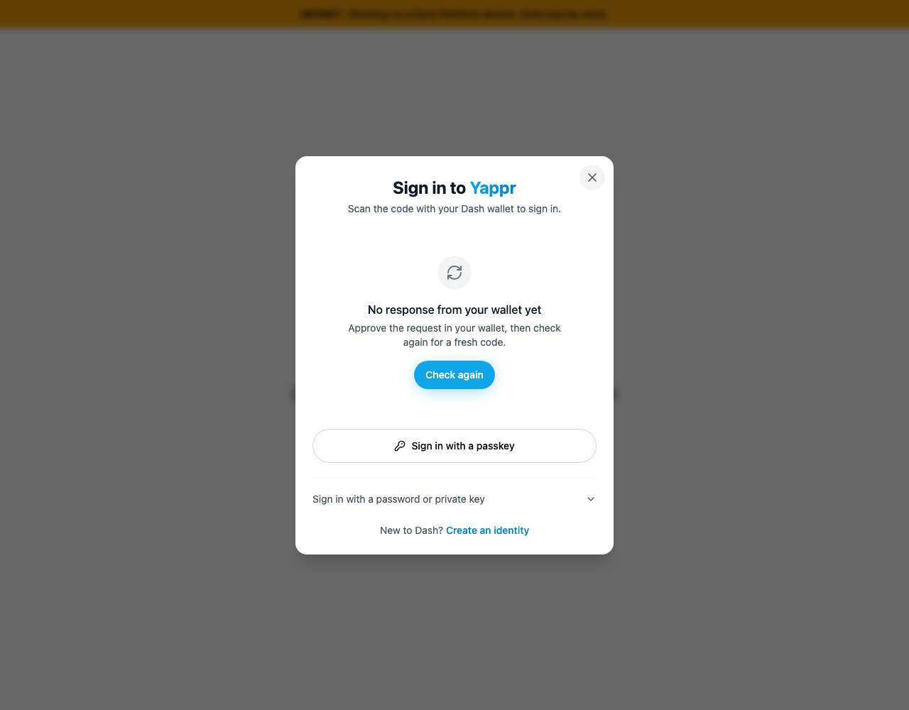

# QA121 — Dismiss the login route

Clicking **Close** on the login route previously reopened the sign-in dialog. The fixed build dismisses it and returns to the home page in both a `/devnet` deployment and a root deployment.

| Provenance | Exact revision |
| --- | --- |
| Before — frozen staging base | `cf0efbc10b8757137063113ebbd2061e8b87d8f7` |
| After — full PR head | `88a64b8c18a75907f15c0f054a5dde44ac410cb4` |

Both revisions were built independently as static production exports with the same devnet environment; the root-path build still connects to devnet. Fresh unauthenticated Chromium contexts, 1280×1000 viewport, light theme. No identity, credential, or wallet approval was used. Screenshots show the state **after clicking Close**. Before captures wait for the real 120-second wallet no-response state so no ephemeral request QR is published; root after capture was delayed during the same run. The devnet after image was recaptured against the identical build after matching the live host's root logo asset routes. Live home statistics can change independently of this fix.

## Devnet deployment

| Before — exact base | After — full PR head |
| --- | --- |
|  |  |

The original evidence commit `65ea18fdfb689dc319e2834d5ab6d5e1f15e10c9` had an unrelated missing logo caused by the local capture server rejecting the root `/pbde-light.png` path. Real staging and the frozen comparison server both serve that asset successfully. This image supersedes that capture after the local server was configured to match those asset routes; application source and head revision are unchanged. See [recapture procedure](recapture.cjs).

## Root deployment

| Before — exact base | After — full PR head |
| --- | --- |
|  |  |

## Procedural validation

- Actual UI checks cover `/login` and `/login/` for root and devnet: all four base cases retain the modal, all four head cases dismiss it and reach the correct home URL. Root base `/login` reaches home but reopens the modal, exposing the separate effect race.
- Opening and closing sign-in from the home page still works in both head builds.
- `npm run lint`, `npx tsc --noEmit`, final committed `npm run build:devnet`, and final committed root-path build passed.
- The two-file diff was independently reviewed. No claim is made about wallet approval or authenticated return destinations.
- [Machine-readable result](result.json) and [capture procedure](capture.cjs).

All four PNGs were inspected at original resolution before publication. The source commits are signed. Guest contexts and owned capture servers are disposable; shared QA servers are preserved.
