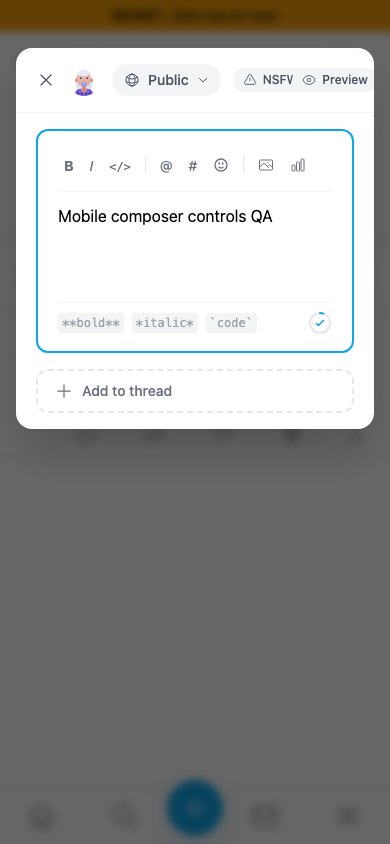
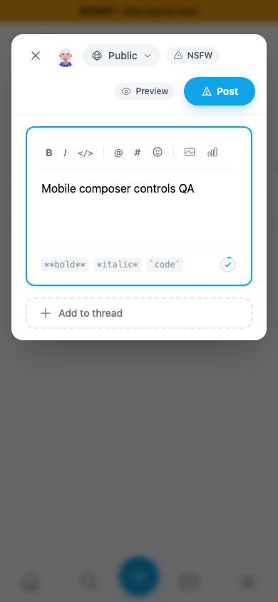
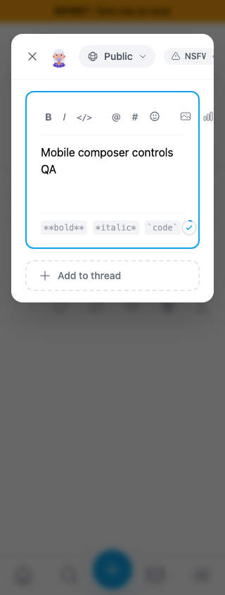
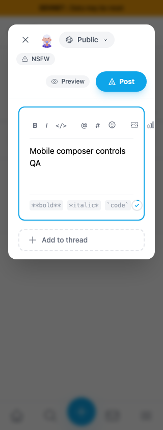

# Mobile composer header controls

Exact staging `cf0efbc10b8757137063113ebbd2061e8b87d8f7` → full signed head `692eeed19f1989773d0634ae7dc520ae56fb8fa3`, separately built in devnet mode. Same fresh persona55 scoped session, draft `Mobile composer controls QA`, light theme and existing background post `9mcdDNznWP86bScjmMykF1kzNpecneoFoZVVNAB5qCFd`. These seeded sessions are not login evidence. No posts were submitted.

| Width | Before — exact staging base | After — full fix head |
|---|---|---|
| 390px |  |  |
| 320px |  |  |

Before, the header clips Post entirely and also clips/overlaps nearby controls. After, the action row keeps Preview and Post visible; the settings row can wrap on narrower screens. Assertions include each control's bounds and center hit test. Outer dialog bounds alone are not used as proof.

Desktop stays on one row: [1280px before](before/1280.png), [1280px after](after/1280.png). Browser checks also cover Preview/Edit text retention, NSFW interaction,320px poll/reply/quote headers,844×390 landscape and320px Private with Teaser. The [long private-label state](after/private-teaser320.png) uses persona39's existing enabled private feed and a local draft only; no key/feed/request writes. See compatibility.json. The independent narrow formatting-toolbar clipping is tracked separately as QA120; this change concerns header controls.

All seven final screenshots were inspected at original resolution. Production devnet build including lint/types passed;265 unit tests passed; independent code review approved. PLAN.md and JSON ledgers retain exact provenance and no-submit counts.
