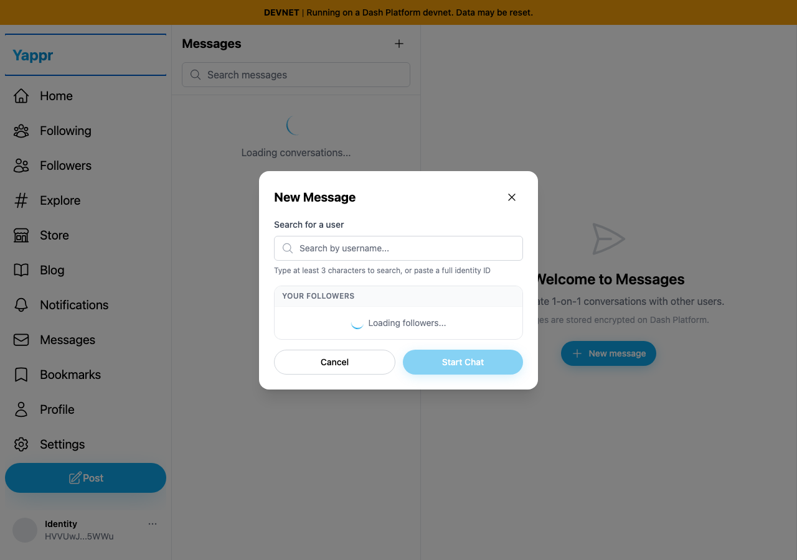
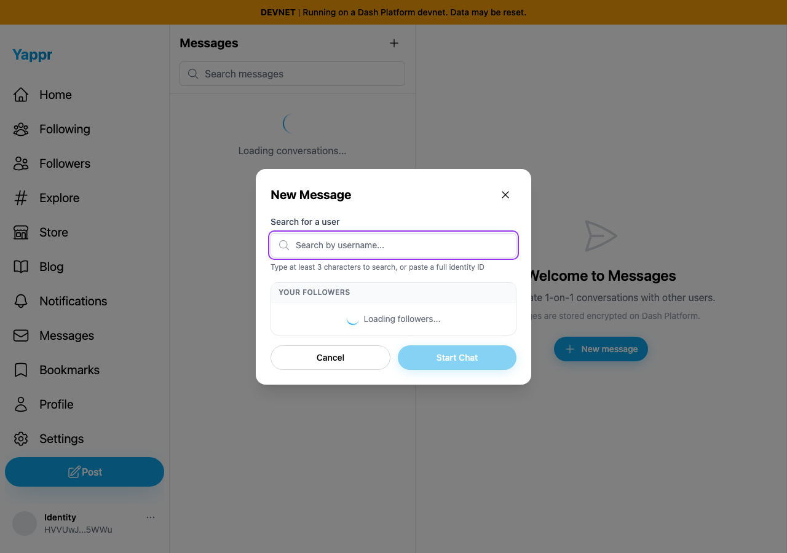
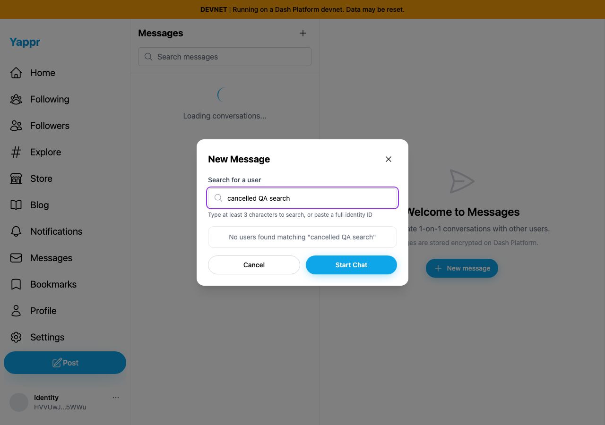
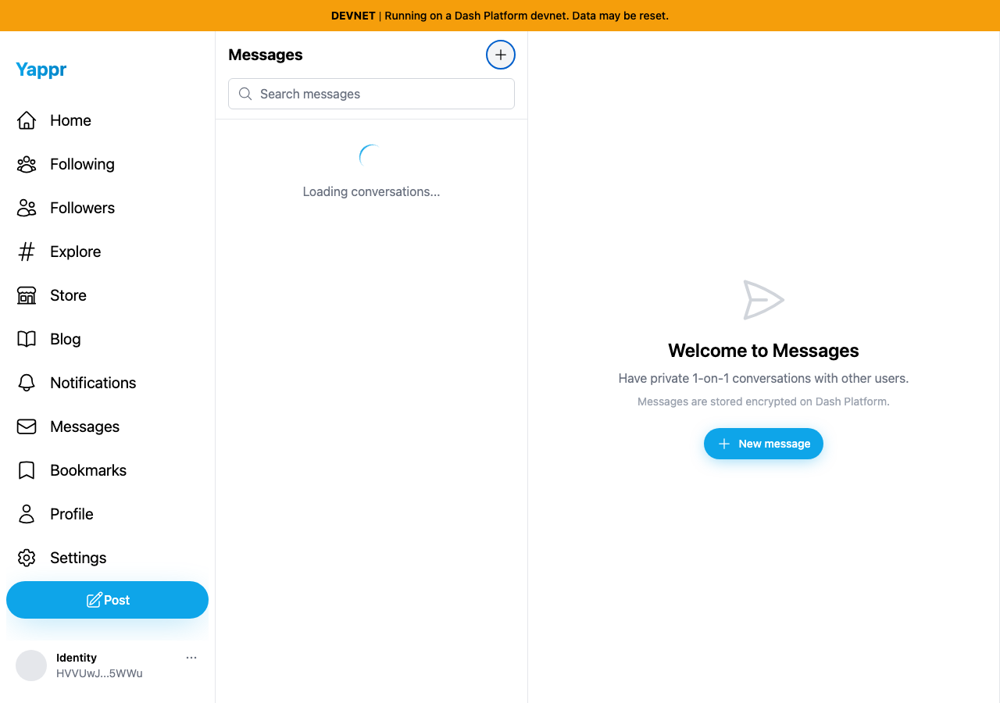

# New Message dialog keyboard behavior

| Surface | Before — exact base | After — full PR head | Shared fixture | Visible delta |
|---|---|---|---|---|
| New Message, three Tab presses | eb895be71a7207c73fb9329ac9d9bb7b398f53da | e8555303348c3eee7f8d4263000f517a29aa7803 | Fresh QA persona55 session, opened during initial conversation loading | Focus stays in dialog instead of moving to Yappr navigation |
| New Message, Escape | Same base | Same head | Same cancelled QA search text before Escape | Modal closes and focus returns to its opener |

Independent committed devnet production builds at ports3240/3256, Chromium1280×900, light theme. Private session setup is seeded from the QA corpus; this is not evidence of a sign-in ceremony. No API responses, data or screenshots were mocked or altered. Both comparisons deliberately capture the early loading state after opening the dialog; interaction results separately confirm use after conversations load. Persona55 identity: `HVVUwJLhEngLH5LkZx8FgUkcso28xK7tn5gaaHke5WWu`.

| Before — exact base | After — full PR head |
|---|---|
|  |  |
|  |  |

The 12 forward and 12 reverse Tab trials produce 11 outside stops per direction before and zero after. The fixed dialog has an accessible title, description, named close button and associated recipient label. Escape, Cancel, close and backdrop dismiss, clear transient state and restore the exact activating button. Selecting an identity on mobile focuses the composer when the opener is hidden. A separate real username search for `samir-plates-5` selected identity `6yDkcAPd29Y24aLt1Ec1ZaRfwd4BCMJB6Swg9tgeYFmx`. These semantic and compatibility assertions are in the JSON records; screenshots show focus containment and dismissal only.

ESLint and exact committed devnet production build/type check passed. Independent source review approved; its suggestion to capture the clicked button via currentTarget was applied. All four final PNGs were inspected at original resolution.

Correction: the initial PR description briefly linked unrelated conversation-header screenshots and an incorrect head string. Those were invalid evidence for this issue and are replaced by the exact four images and full hashes above. The initial artifact index is superseded by this index. Two unmatched mobile captures have been removed from the authoritative comparison; mobile behavior is recorded procedurally in after.json.
