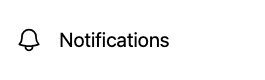
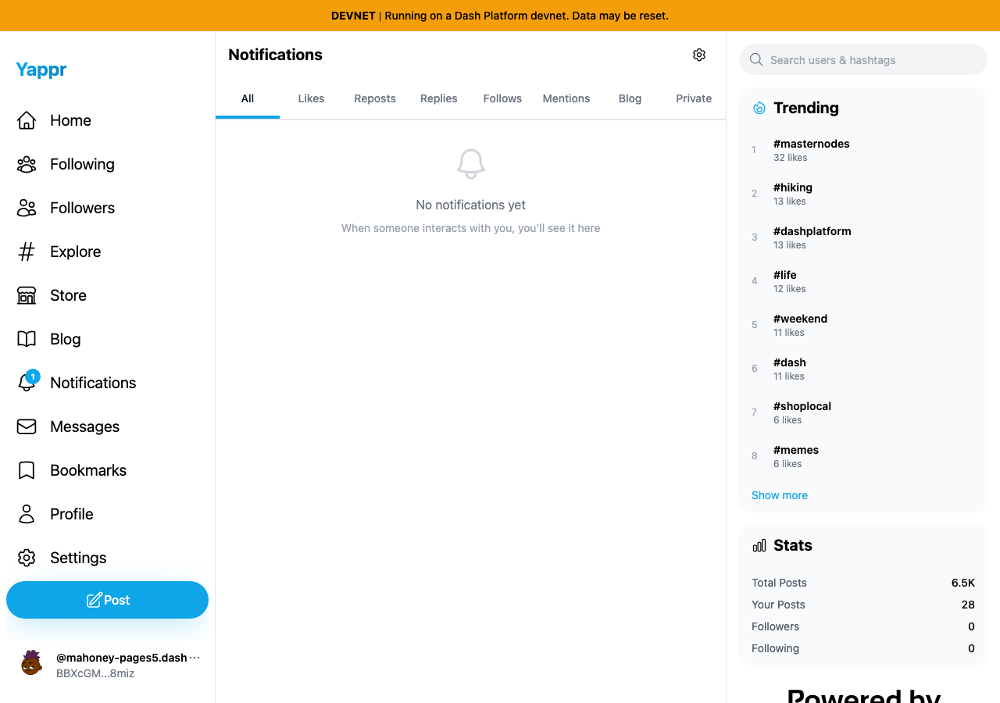
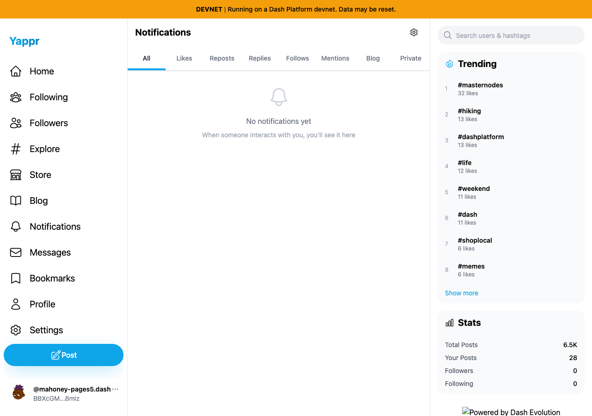
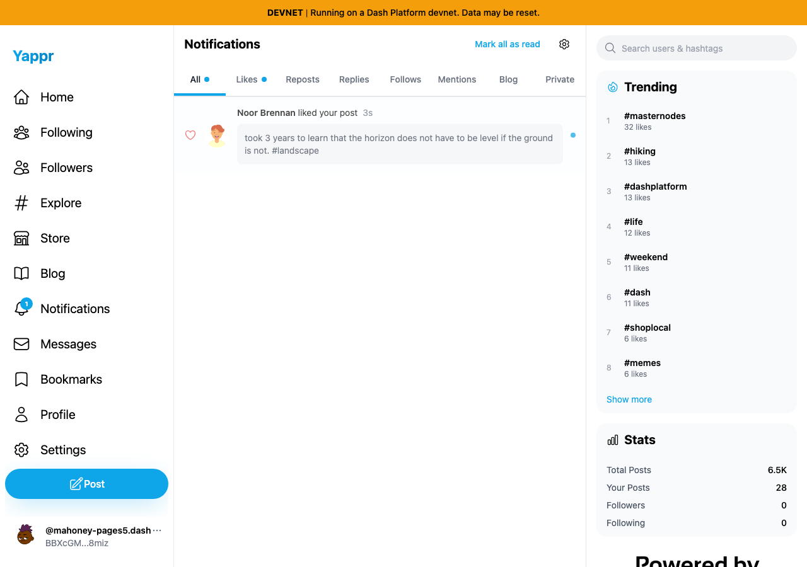
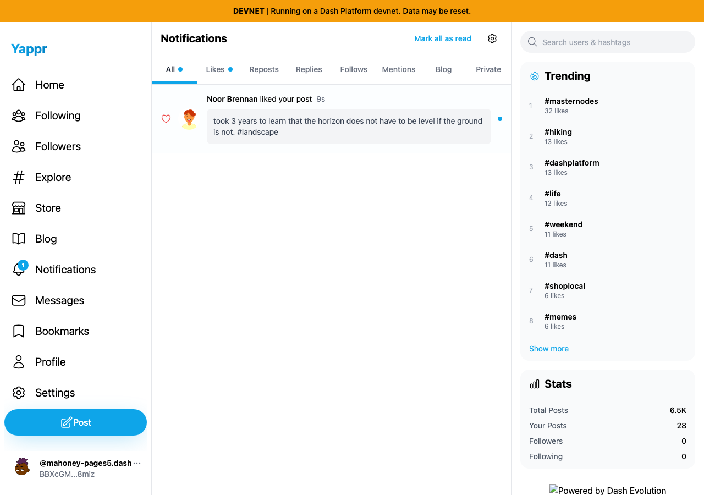

# QA101: notification preferences and the sidebar unread badge

Exact base: `cf0efbc10b8757137063113ebbd2061e8b87d8f7`, production devnet build on port 3288. Full PR head: `70336915ff4bcc58f3e1f352e0dcc35de9b44ee0`, production build made after the signed commit, served on port 3296. Chromium, light theme, 1280×900, matching `/devnet` configuration and independent disposable browser contexts. Source worktrees clean at capture.

The same real like by dedicated persona 67 Noor Brennan (`HMqf6LRJ4uxwjQqNYdJXrENQNFSuLbB91hfj7j8zy8P3`) on persona 66 Nils Mahoney's post `6QeYEV4WgH4HLfnKQGqmrGnKWCQS5PwxxMECK6CZ4scS` supplies both comparisons. Recipient identity: `BBXcGMZay7ZN6r71CK14VaGxwDn6CJCQcvFgrFpg8miz`. Sessions are provided by the dedicated QA harness; this is not a login test. All likes, preference changes, and read actions use the ordinary UI; no notification response is fabricated.

| Behavior | Before | After | Visible delta |
| --- | --- | --- | --- |
| Likes enabled | One real unread row and badge | Same event and count | Unchanged compatibility |
| Likes disabled, then reloaded | Empty list and tabs, sidebar1 | Same hidden row, sidebar clear | Badge obeys the same preference |
| Re-enable Likes | Row/unread return | Row/unread return | Hiding does not consume read state |
| Explicit Mark all as read | Badge clears across reload | Badge clears across reload | Read action preserved |

## Likes disabled and page reloaded

Both lists show **No notifications yet** because the only incoming event is a like and Likes is disabled. The base still claims an unread notification in the sidebar; the head clears it.

| Before — exact base | After — full PR head |
| --- | --- |
|  |  |
|  |  |

Focused images are unannotated `(x5,y450,width265,height80)` crops of the full-resolution overviews above. Live relative ages and the externally loaded footer logo can differ; neither is changed by this PR.

## Same incoming event before disabling Likes

| Before — exact base | After — full PR head |
| --- | --- |
|  |  |

[Procedural results and cleanup](result.json) verify re-enabling the preference restores the same unread event and that explicitly marking it read persists after reload on both revisions. The controlled like was removed through the UI; a fresh actor reload confirmed the original unliked state. Preferences were restored enabled before disposing contexts.

Eight focused tests cover each of six preference mappings, private-feed events remaining visible, and mixed read states without hidden-event read mutation. Types, full lint, production build, and independent source review pass. Other event types are covered by these focused tests rather than this like-only live fixture. All six final PNGs, including both crops, were opened at original resolution and visually inspected. No credentials or authentication state are published.
