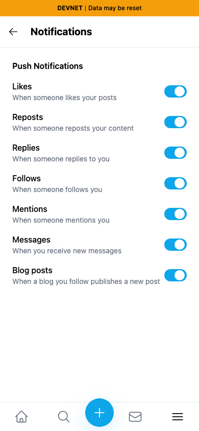
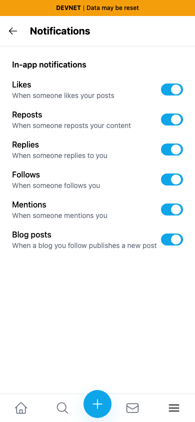
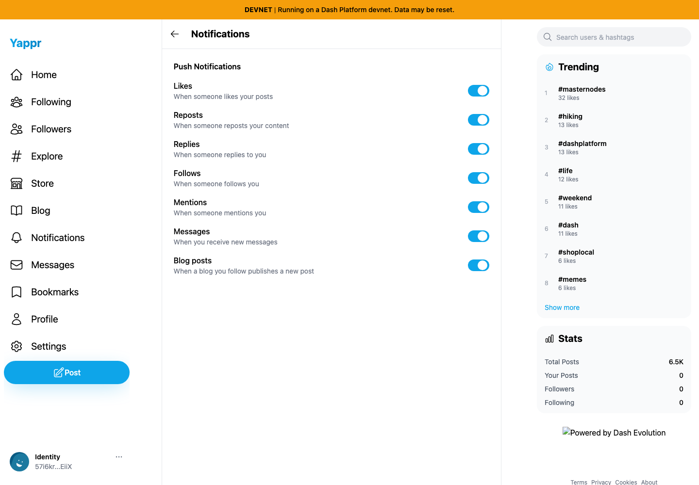
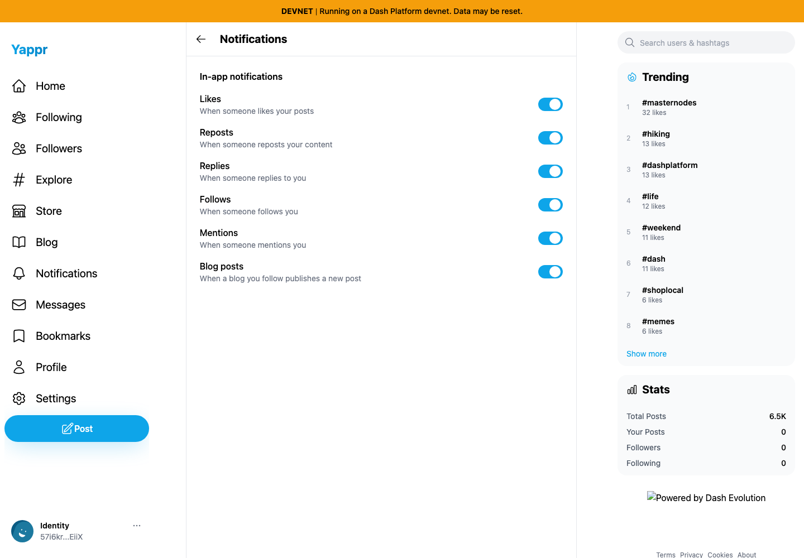

# Supported in-app notification preferences — QA136

Settings describes these controls as “Push Notifications” and exposes a Messages switch, but their consumer filters the in-app notification list. There is no Messages event in that list and no consumer for that preference. The fix labels the section “In-app notifications” and renders its six supported event filters. The persisted Messages boolean and all storage code remain unchanged.

**Before exact staging: `cf0efbc10b8757137063113ebbd2061e8b87d8f7`. After full head: `1a24e56398cf82932eae275afe8482f81bb0747e`.** Separately built devnet exports; compiled revision checked in About. Same unnamed QA identity `57i6krpfkLARMr9SbXSGhxtCd4dk6BFkJUMpuom4EiiX`, normal key login and default notification preferences, fresh browser contexts, light theme, en-US, America/Chicago. No storage injection, server writes, traces or credentials in evidence.

| Before — exact base, 390×844 | After — full head, 390×844 |
| --- | --- |
|  |  |

| Before — exact base, 1440×1000 | After — full head, 1440×1000 |
| --- | --- |
|  |  |

All four final screenshots were inspected at original resolution. Static adapters are identical; the desktop footer-logo omission is unrelated to this change.

## Validation

Full lint, TypeScript and exact-head devnet build pass. Both ordinary-UI runs turn Likes, Reposts, Replies, Follows, Mentions and Blog posts off, reload and confirm all six remain off, restore them on, then reload and confirm persistence. Base has seven switches; head has six and no Messages switch. Matching heading, page and source revision are asserted. The unchanged store merges partial preferences and retains the legacy Messages value.

Source audit finds notification preference consumers only in Settings and Notifications; the event mapping contains the six rendered keys, and no message event. No browser push implementation was found in app/components/lib/hooks/contexts/public. Prior discovery tested a real DM with the Messages preference on/off, but headless notification permission was denied; that result is not claimed as an OS-delivery test. This PR corrects the offered UI rather than adding a delivery system.
