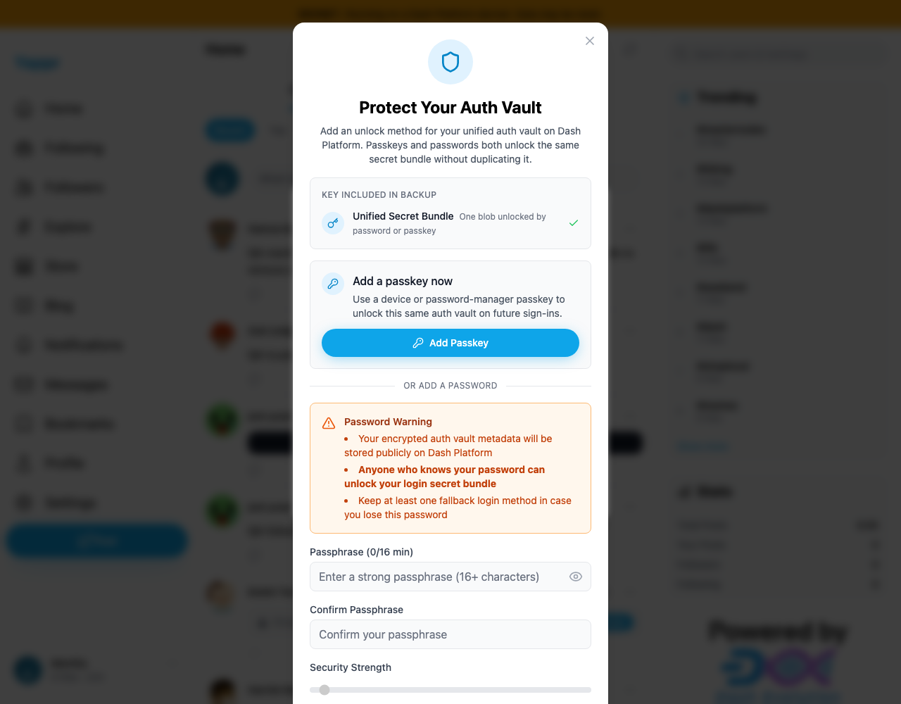
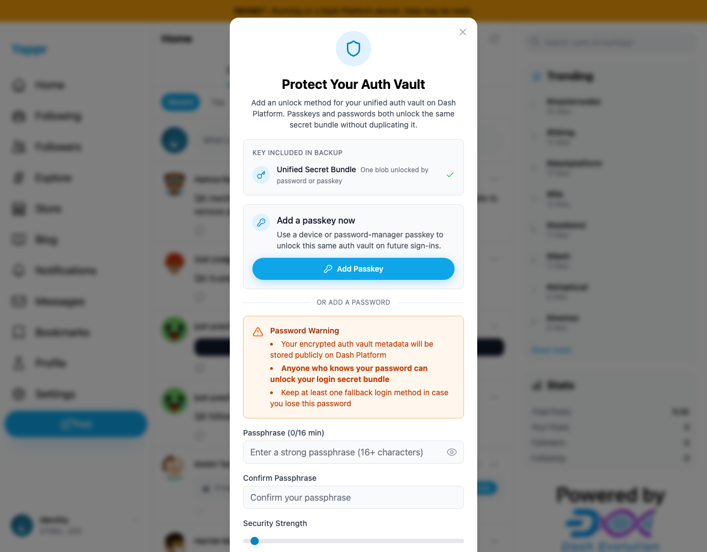
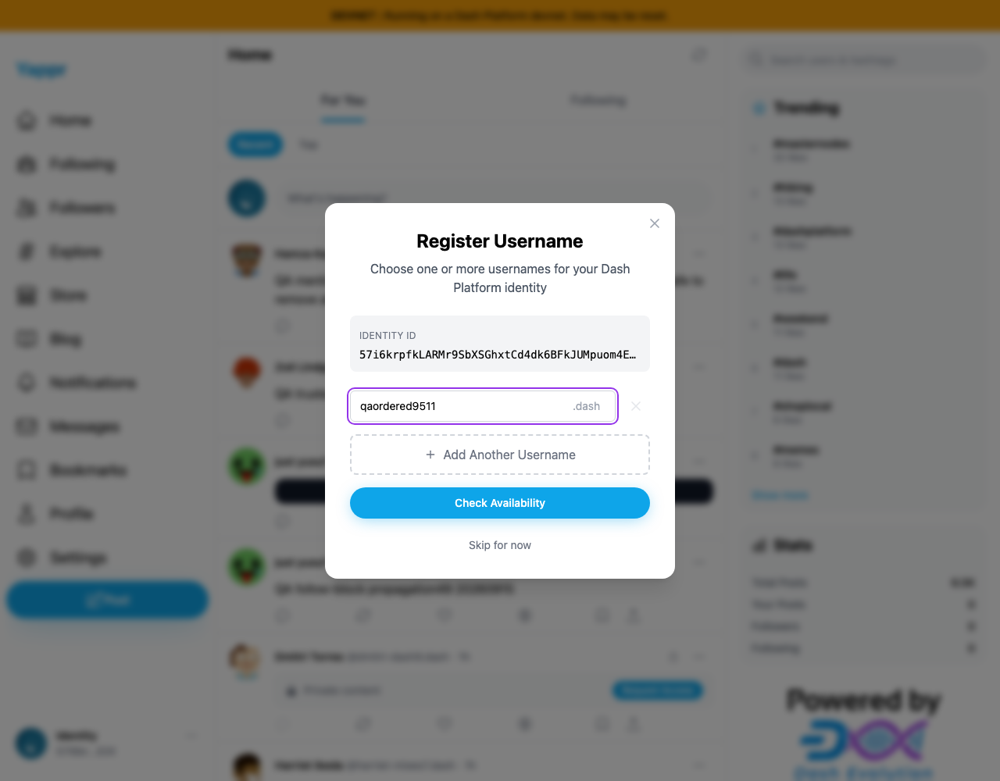

# Show first-login onboarding dialogs in sequence

Before exact staging `4105c5d1c914f5d0838619da93c3b8d28b4a780e`; after full head `fdec9891614efac75ba0397eff9f7df418938c18`. Separate devnet builds, same 1280×1000 viewport, same unnamed identity, real key-login forms and identical static export adapters.

After a fresh unnamed identity signs in, username registration opens. The key-login flow then also opens backup setup. Previously both remained mounted, with two backdrops darkening the page and the hidden username input still present. The provider now preserves the username request but defers its dialog until backup setup closes.

| Before: two active backdrops | After: one backdrop and one onboarding step |
|---|---|
|  |  |

The visible difference is the doubled page darkening. The hidden username form cannot be seen through the backup dialog; capture records independently assert its heading/input count changed from 1 to 0 while backup was shown. These are settled-state captures, not a claim about instantaneous animation overlap.

The same actual **Skip for now** action continues to username registration on the full head:

Dedicated fixture `57i6krpfkLARMr9SbXSGhxtCd4dk6BFkJUMpuom4EiiX` was provisioned with documented SDK tooling using 0.04 devnet DASH from the already-funded QA treasury. `fixture.json` records public asset-lock and chain-lock readback. No new faucet request, username registration, vault write or password enrollment occurred in the comparison. Private recovery material is retained outside this artifact.

Local devnet build and zero-warning lint passed; independent source review approved. All four images were inspected at original resolution. Secret-entry stages were not captured. This provider-only change is independent of the backup dialog's separate accessibility work.
