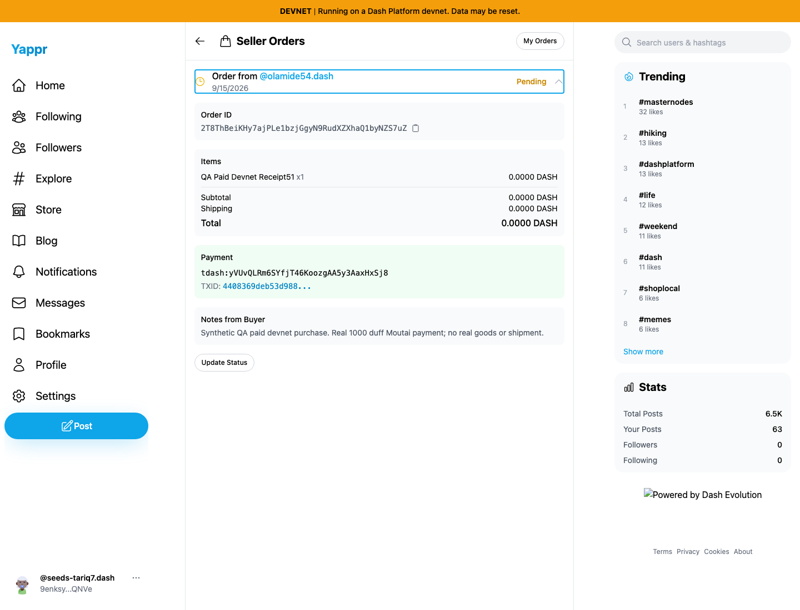
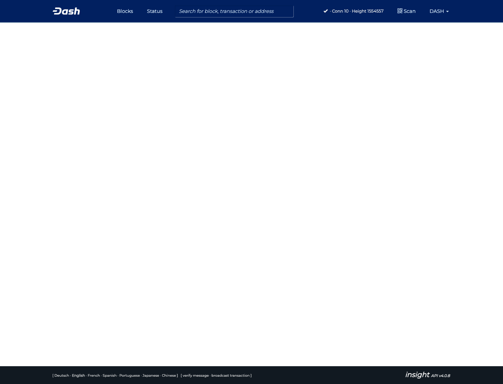
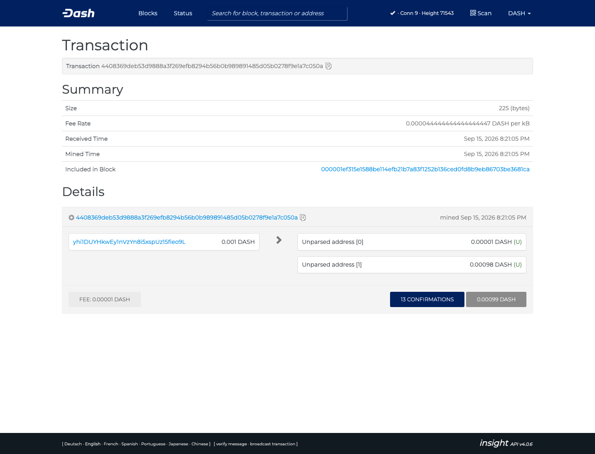

# Seller payment explorer network (QA69)

Clicking the seller's transaction ID for a real devnet payment opens the testnet explorer. That explorer returns 404 for the transaction and displays no transaction details. The fix selects the chain from the actual payment scheme and deployment network. Mainnet Dash remains on mainnet, tdash uses testnet or the configured devnet, and non-Dash transaction IDs are displayed without an incorrect Dash link.

Exact base `c98a6ecd7e26ae5bc9fc8e400e6011eb8465b3a0` and exact head `79e44e6b626f7595d47fe6f42a78fa87c6817447` were built independently and served by the unchanged Node static adapter at 3260 and 3270. Same Chromium 1440×1100 viewport, synthetic seller, immutable paid order, and actual transaction. Screenshots are unmodified and inspected at original resolution.

Actual order: `2T8ThBeiKHy7ajPLe1bzjGgyN9RudXZXhaQ1byNZS7uZ`. Actual Moutai payment: `4408369deb53d9888a3f269efb8294b56b0b989891485d05b0278f9e1a7c050a`, paying 1,000 duffs to the dedicated QA merchant. Before/head each opens and decrypts that same order, then clicks the same transaction ID. Neither capture submits another order or payment.

Before, seller link opens testnet and its transaction API returns 404:

After, clicking the link opens the actual transaction on Moutai:

The after link enters through the explorer root hashbang route. Direct Moutai deep links return404; the root route loads correctly, and the external explorer redirects itself from HTTPS to its existing HTTP frontend before Angular rewrites the path. This PR does not modify that external hosting behavior. The actual request log records the destination and 200 transaction response.

Validation: nine scheme/network mapping tests, full TypeScript check, lint, exact-head devnet build, independent review, and actual before/head seller clicks pass. Baseline request logs record the 404, head logs record 200 and confirmed 1,000 duff output. Two after-capture selectors were corrected for the explorer's hidden responsive duplicate and nested amount text; these were harness issues, not application failures.

[Related real payment and buyer/seller readback](../qa-20260915-revalidation/commerce-payment51/README.md). The original payment test required an explicitly disclosed local integration of existing currency fix PR432 because clean staging cannot calculate the DASH→tdash amount (QA25). This payment-link PR contains no currency integration; its comparison is clean exact base/head against the already-created immutable paid order. The unrelated rounded 0.0000 DASH values in the seller screen are QA21.
