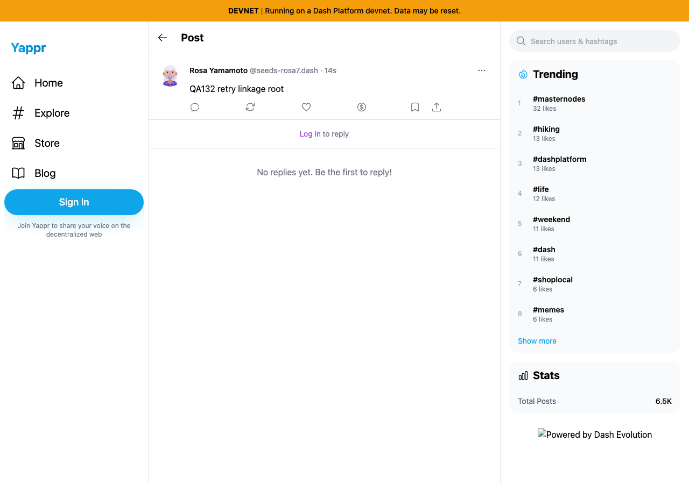
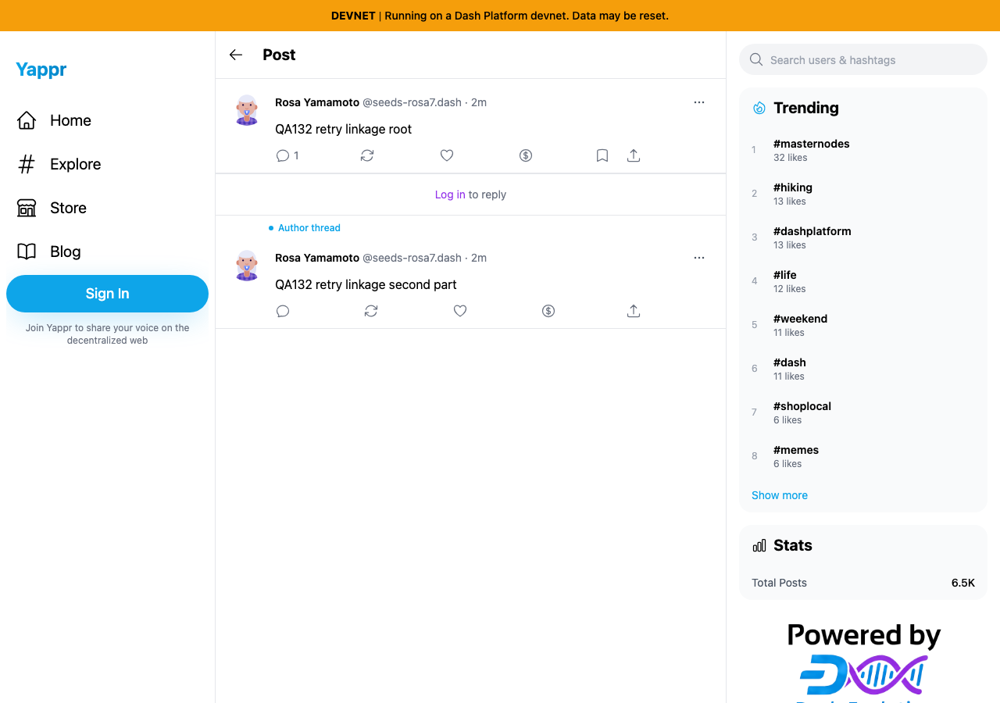
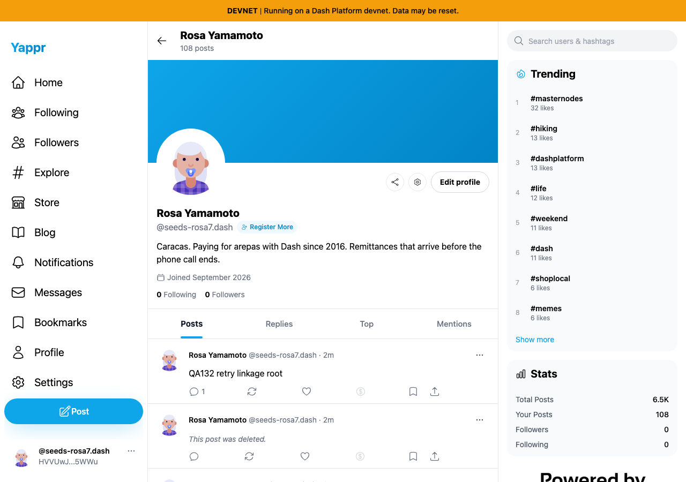

# Partial thread retries retain their confirmed prefix

Before: exact PR484 dependency head `87bdb83bbb98497d0f9354e6841ca067a763a8ec`. After: full signed fix head `c266ca13d163501ec4b7097b0489359f2f30c2a6`. This fix is stacked on PR484 so the ordinary explicit retry can recover its SDK transport before testing linkage. Separate committed devnet production builds verified by visible About revision.

Same QA persona55, same two-part text,1280×900 light Chromium. Each run used the actual visible identity/private-key login form. Credential entry was not captured. After the first broadcast delivered and confirmed, later broadcasts were aborted locally before delivery; requests were neither inspected nor modified. Both builds retained the second draft. Restoring transport followed by exactly one explicit Retry completed it; no offline/online cycle or automatic duplicate publication was used.

| Fresh guest reading original root after retry | Before | After |
|---|---|---|
|Thread linkage|||
|Owner's Posts tab|||

Before, the profile contains two separate matching top-level posts and the original root has no replies. After, the root has exactly one matching reply and the profile contains exactly one matching top-level root. Fresh guest contexts read these persisted documents. All four created documents were deleted through the owner's UI and their post/reply tombstones verified by fresh guest reads. IDs and transport counts are in the raw ledgers. Existing profile tombstones, relative times, aggregate counts and external footer-image loading differ naturally; they are not claimed as changes from this fix.

The after harness initially waited for `post-created`, while the corrected behavior emits `reply-created`. Readback continued against the already-created reply without another publication. Its first cleanup assertion also expected post wording for a reply tombstone; fresh reads checked the correct reply wording. Both harness corrections are explicitly retained in [after results](after-results.json); [before results](before-results.json) retain the original defect. Neither timeout was an application failure.

Validation: three added regression cases fail without the linkage fix and all six publish-thread cases pass afterward. Four added cases cover resume after root, resume after previous reply, unconfirmed-prefix gating and unaffected fresh publication. The stacked full suite passes281 tests; targeted ESLint, TypeScript, committed devnet production build and independent review pass. The rebase from cf0 onto the SDK fix is patch-identical by range-diff. Four final original PNGs inspected, unaltered. Two explicitly identified detail crops use rectangle (275,40)–(930,440) from the full root screenshots so the PR comparison is legible. The original screenshots remain above. SHA256SUMS records published bytes; public verification and rendered comparison follow publication.
