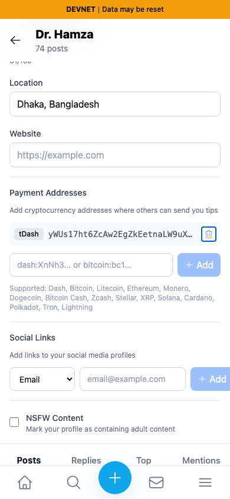
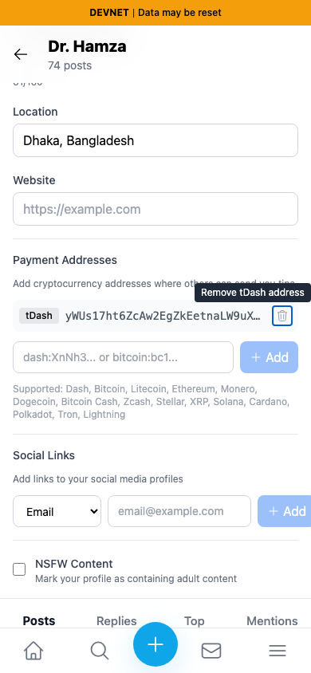
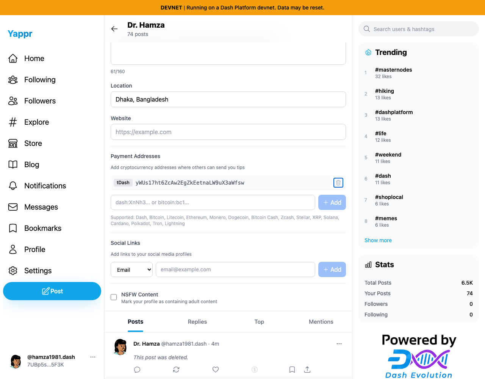
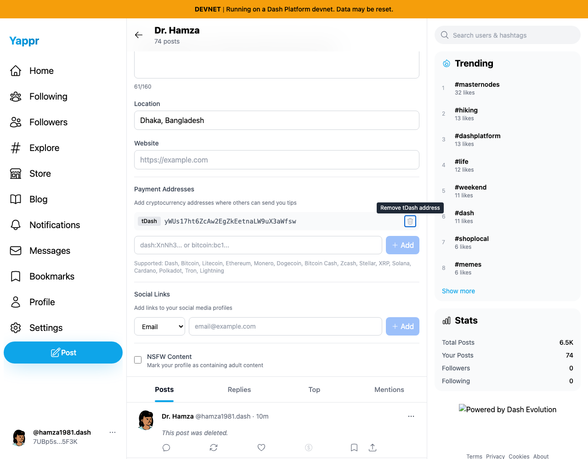

# QA126: payment-address-remove-labels

Before exact base: `cf0efbc10b8757137063113ebbd2061e8b87d8f7`. After full PR head: `87fd79b76a9e86c97707b6246323ff43338d35bb`. Each revision built independently with `npm run build:devnet`, with actual `.next/BUILD_ID` matching its source prefix; source worktrees clean. Shared devnet contract data, Chromium fresh contexts, light theme, desktop1280×1000/mobile390×844. Existing persona72 / `hamza1981.dash`, identity `7UBp5sw8GBwMriinMNyKGV9nPHsCfxovgCNwRBjY5F3K`. Authentication context restored from the dedicated QA fixture; this is not login-ceremony evidence.

Public draft URI: `tdash:yWUs17ht6ZcAw2EgZkEetnaLW9uX3aWfsw`, an address already present in repository validation tests. No payment was sent and the draft was cancelled each time; reopening confirms zero saved payments. The second keyboard-removal control uses public QA address `yWMS6SqGyzUxRHp4jDPsdPDRWRB2Q8grGN`.

The same removal button is keyboard-focused. Before has no accessible name or tooltip; after visibly shows Remove tDash address. Browser assertions verify the full URI-specific accessible name and Enter/Space targeted removal.

All final PNGs were opened and inspected at original resolution. Desktop overview has unrelated live notification/time/external-logo differences; these are not claimed as fixed. The QA125 desktop-focus images are identical-region unscaled crops of the full desktop screenshots. QA126 uses the full desktop screenshot to keep its tooltip entirely visible. Mobile addresses naturally truncate; the desktop and this index provide full identity. JSON check records substantiate nonvisual behavior rather than pretending screenshot pixels prove accessible names.

Validation: targeted ESLint, TypeScript and production build passed. Exact same draft actions run on before and after; empty/whitespace input, exact duplicates, trailing-space duplicates, second distinct row and leading/trailing duplicate handling checked for QA125. Native keyboard Enter/Space removes only its named row; empty list and Cancel/reopen checked for QA126. No product fixture or visual instrumentation changes were committed. Independent actual-diff review completed.

| Before — exact base | After — full PR head |
|---|---|
|  |  |
|  |  |

SHA256SUMS records every published capture and check record. Immutable artifact commit URLs are linked from the respective PRs after upload verification.
