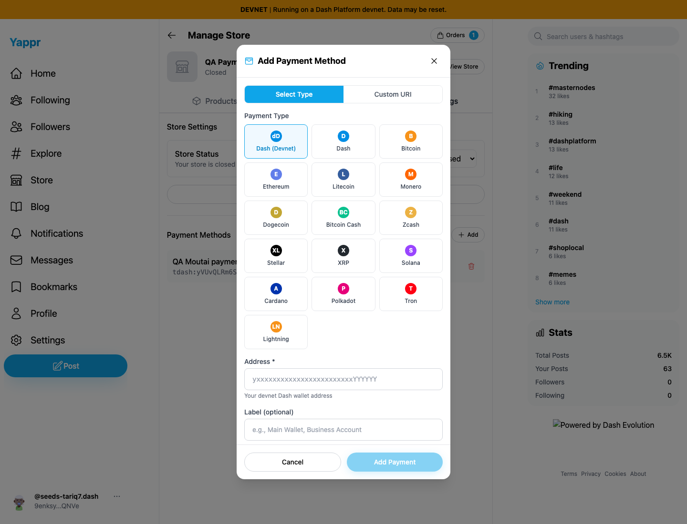
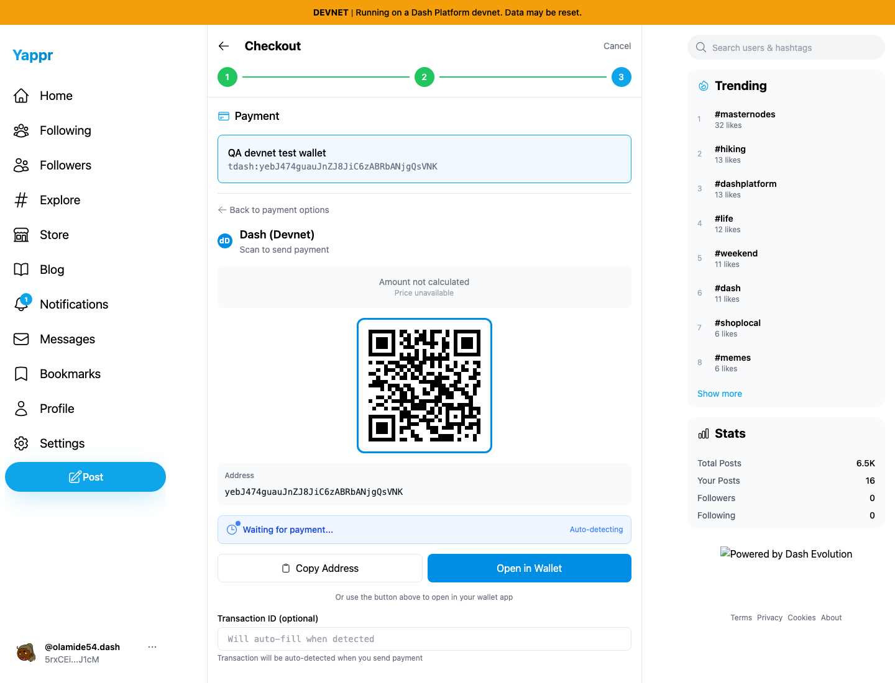
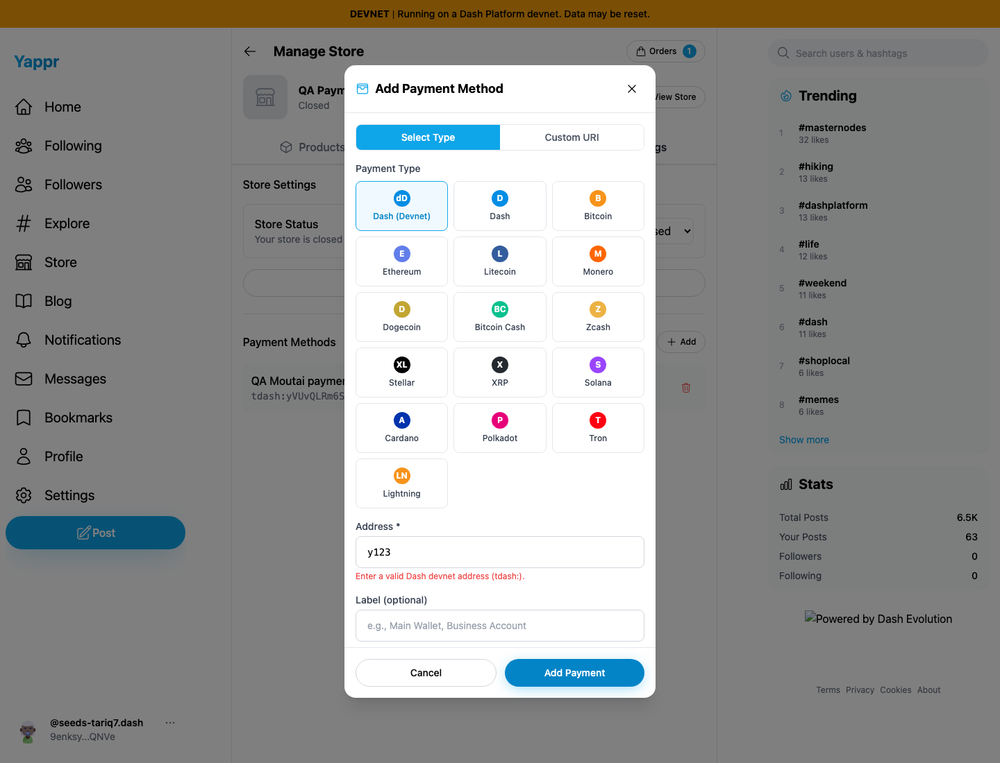
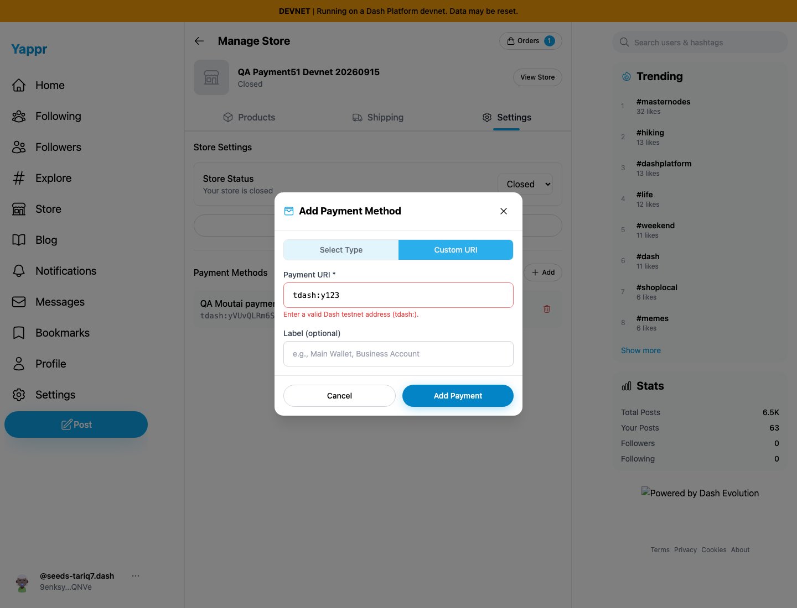
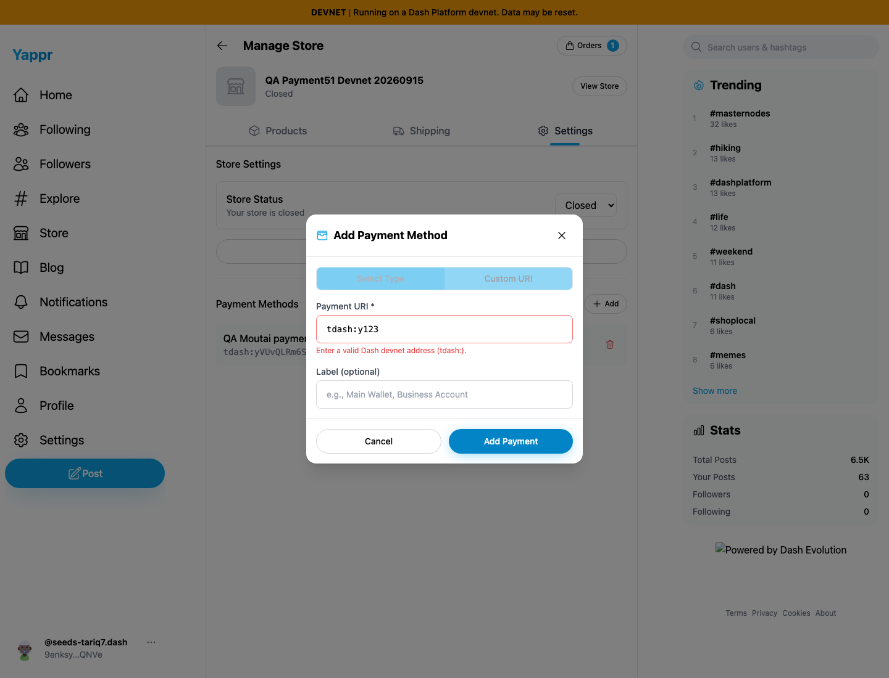

# Devnet payment network labels (QA76)

A devnet `tdash:` payment is watched on Moutai but labeled **Dash (Testnet)**. The seller setup also asks for a testnet address and calls validation errors testnet errors. The fix derives its shared network label from the same scheme/deployment mapping as the payment watcher. Devnet now uses **Dash (Devnet)** and **dD**, with matching address hints and errors; testnet retains Testnet/tD and mainnet `dash:` remains Dash.

Exact before: `c98a6ecd7e26ae5bc9fc8e400e6011eb8465b3a0`, port3260. Exact full head: `fe9c159b2260bbc2f573261c8372f1d471ed01c7`, port3282. Separate devnet builds, unchanged Node static adapter, Chromium1440×1100, fresh browser contexts from the same dedicated QA login fixtures. No DOM, payment response, or order data was mocked.

Shared fixtures:

- Seller persona51 opens an **unsubmitted** Add Payment Method dialog for closed store `GJdJn1iWx9CdtqRXetwa39Kkr3ZG2fBajQbcE1u6aJKr`. Its status remains Closed. The invalid `y123` and `tdash:y123` values only trigger existing local validation; nothing is saved.
- Buyer persona52 uses ordinary Add to Cart for quantity1 of existing product `6mp5PmmL7vU792PGEHC84VNy632gcFDo47c9qMpErD3E`, store `98FYBhEF9Q8xNzbamzy66Dm5cMQ5gm9MoAZaiy518sNp`, and advances to checkout payment review. No payment or order is submitted; no shared store inventory changes.

## Setup and QR comparison

| Before — exact base | After — full PR head |
| --- | --- |
|  |  |
|  |  |

## Local validation messages

| Before — exact base | After — full PR head |
| --- | --- |
|  |  |
|  |  |

All final screenshots were inspected at original resolution. The setup card control was initially targeted as a select in the capture harness; that locator was corrected before completing the comparisons. This was a harness correction, not a product issue.

## Compatibility and limits

Three automated deployment mapping tests cover devnet, testnet, and mainnet; mainnet `dash:` and Bitcoin display labels remain unchanged. Seventeen existing address-validation tests pass, including optional query parameters and network prefixes. Ordinary UI selection of the mainnet Dash card preserves its label and address hint. The underlying URI schemes, address rules, QR payloads, and payment watcher are unchanged.

The coin-value note also uses the shared network label. Its interpolation was verified in source and its label constant is covered by the deployment tests. **The coin-value note is not screenshot-covered:** clean staging's existing QA25 amount-calculation failure prevents that amount section from rendering for these DASH items. The earlier controlled USD fixture has no remaining products. The actual QR header comparison is still clean exact base/head; no PR432 integration is present. The unrelated Amount not calculated message remains visible and is not fixed by this PR.

Local exact-head devnet build, lint, mapping/address tests, diff whitespace check, and independent review pass. These are label changes only; this evidence does not establish external wallet interoperability or a new payment settlement pass.
