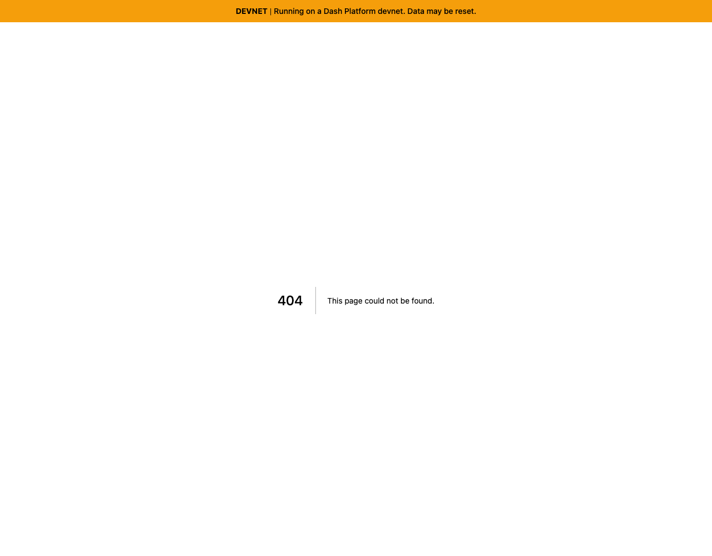
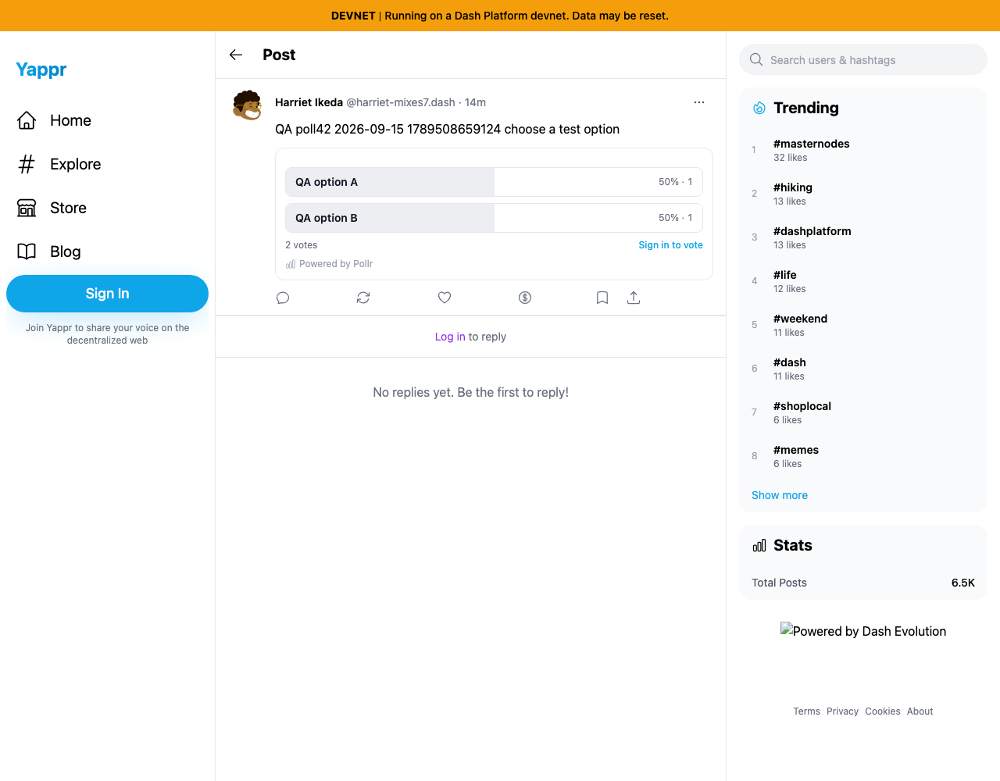
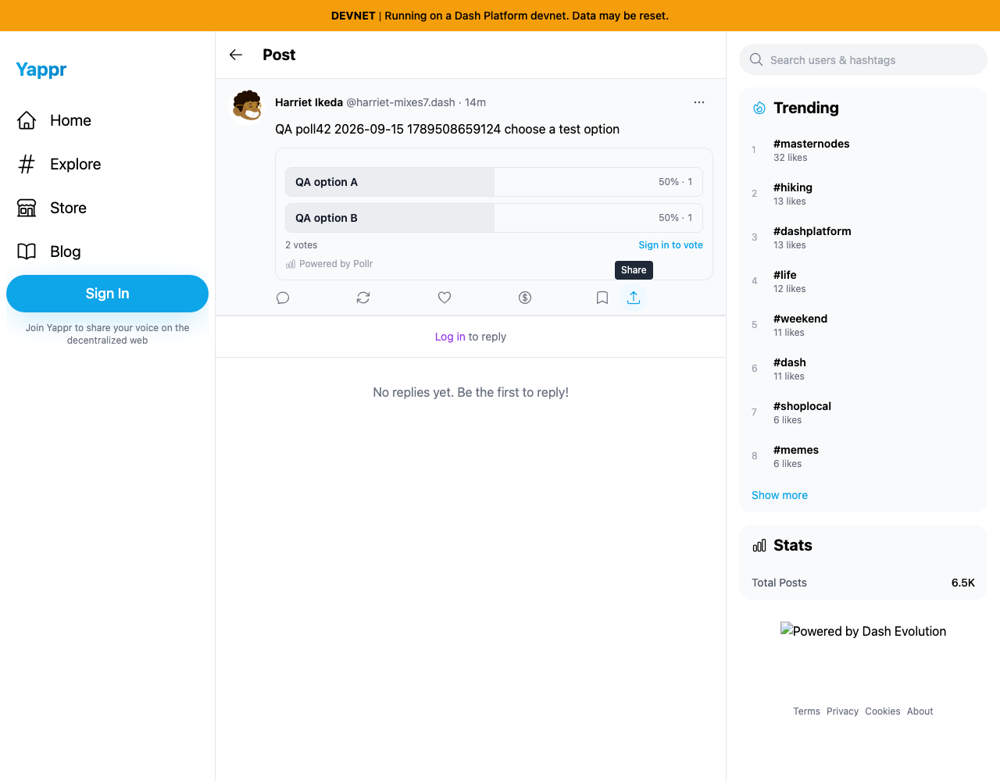

# Post Share keeps the deployment path

Before: exact staging `4105c5d1c914f5d0838619da93c3b8d28b4a780e`. After: full PR head `b125d3d2b97c723f17ac7932de63b94b8034311e`. Both were independently built with `npm run build:devnet` and served with the repository static server. No runtime product modifications or mocked responses.

The same real devnet poll post is used throughout: `Aey3uVJBpk7hEUi48zxRfZMavt3pQNeTdsUXkp4zppCd`, poll `DMN4Y5rkdCiFBUmhzgzizJbMFX6RpQaqLq4666Hc6aB3`. Fresh guest contexts, Chromium, 1280×1000, en-US, UTC. The public poll is a deliberately created QA fixture and remains available. Unrelated background seeding may change network counters; its two-vote state matches both captures. Relative timestamps advance during capture. Local server ports differ.

Click the actual Share button on this post, read the browser clipboard, then open that exact copied string in another page:

- Before clipboard: `http://127.0.0.1:3211/post?id=Aey3uVJBpk7hEUi48zxRfZMavt3pQNeTdsUXkp4zppCd` → HTTP404.
- After clipboard: `http://127.0.0.1:3226/devnet/post/?id=Aey3uVJBpk7hEUi48zxRfZMavt3pQNeTdsUXkp4zppCd` → HTTP200 and the same post.

The screenshots show actual rendered destinations; clipboard values and status codes are recorded in each `capture.json`. The404 is from the local static staging build. On a host that also serves a root deployment, the old link can instead enter that other deployment/network.

| Before — exact base | After — full PR head |
|---|---|
|  |  |
|  |  |

The source pair is included for context; no source-card visual change is claimed. The destination pair demonstrates the fix. All four images were inspected at original resolution. The pre-existing missing footer logo is outside this PR.

Validation: full devnet build, zero-warning lint and E2E TypeScript compilation pass. Actual clipboard/navigation smoke fails on baseline at missing `/devnet`, passes on committed head. Completed empty feeds visibly skip because no public fixture exists; loading/query errors do not skip. Root deployment fallback is covered by code review, not a root-build screenshot.
