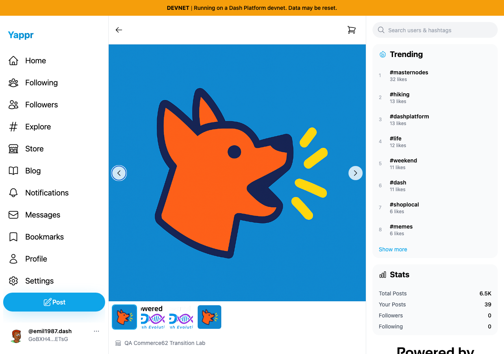
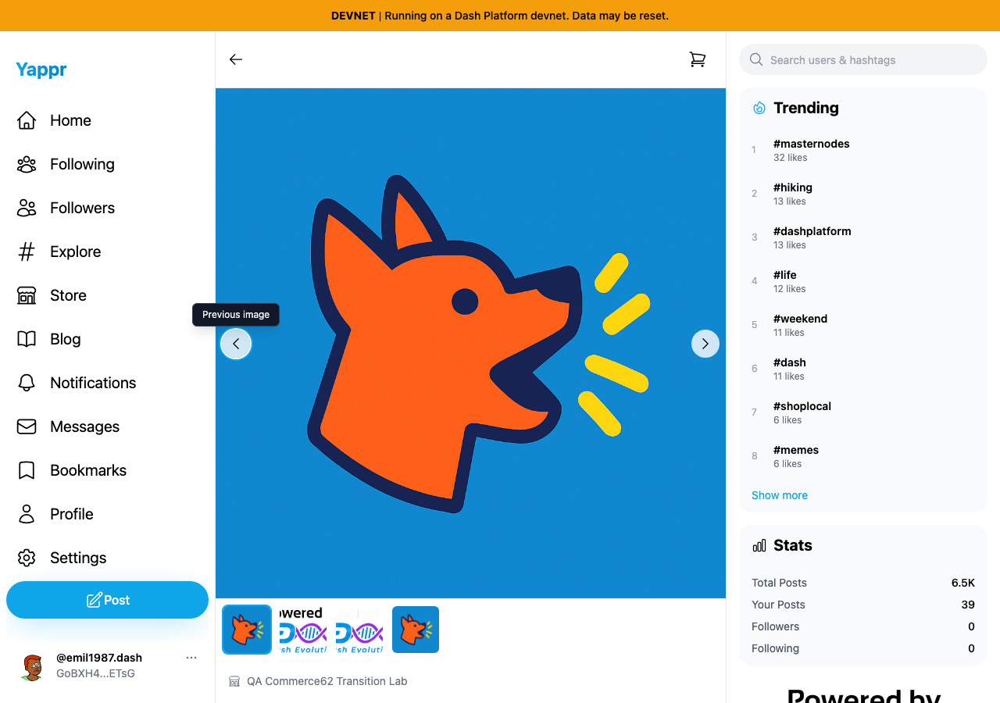
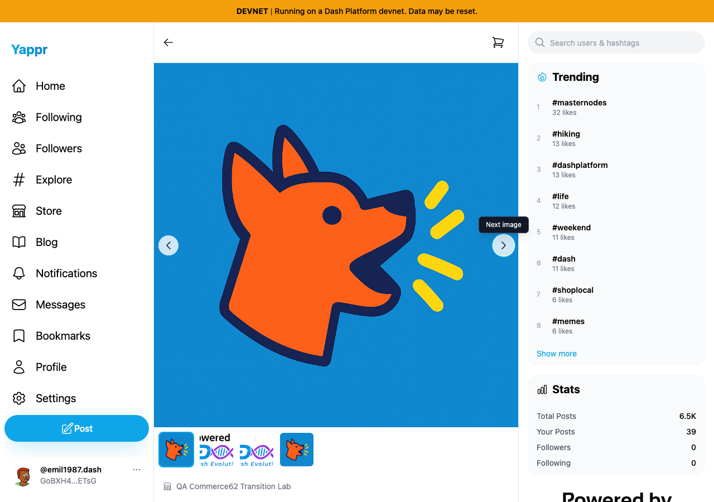

# Gallery arrow names and tooltips

Exact base `cf0efbc10b8757137063113ebbd2061e8b87d8f7`; full signed head `3e0df10afba08c081c39ea8eb9dfcbc8129bf1e0`. Independent committed production devnet builds, unchanged Python static adapter, Chromium, light theme. Same actual synthetic merchant62 store `CP3dEXrdMEbbiFNHakoRkC86DonfVftuzUyaY4ngrnQb`, product `GWgJbLzxK5XfyNnVNdy7k8fyiBmUziSTSRQ5XtkExCWK`, buyer63. Session seeding is not login evidence. No data write or payment in comparisons.

Previous image focus:

| Before — exact base | After — full head |
|---|---|
|  |  |

Next image focus:

| Before — exact base | After — full head |
|---|---|
|  |  |

Mobile focus compatibility:

Actual accessibility snapshots show unnamed base arrows and named head arrows. Enter/Space wrap in both directions; four Next clicks cycle to the original image; thumbnail3 selects the intended image. Mobile390px focus tooltip remains in bounds. Desktop pairs1280×900; mobile uses image3 and is explicitly a separate compatibility capture. All five final PNGs inspected at original resolution.

Targeted ESLint, full TypeScript, clean committed production devnet build and independent actual-diff review passed. JSON records actual procedural results; screenshots demonstrate focus/tooltips, not screen-reader speech.
