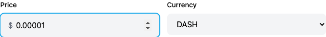
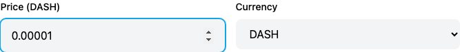
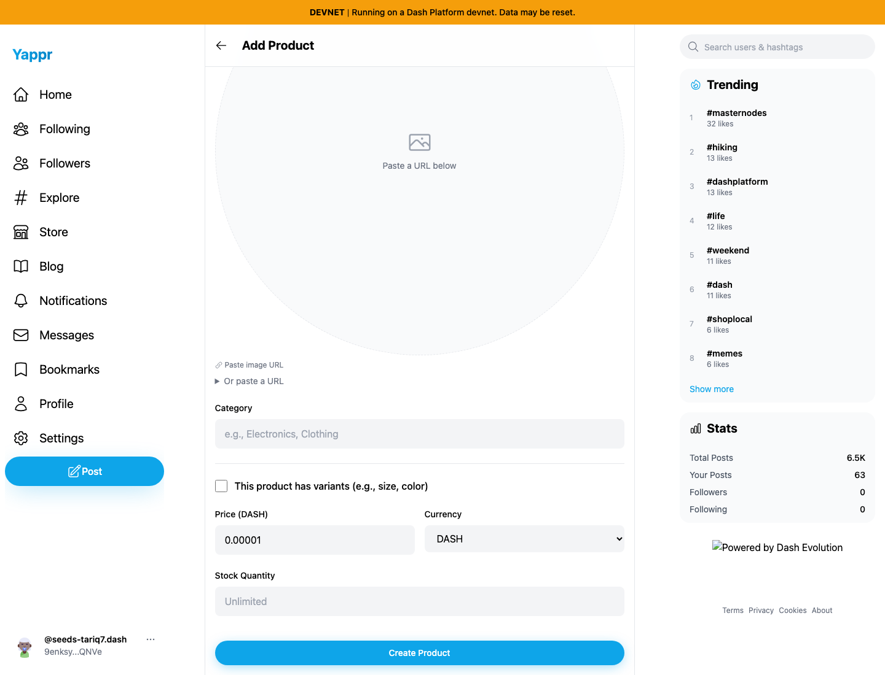

# Product price currency label (QA70)

The simple product price field hardcodes a dollar sign for every supported currency. Selecting DASH or EUR therefore shows a conflicting dollar amount beside that currency. The fix uses `Price ({currency})`, matching the existing variant-price table, and removes the dollar prefix and its unused wrapper/padding.

Exact base: `c98a6ecd7e26ae5bc9fc8e400e6011eb8465b3a0`, independently built and served at port 3260. Exact head: `0fa8e37b33a2b4fd63cb2a5b75d5c86ae7884671`, independently built and served at port 3271. Both use the unchanged Node static adapter with `/devnet`, Chromium 1440×1100, and fresh browser contexts for the same dedicated merchant persona51 and store `GJdJn1iWx9CdtqRXetwa39Kkr3ZG2fBajQbcE1u6aJKr`. Real devnet store data is read; the new-product form remains unsubmitted. No product or payment is created by these checks.

## Focused DASH comparison

These are direct browser element screenshots of the actual price/currency controls, with no image editing or injected UI.

Before — exact base, conflicting dollar prefix:

After — full PR head, explicit DASH label:

## Full page context and currency selection

| Currency | Before — exact base | After — full PR head |
| --- | --- | --- |
| DASH |  |  |
| USD |  |  |
| EUR |  |  |

Every final image was inspected at original resolution. The overview images preserve the Add Product header and show the entire price, currency, stock, and submit area. The unrelated oversized image placeholder is unchanged.

## Compatibility checks

Actual browser interaction selected DASH→USD→EUR→GBP→CAD→DASH. Every selection preserves the entered numeric value. The native input step remains 0.00000001 for DASH and 0.01 for the fiat currencies. The full head updates the label to the selected code and has no dollar prefix. USD is shown as `Price (USD)` for consistency. GBP/CAD are procedural checks recorded in result.json, not separate screenshot claims. No amount-conversion logic, submit behavior, or variant-price behavior changes.

Local exact-head devnet build, full TypeScript check, lint, diff whitespace check, and independent one-file review pass. This is a presentation-only change; no implementation-mirroring unit test was added.
