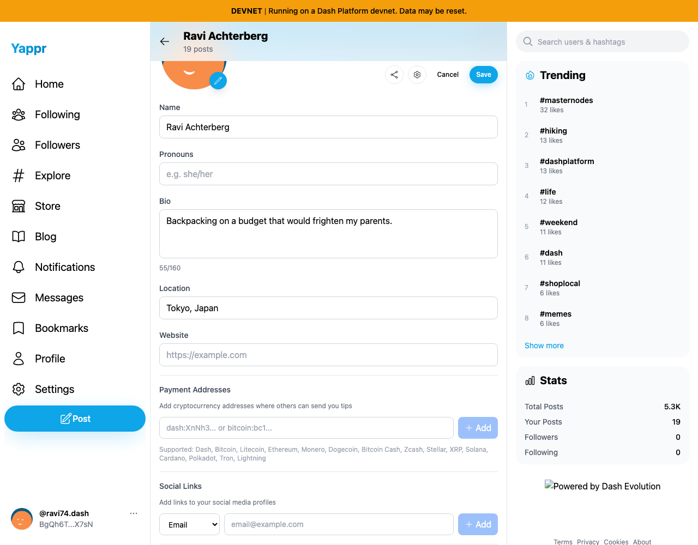
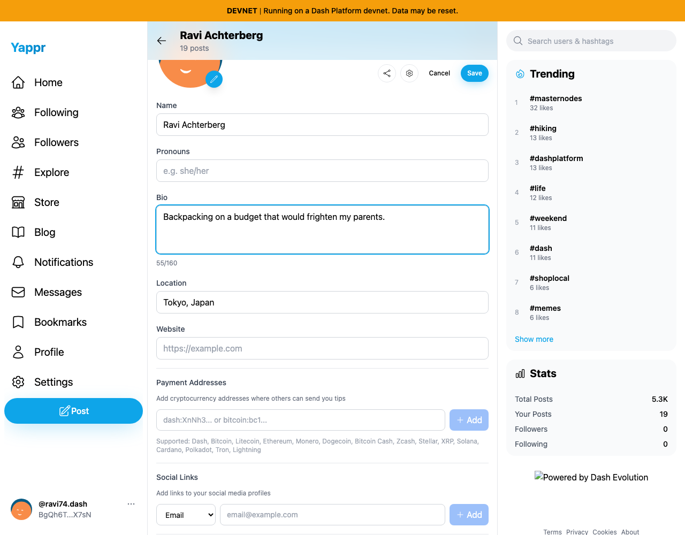

# Profile editor labels — exact base and committed fix

Before: `4105c5d1c914f5d0838619da93c3b8d28b4a780e` (staging). After: `e54f768df254d6eee0de9cbc4f8e7cf219579e15` (`fix/profile-field-accessibility`). Both are independently built production devnet exports; build IDs match source revisions. The same unchanged QA profile is opened in independent browser contexts on live devnet. No HTML, data, focus styles, or successful outcomes are synthesized.

Identity `BgQh6T8KCWL99TqasQV6f3pm24hzbVQux1dUhZ2bX7sN` (`ravi74`, Ravi Achterberg). 1280×1000 Chromium viewport, light theme, scroll y200. Open own user page, click **Edit profile**, then click the visible **Name** or **Bio** label. Before: no focus ring because the label has no associated control. After: the native application focus ring appears on the intended input/textarea. No typing or Save action occurs; Cancel closes both runs.

| Behavior | Before — exact base | After — full PR head |
|---|---|---|
| Click Name label |  |  |
| Click Bio label |  |  |

All four screenshots were opened and inspected at original resolution. The blue focus rings are actual rendered UI. `comparison/*/assertions.json` covers all five fields: before, Name/Bio/Location are unnamed and Pronouns/Website fall back to placeholder names; after, their names are Name/Pronouns/Bio/Location/Website, and each label focuses its field. Field values are identical between captures. These accessibility-tree assertions cover the nonvisual name changes; screenshots demonstrate two representative label activation results.

`provenance.json` includes exact revisions, build IDs, fixture, checksums, and known unrelated footer asset/global-statistics differences. `matrix.md` records the evidence plan. Local production build, full lint, E2E TypeScript checks, live browser assertions, and independent source review passed.
