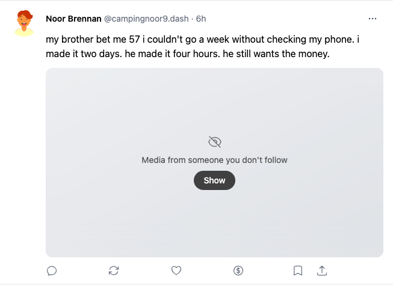
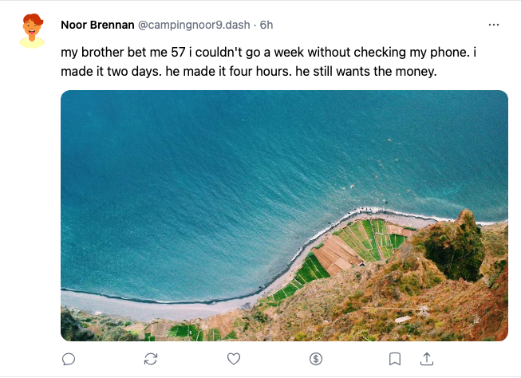
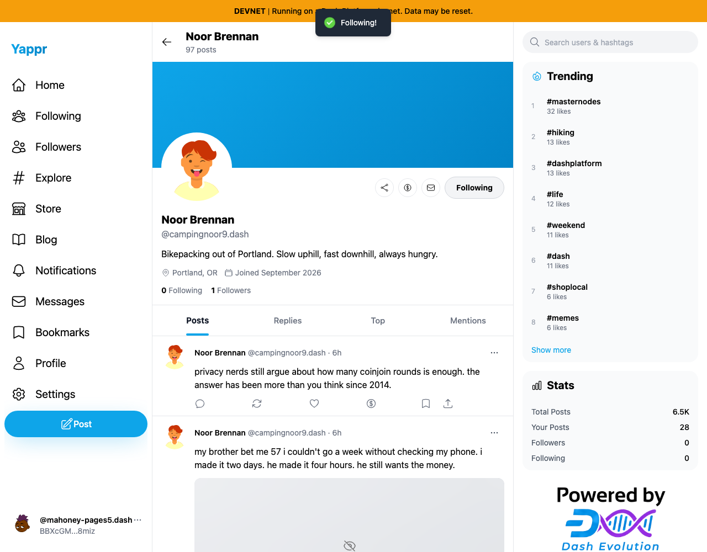
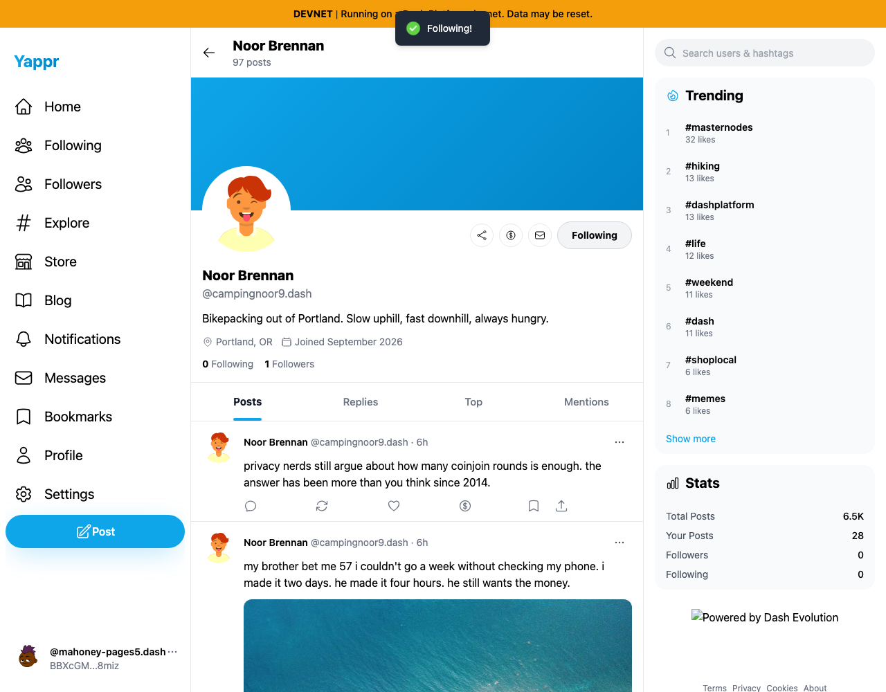

# QA106: mounted profile media follows the confirmed relationship

Exact base: `cf0efbc10b8757137063113ebbd2061e8b87d8f7`, independently built devnet export on port 3288. Full PR head: `4759d05e82c40008b9a03766ebed3c07ce27227d`, built after the signed commit and served on port 3320. Both runs use Chromium, light theme, 1280×1000, default enabled non-followed media gating, and `/devnet`. Source worktrees were clean at capture.

Shared fixtures: viewer persona 66 Nils Mahoney `BBXcGMZay7ZN6r71CK14VaGxwDn6CJCQcvFgrFpg8miz`; author persona 67 Noor Brennan `HMqf6LRJ4uxwjQqNYdJXrENQNFSuLbB91hfj7j8zy8P3`. Both start not following in separate disposable browser contexts. The ordinary profile Follow action is awaited through its completed Following! toast before capture. Sessions are supplied by the dedicated QA harness, so this is not a login test. No follow response, image response, or post is mocked.

The exact same existing posts are mounted before Follow:

- `DBBQWxCPSQbrWW2oNBQGCTmE2FNfToy47GS3yTFCBPpS` (pictured), image `https://picsum.photos/seed/street268/1000/750`.
- `3ASQZnn539Upiwr6fD62YrhmnhU1gmmTbGszJ5paSfDT` (second mounted-card assertion), image `https://picsum.photos/seed/lighthouse728/900/900`.

| State | Before | After | Visible delta |
| --- | --- | --- | --- |
| Confirmed profile Follow | Following button and success toast | Same confirmed relationship | Compatibility unchanged |
| Already-mounted post media | Says author is not followed; Show required | Actual media visible immediately | Gate responds to confirmed follow |
| Confirmed Unfollow | Mounted media gated | Mounted media gated | Privacy gate restored |

## Same post after Follow succeeds

| Before — exact base | After — full PR head |
| --- | --- |
|  |  |
| [Full-resolution page overview](before/media-overview.png) | [Full-resolution page overview](after/media-overview.png) |

These are direct full-card screenshots, not composites or edited UI. The same content and card framing are retained. The Follow button and success toast are shown below to establish that both actions completed:

| Before — exact base | After — full PR head |
| --- | --- |
|  |  |

The main delta is also visible in the [base overview](before/media-overview.png) and [head overview](after/media-overview.png). The externally loaded footer logo differs between runs; it is unrelated to this change.

[Result metadata](result.json) records both mounted cards: base gate=1/image=0; head gate=0/image=1. After ordinary Unfollow, both cards return to gated state on both revisions. The original not-followed relationship was verified after reload and from fresh browser contexts following each run. No posts were modified.

Type checking, full lint, production build, and independent source review pass. The three-line cache integration is covered by the actual two-card Follow/Unfollow/reload flow rather than a unit test mirroring the implementation. The cache is updated only after a successful service result; failures retain the old state. All six final PNGs were opened at original resolution and visually inspected. No keys or authentication state are published.
