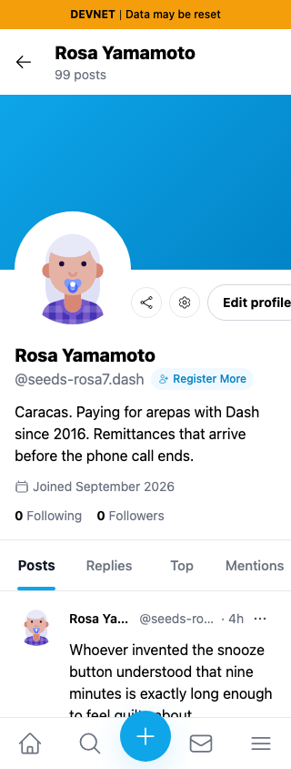
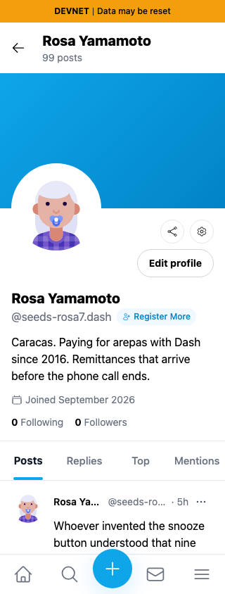
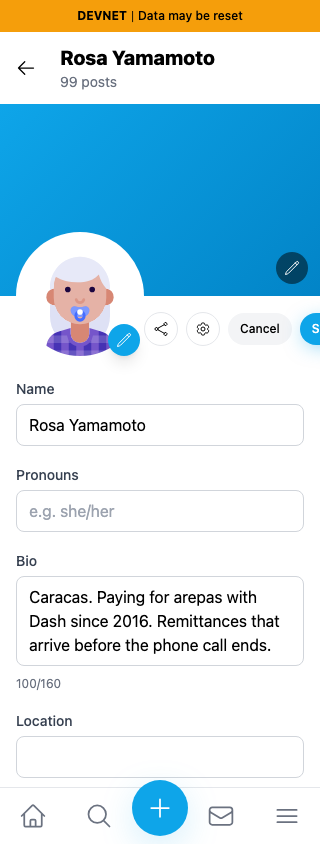
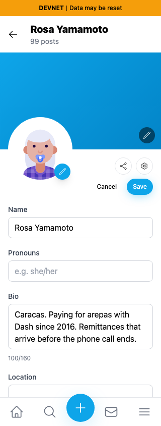
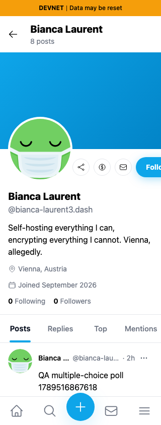
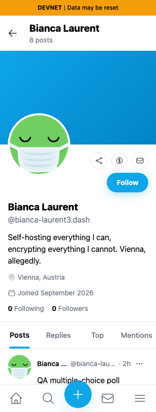

# Profile actions fit narrow screens

Exact base `733faf53cd893cba861476a4af75b442ed67ca72` and full head `29f8abe2305a0b53c5f3d549c761e2072f45c0aa`, independently built with `npm run build:devnet`. Fresh Chromium contexts, light theme, same real persona55 (`HVVUwJLhEngLH5LkZx8FgUkcso28xK7tn5gaaHke5WWu`, Rosa Yamamoto). The helper seeds a scoped QA session; this is not login evidence. No CSS, DOM, clipboard value or API response injection.

At320px the original Edit profile, Save and Follow controls extend outside the viewport. The final layout wraps actions beside the unchanged128px avatar. The guest comparison visits persona57, Bianca Laurent (`A48nBj6ncVpDHrCdx84uaqSRtHR3p6ZuwdqLXfgbEpRW`).

| Surface | Before — exact base | After — full head |
|---|---|---|
| Own profile |  |  |
| Editing |  |  |
| Another profile |  |  |

Browser assertions: all visible header controls fit320/390/1280px;390/1280 measured geometry matches base. Save right edge351.39→304px; Follow354.63→304px. Unsaved Name edits were canceled and reopening restored the original value. No profile/follow writes were submitted. The bottom portion of the profile form has a separate Social Links overflow fix in#477; this PR only changes header layout. Relative post times can advance.

Lint, TypeScript, exact committed production build and independent source review passed. All6final PNGs inspected at original resolution. Initial diagnostic injected CSS and earlier nested-wrap captures are excluded.
