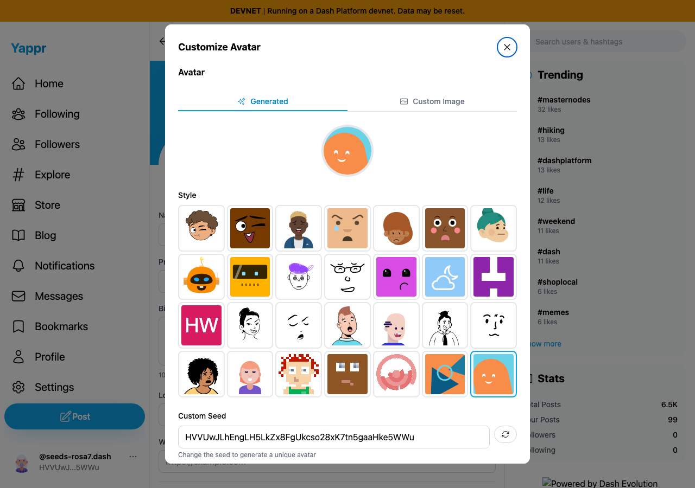
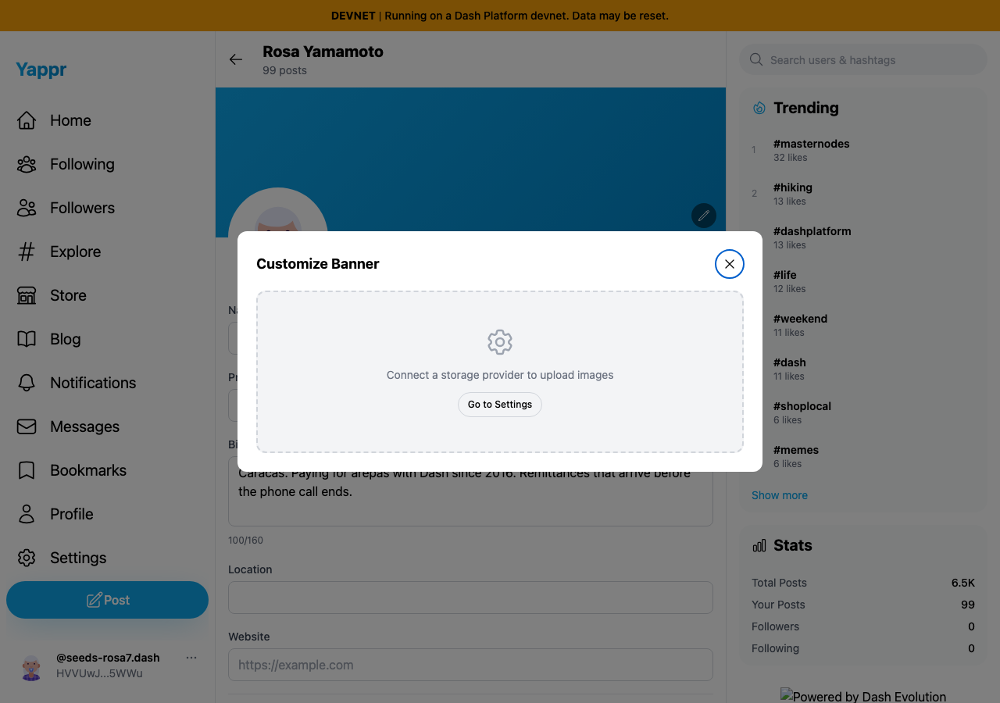
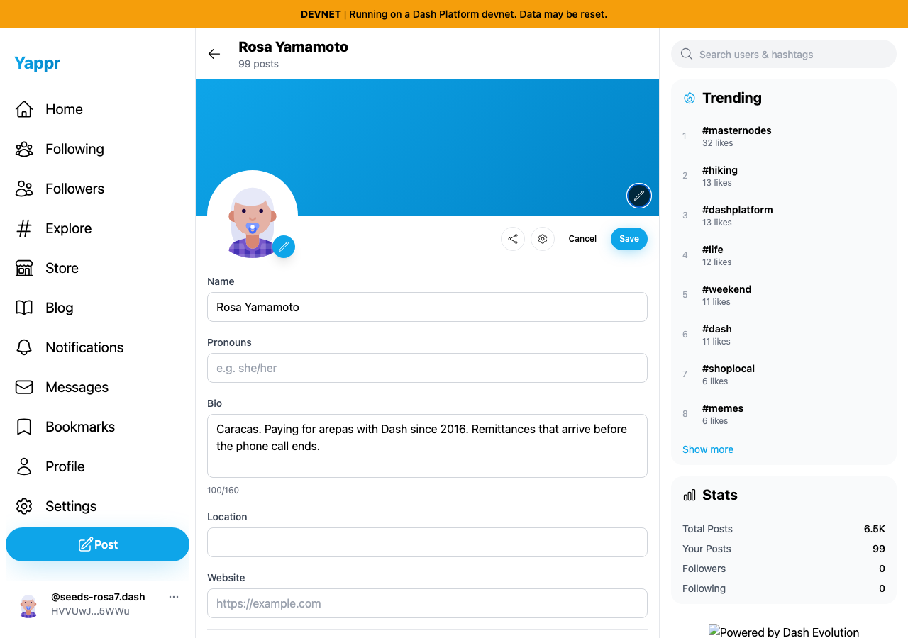

# Avatar and banner dialog keyboard behavior

Exact base: `c98a6ecd7e26ae5bc9fc8e400e6011eb8465b3a0`. Full head: `237ea1f65958b3dc1b01644703c1cd2e7e021541`.

Separate committed production devnet builds served at ports3260 and3268. Same seeded QA profile `HVVUwJLhEngLH5LkZx8FgUkcso28xK7tn5gaaHke5WWu`, fresh Chromium contexts,1280×900, light theme. Scoped test sessions were provisioned using existing QA keys; this is not login-ceremony evidence. No profile save or upload was performed.

Each screenshot follows opening the named editor, keyboard focus checks, then Escape with focus on Close. Scroll was returned to the same page origin before capture. All four final PNGs inspected at original resolution. Both base editors stay open; both head editors close and focus their original pencil buttons.

| Surface | Before — exact base | After — full PR head |
|---|---|---|
| Avatar after Escape |  |  |
| Banner after Escape |  |  |

JSON assertions separately verify named dialogs and keyboard focus. Forty forward/reverse Tab presses per editor escaped the base avatar8/40times and banner38/40times; the head escaped0times in both directions. Head Close and backdrop dismissal return focus; editors reopen. Mobile avatar panel remains within a390px viewport at left16/right374on both revisions. The underlying profile form has the same pre-existing396px document width on both; this is not a mobile-page-width fix. Chromium focus restoration is verified; other browsers/device input methods remain untested. Plan items not present in JSON, including unsaved-value preservation, are not claimed as executed.

Full ESLint, TypeScript and a clean sequential committed devnet build passed. Independent source review approved. The local base-path-only static server omits root footer branding; this is a capture-server limitation.
