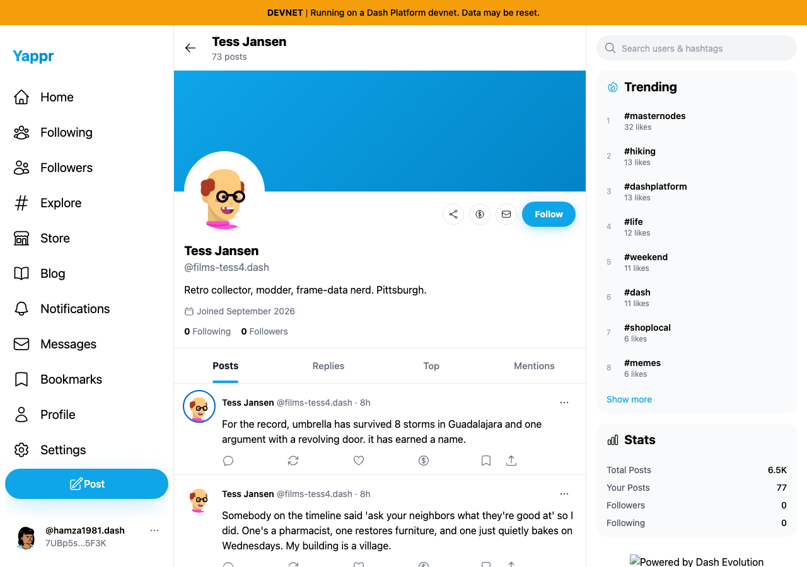
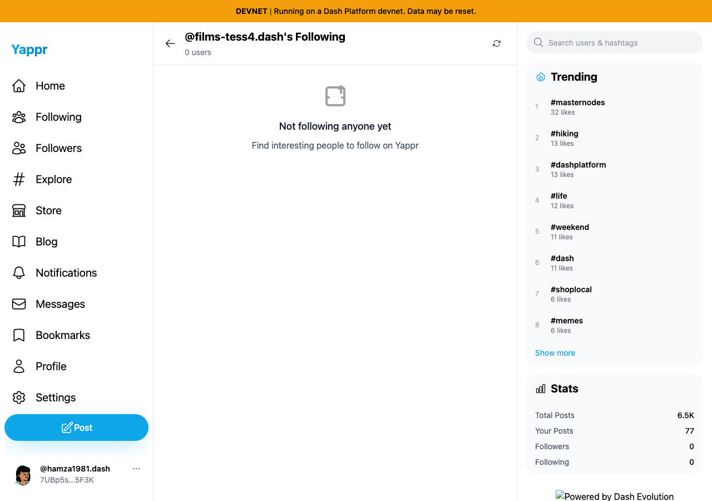
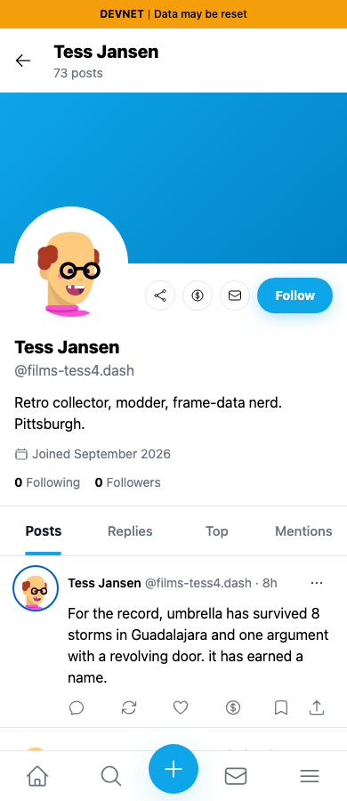
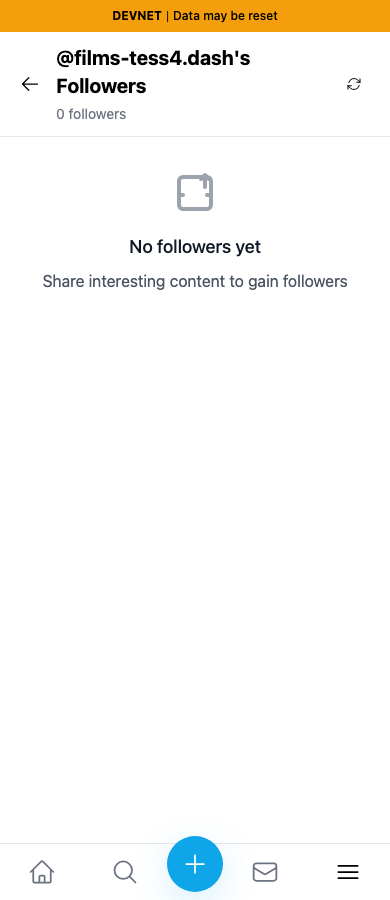

# QA130 — Profile preview connection links

Exact base `044abe7237c0f314fa847e37e75f7f4ba5227cb63` (#528); full head `df37612311b75dc9619a7f6a78d02b978664dc5f`.

At 1280px and 390px, keyboard-open profile previews used the same persona72/profile target. Before, Following/Followers links stayed on `/user/?id=...&tab=...`, which the profile page ignores. After, links navigate to the matching `/following/?id=...` or `/followers/?id=...` page and show the correct empty-state/list heading. No follow writes.

| State | Before — exact base | After — full head |
|---|---|---|
| Following, desktop |  |  |
| Followers, mobile |  |  |

All eight final originals were inspected at original resolution; JSON records href/destination/heading at both widths and both links.
