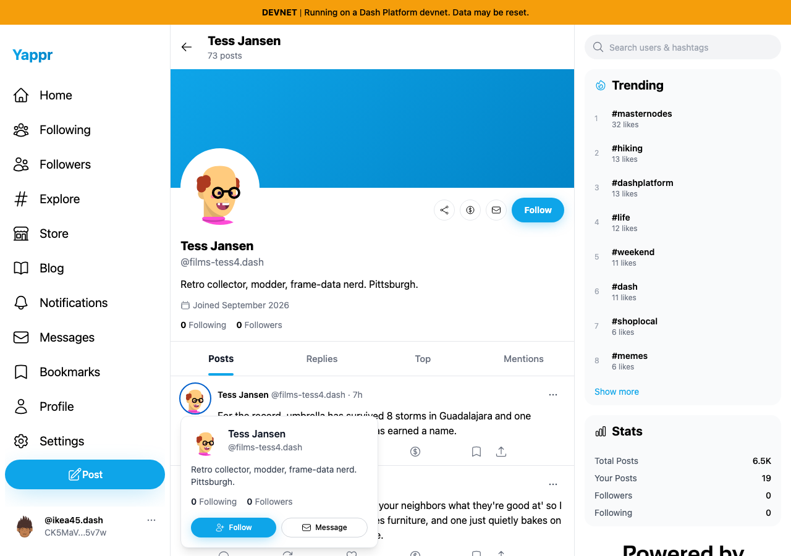
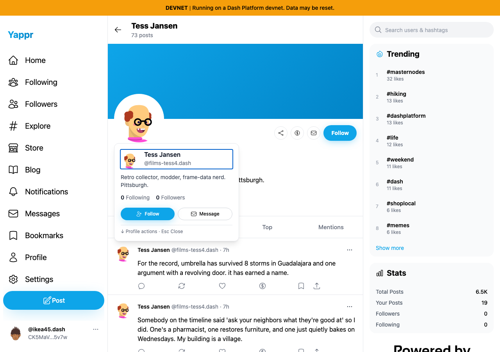
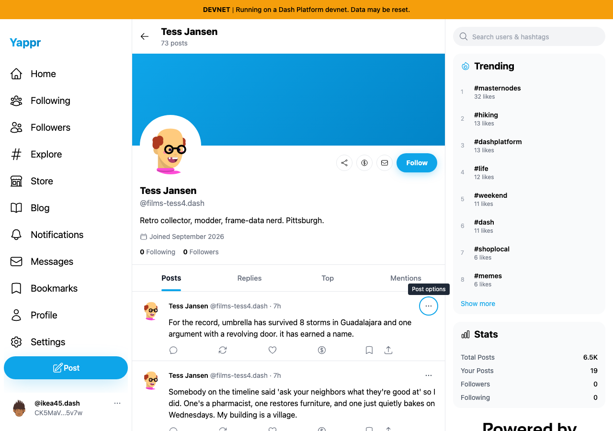
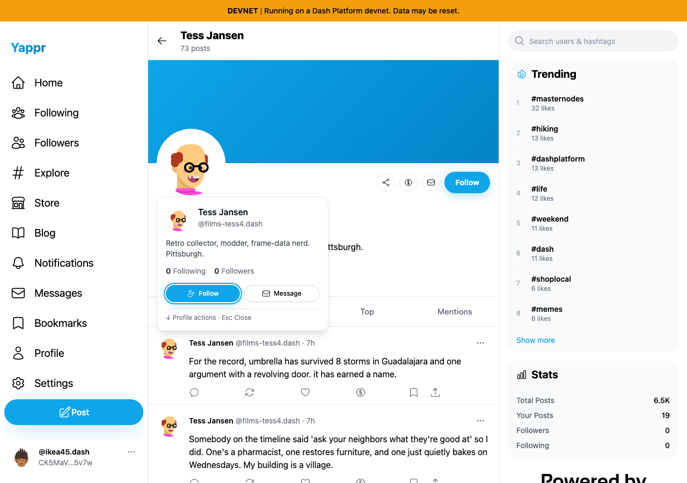
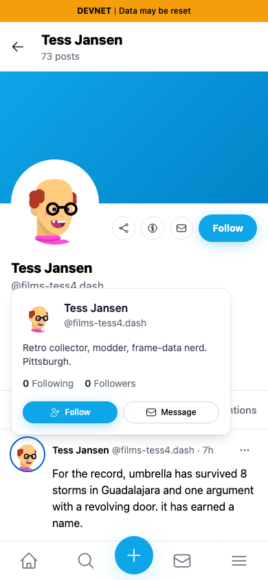
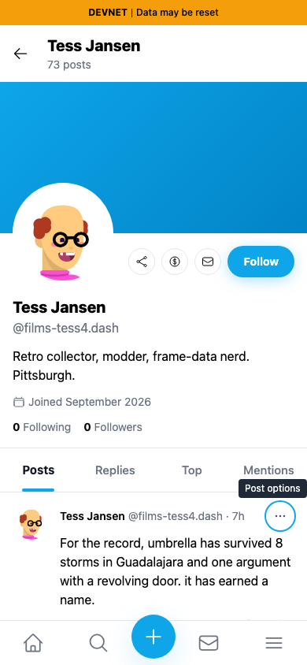
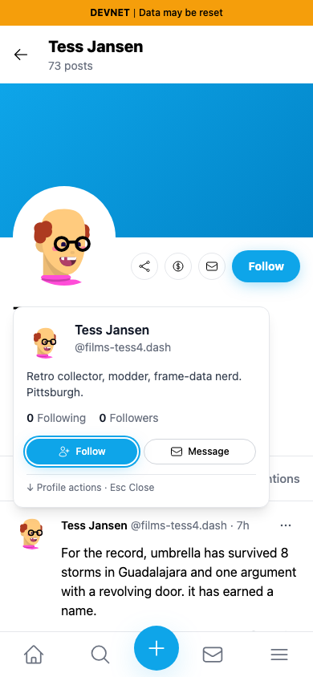

# QA131 — profile preview keyboard access

Before: exact staging base `cf0efbc10b8757137063113ebbd2061e8b87d8f7`.
After: signed full head `044abe7237c0f314fa84737e75f7f4ba5227cb63`.
Both independently built as production devnet exports. `provenance.json` records matching source heads, local build IDs, and build IDs read from the actual served HTML.

## Shared fixture and framing

Both sides use the same live seeded devnet account 76 (`CK5MaVdcXa6Hs6i3bKFEoTwSEHpV6hkqXLFeDfmT5v7w`), same Tess Jansen profile (`7q9PdfjVLCZbcLb8wDdExUCokYSdi9Gu251Fqne2jNv9`), and same post (`Dr7Rkro6c4rp4BupbMHA5iXoKrSDtBqCTifWn9PioSrm`). Fresh browser contexts, Light scheme, 1280×900 or 390×844. The authentication session is seeded; these are not login-flow evidence. The article responses and DOM are not mocked or modified.

The ordinary post avatar link is focused, then ArrowDown is pressed. For the Follow pair, three additional Tabs are pressed. Before each screenshot, page scroll is returned to zero on both sides without changing focus, keeping the page framing equal despite the base's default ArrowDown page scroll. Each JSON records the actual focused element. The new instruction row makes the popover taller and its placement adjusts around the same anchor.

| State | Before — exact base | After — full PR head |
|---|---|---|
| Desktop: ArrowDown leaves focus on avatar before; enters the profile link after |  |  |
| Desktop: three Tabs skip to Post options before; reach Follow after |  |  |
| 390px: ArrowDown focus ring and visible instructions |  |  |
| 390px: three Tabs skip the preview before; reach Follow after |  |  |

## Functional checks

- Actual final committed build: Profile→Following→Followers→Follow→Message focus order; forward/reverse looping uses standard Radix Popover behavior. Escape exits and returns to the trigger; Tab does not leave this explicit interaction mode.
- Loading first focuses the named dialog; first Tab after data arrives enters its profile link. Verified at 1280×900, 390×568, 320×568.
- Escape from both trigger and content closes without reopening. Outside focus dismisses without stealing focus. Moving the pointer away does not dismiss a keyboard-focused preview.
- Pointer hover opens without autofocus; moving into controls retains the preview; leaving closes it. Normal Enter and modified-click primary profile navigation remain functional.
- Guest Follow prompts sign-in; own-profile previews omit Follow/Message.
- Ordinary keyboard Follow 76→77 persisted after reload; keyboard Unfollow persisted and restored target 77 to 0 followers; Message opened the intended conversation route. Account 77 is `9GmFToc9UiCYUz9aULocqsw1AKB1DdZsqo8ibzwWvTgL`. This mutation check ran against the same source tree before its committed rebuild; final-head read-only lifecycle checks were then repeated.
- Target ESLint, full TypeScript, knip, 17 relevant follow/profile-link unit tests, and committed production devnet build passed. Independent actual-diff code-review-validator APPROVED. Code-simplifier found no additional safe abstraction; unused HoverCard wrapper/dependency were removed.

JSON results and capture script accompany the images. Existing wrong Following/Followers destinations are tracked separately as QA130; this fix preserves their current hrefs and only enables access to the controls.
