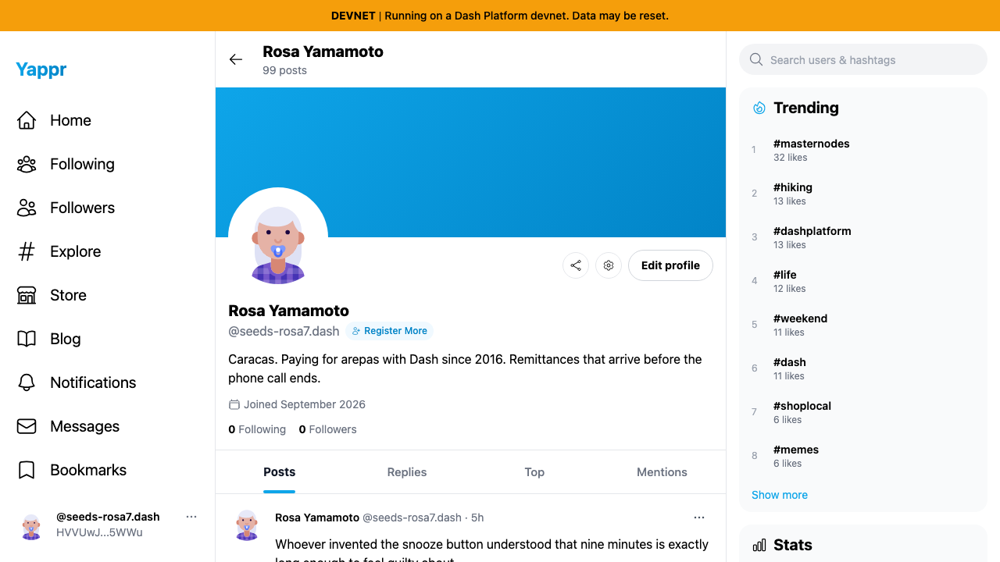
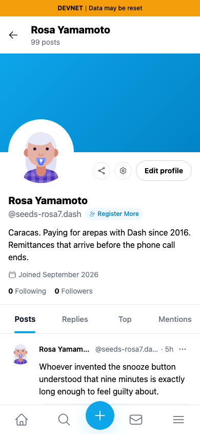

# Copied profile links preserve the deployment

Exact base `733faf53cd893cba861476a4af75b442ed67ca72` and full head `a265c2630158f5d4f40c5441733aa03c3da217bf`, independently built with `npm run build:devnet`. Fresh Chromium contexts, light theme, same real persona55 (`HVVUwJLhEngLH5LkZx8FgUkcso28xK7tn5gaaHke5WWu`, Rosa Yamamoto). The helper seeds a scoped QA session; this is not login evidence. No CSS, DOM, clipboard value or API response injection.

The normal Share profile button populated the actual clipboard, then a fresh tab opened that string unchanged. On the local/devnet mount the original `/user?id=...` returned404; the corrected `/devnet/user/?id=...` returned200 and the same profile. Rootproduction fallbacks are preserved by the empty base-path expression; screenshots coverdevnet.

| Viewport | Before — exact base | After — full head |
|---|---|---|
| 1280px |  |  |
| 390px |  |  |

Actual clipboard URLs and response status are recorded in before.json/after.json. Different local ports distinguish independently served builds; no URL was repaired by the harness. No profile writes. Lint, TypeScript, exact committed production build and independent source review passed. All4final PNGs inspected at original resolution.
