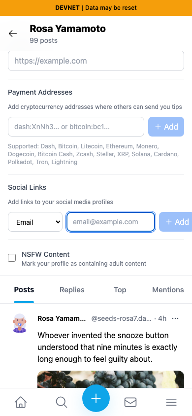
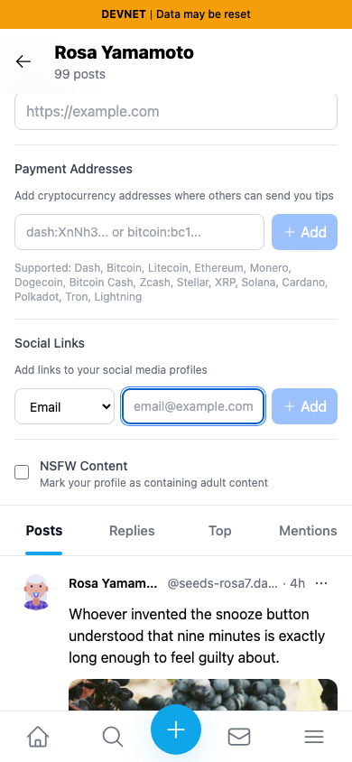
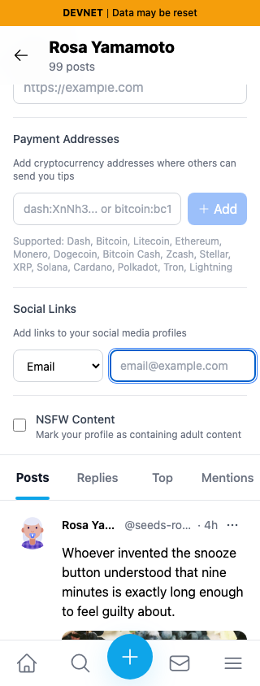
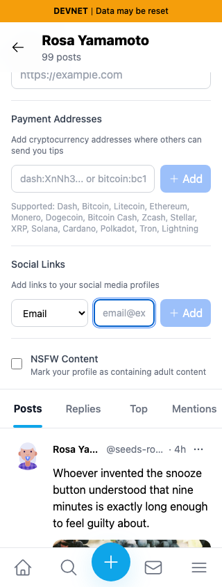

# Profile social-link controls on small screens

Exact base `c98a6ecd7e26ae5bc9fc8e400e6011eb8465b3a0`; full head `1f336e3733164cc3976fc0b2c370e829b43e33ce`. Separate committed devnet builds at3260/3274; same seeded persona55 profile `HVVUwJLhEngLH5LkZx8FgUkcso28xK7tn5gaaHke5WWu`, light Chromium contexts and focused empty email field. Same field top430px framing. All four final screenshots inspected at original resolution.

The base social Add extends to396px: partly clipped at390px and wholly offscreen at320px. Head Add ends at374px/304px, inside each viewport. The flexible input can shrink instead of forcing its neighboring button offscreen.

| Viewport | Before — exact base | After — full PR head |
|---|---|---|
|390px|||
|320px|||

JSON contains exact measured bounds. Desktop1280px compatibility passed; entering/clearing a valid email draft enables/disables Add. No profile save or email message occurred. At320px, a separate pre-existing header Save control still expands document width to351px; this PR only fixes the social row. At390px document width is corrected396→390. That separate header issue is QA78.

Full lint, TypeScript, committed production devnet build and independent source review passed. An initial broad320pxdocument-width assertion identified the separate header issue and was narrowed to the actual changed row, with the outstanding overflow disclosed here.
