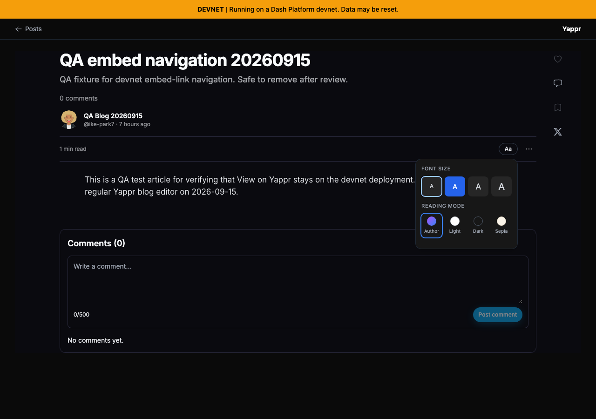
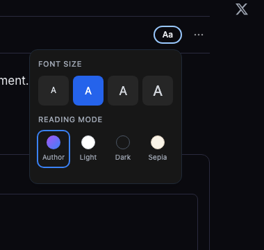
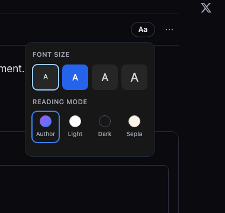
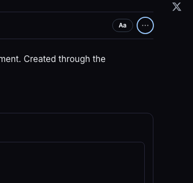

# QA96 — keyboard access to reading preferences

Focus Aa and press Enter: the popover opened while focus stayed on Aa. Tab then closed it and moved to More actions, skipping its options. The fix restores Radix's normal initial focus into the first option; opening still leaves the selected preference unchanged.

Base **cf0efbc10b8757137063113ebbd2061e8b87d8f7**, final signed head **f4a2ac06c421327560f8d6a3ed685e8e1ba6f966**. Separate production builds, fresh guest Chromium, same actual article `5cY37VaxiKxBnprHfXG11Nx37eDv6Jb8RHYDMCmWWi8G`, blog `BkqjYQ95Mm2vNGEaoKbE473jodp7ZPFQr1Mj3jmqw6wA`, slug `qa-embed-navigation-20260915`. No product writes; local reading preferences disposable.

| Same keyboard sequence | Before — exact base | After — full head |
|---|---|---|
|Aa → Enter, full reader context |  |  |
|Aa → Enter, focused view |  |  |
|Then one Tab, focused view |  |  |

The focused views are unaltered browser screenshots using matching x850/y270/380×360 clips from the1280×900 viewport. The blue outline shows focus: before it stays on Aa then More actions; after it moves into the font options.

Validation: targeted lint, full TypeScript, committed devnet production build; independent actual-diff approval. Normal keyboard activation of all four sizes and all four modes, Reset to defaults, Escape/reopen, pointer outside dismissal, and320/390px keyboard/popover fit all passed. Source removes only the autofocus-prevention handler. All six final originals inspected before publication; detailed state/assertions in `results.json` and capture script. Source review did not claim independent browser execution; these actual browser results are the implementer's validation.
