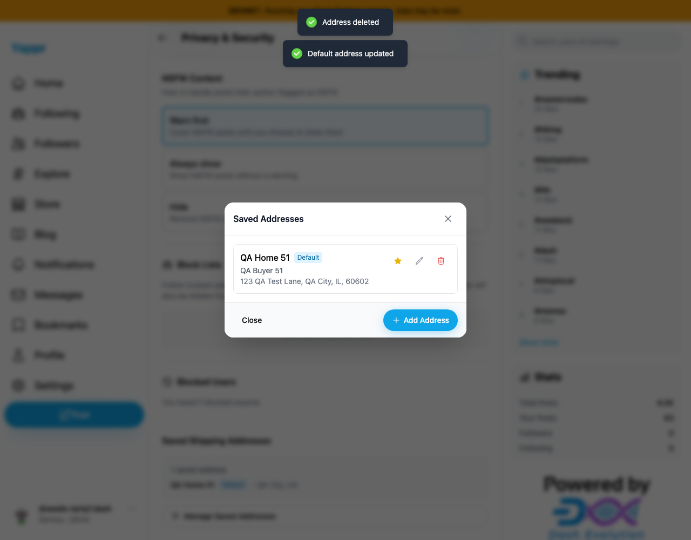
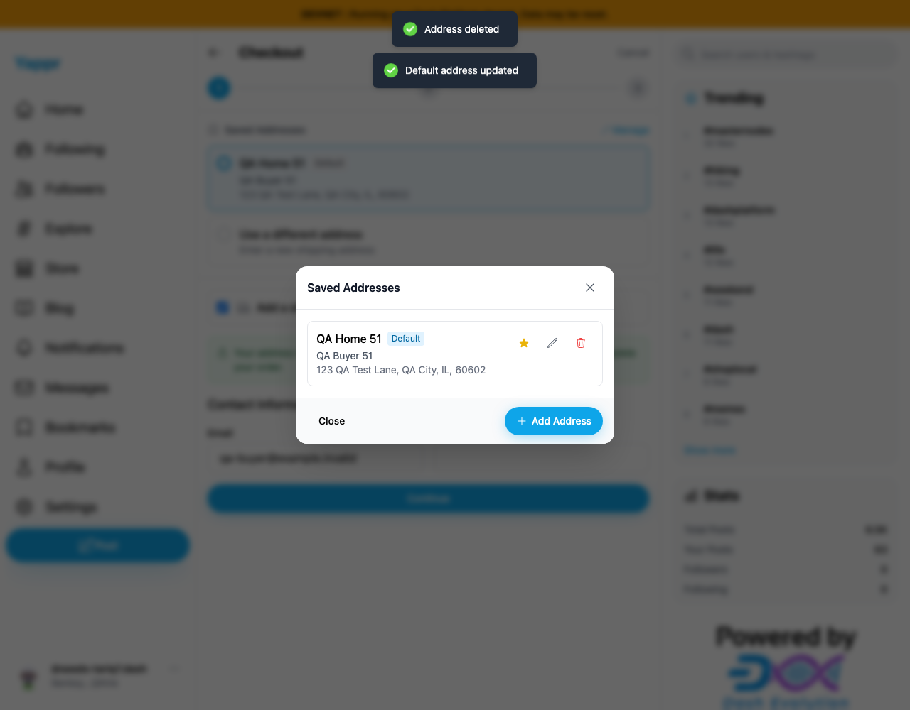
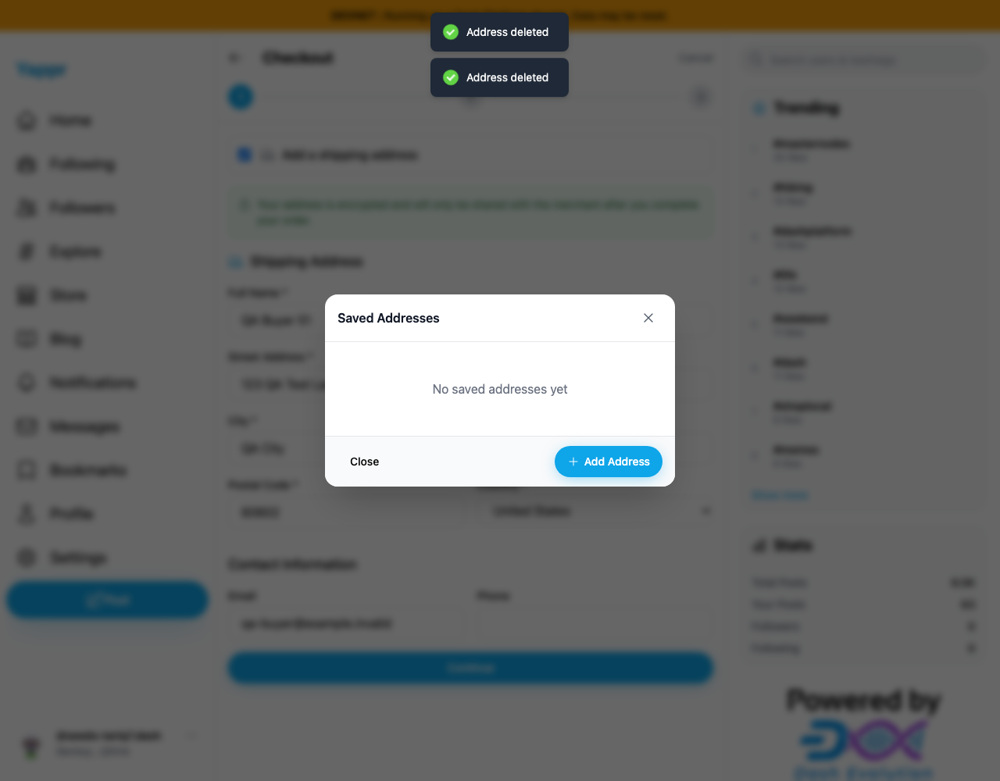

# Keep saved address defaults visible after deletion

Baseline `4105c5d1c914f5d0838619da93c3b8d28b4a780e`; separate production devnet builds, identical static-export adapter, 1280×1000 viewport. Dedicated persona51 auth session restored as a fixture. No secret inputs are captured. All final included screenshots inspected at original resolution. Full head `afd913348775e345c9d1968556ad73d999413775` (build ID `afd91334`).

Create a second QA address, mark it Default, then delete it. The service already promotes the first remaining address in the encrypted saved payload, but settings and checkout previously removed the deleted row without promoting the remaining row in React state.

| Before: remaining Home has no Default badge | After: remaining Home is visibly Default |
|---|---|
|  |  |

[Original two-address precondition](before/before-delete.png). Baseline fresh reload already shows the correct default, isolating this as UI state synchronization.

The head also passes deletion of a nondefault address and fresh persistence. Checkout has the same correction:

Final fresh Settings and independent SDK decryption confirmed zero saved addresses after cleanup. Temporary checkout cart was cleared. No additional order or payment was submitted in this comparison. Full devnet build, zero-warning lint and independent review passed. Clean application to staging `eb895be71a7207c73fb9329ac9d9bb7b398f53da` verified.
