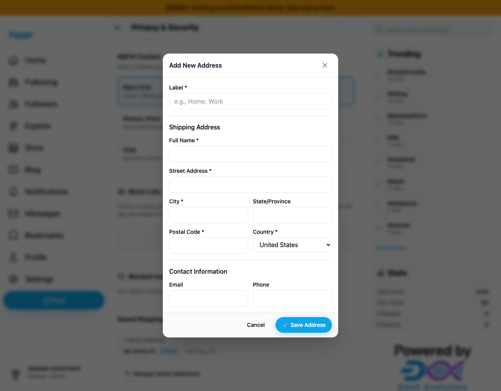
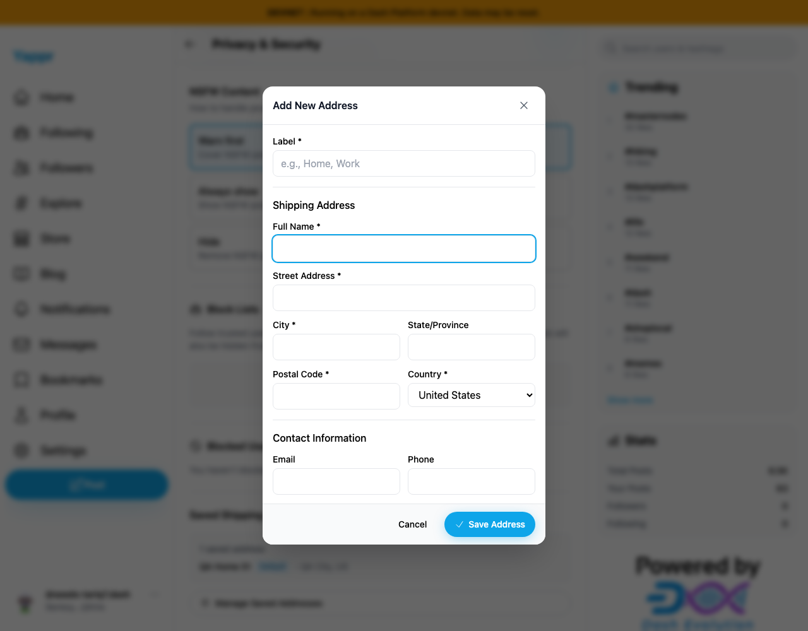

# Associate saved-address inputs with visible labels

Baseline `4105c5d1c914f5d0838619da93c3b8d28b4a780e`; separate production devnet builds, identical static-export adapter, 1280×1000 viewport. Dedicated persona51 auth session restored as a fixture. No secret inputs are captured. All final included screenshots inspected at original resolution. Full head `4369bc2a16826d28c1bc6554034fa420a29e8c4d` (build ID `4369bc2a`).

Open Add New Address and click the visible Full Name label. Before it leaves focus on the dialog; after it focuses the text input, shown by the blue focus ring. The form previously had zero associated label/control pairs. All nine now have unique IDs from useId and explicit htmlFor associations.

| Before clicking Full Name | After the same label click |
|---|---|
|  |  |

Capture records verify all nine associations, actual focus, and named Email/Country control operations. Screenshots establish the visible label-click behavior; DOM evidence establishes accessible names. No address was saved in these captures. Full devnet build, zero-warning lint and independent review passed. Clean application to staging `eb895be71a7207c73fb9329ac9d9bb7b398f53da` verified.
