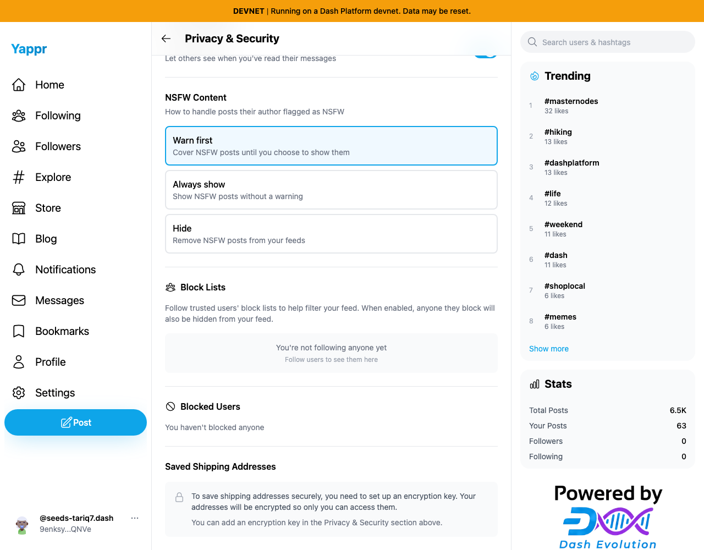
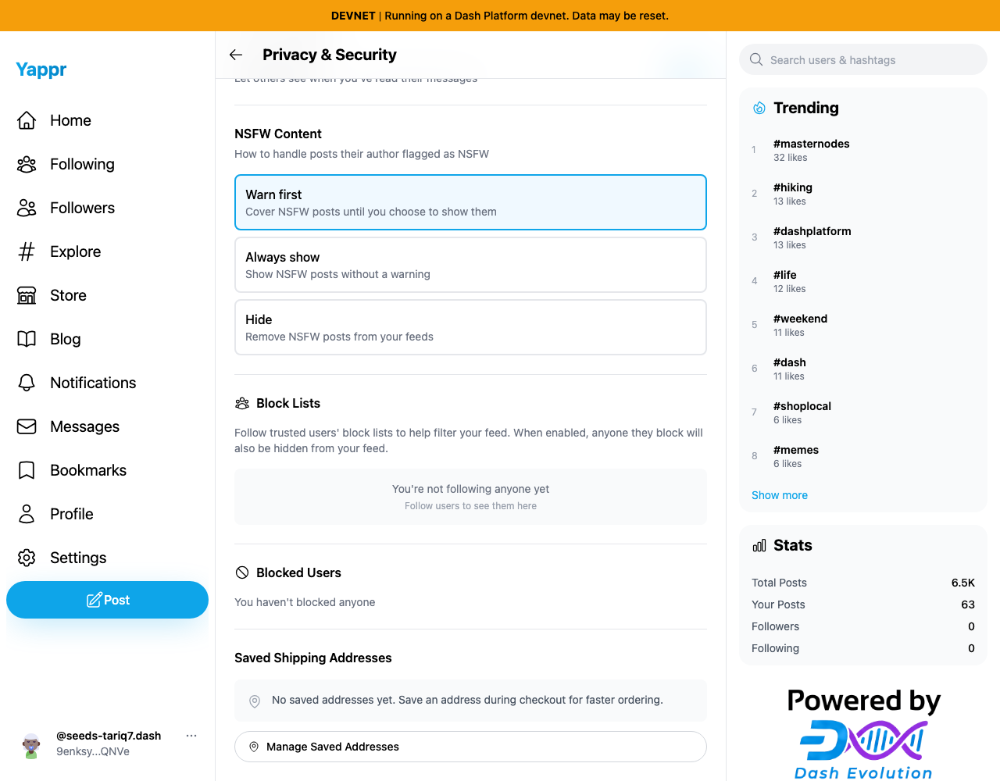
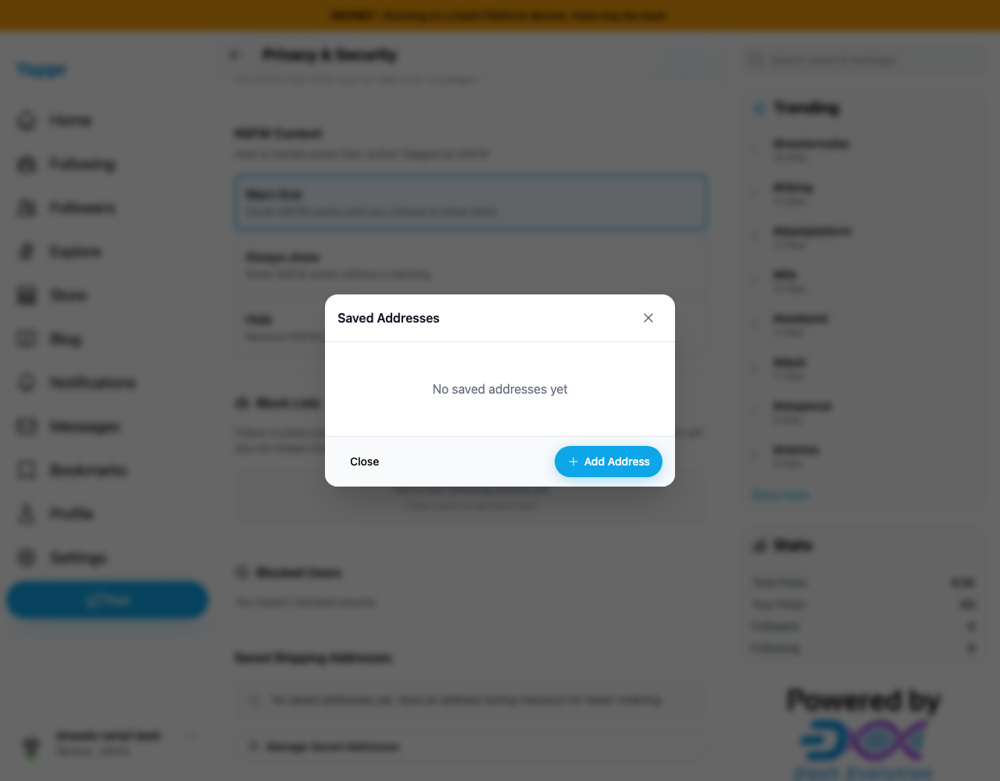

# Refresh saved addresses after encryption key setup

Baseline `4105c5d1c914f5d0838619da93c3b8d28b4a780e`; separate production devnet builds, identical static-export adapter, 1280×1000 viewport. Dedicated persona51 auth session restored as a fixture. No secret inputs are captured. All final included screenshots inspected at original resolution. Full head `d566e38956925576e439957f3817b19e10182662` (build ID `d566e389`).

Open Privacy & Security with no locally restored encryption key. Use **Enter Key → Save Key** with the valid existing identity key, then inspect Saved Shipping Addresses without refreshing or navigating away. Before, it still says a key must be set up. After, Manage Saved Addresses is immediately available.

| Before: same page remains blocked | After: address management is ready |
|---|---|
|  |  |

The final capture uses the empty saved-address payload after QA cleanup. Earlier functional execution also opened and decrypted the existing QA Home address without reload. Captures use the real encryption-key entry UI; no address, identity-key or vault creation write occurs in the comparison. Success callbacks cover both existing-key entry and adding an encryption key; adding a new identity key was source-reviewed rather than repeated for visual capture.

Full devnet build, zero-warning lint, independent review and same-page browser checks passed. The change applies cleanly to staging `eb895be71a7207c73fb9329ac9d9bb7b398f53da`; screenshots intentionally use the audited live baseline above.
