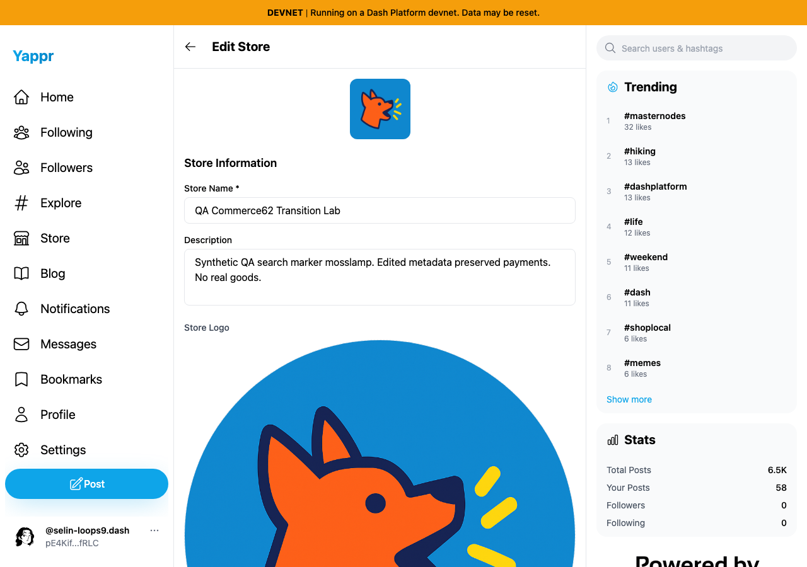
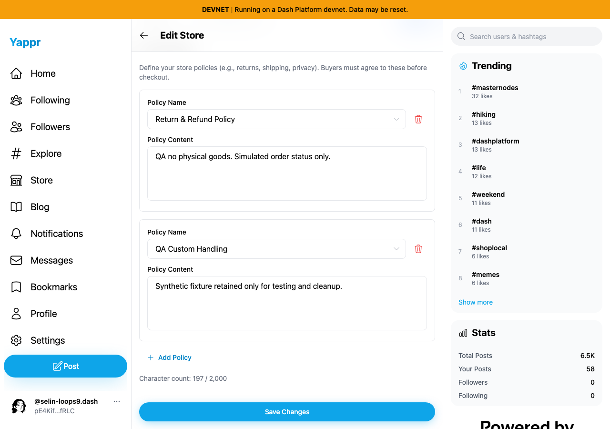
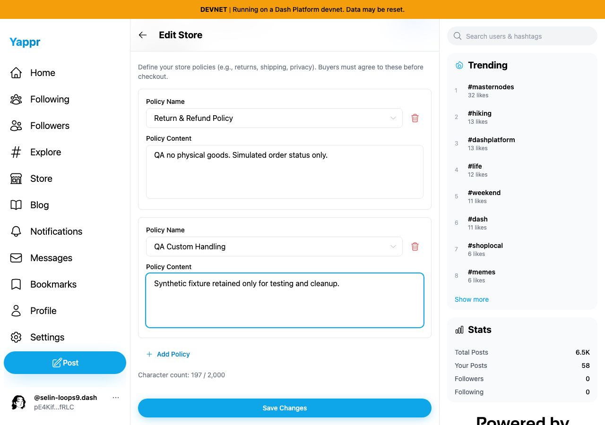

# Store metadata and policy labels (QA92)

Clicking visible Store Name/Description/Location/Default Currency and policy Name/Content labels leaves focus on the page. The currency select has no accessible name; other fields rely on placeholders. Connect each label to its control with unique React IDs, including repeated policy rows.

Exact before: `cf0efbc10b8757137063113ebbd2061e8b87d8f7`. Exact full head: `1941770bd5e371bda760db3ca4b26c712489d1e2`. Independently built production devnet exports, identical unmodified Python static adapter, Chromium 1280×900/light theme. Shared actual synthetic merchant62 store `CP3dEXrdMEbbiFNHakoRkC86DonfVftuzUyaY4ngrnQb`; authentication uses a scoped seeded session, not login evidence. No saves during capture. All four images were opened and inspected at original resolution.

| Before — exact base, click Store Name label | After — full head, same click |
|---|---|
|  |  |

| Before — click second Policy Content label | After — same row and click |
|---|---|
|  |  |

Eight real browser label-click checks fail to focus on base and succeed on head. All eight head controls expose the exact visible label as their accessible name. Adding a third unsaved policy and removing the first retains unique IDs and correct current-row focus targets. The draft was discarded. A harness initially clicked Policy Content while the preceding Policy Name suggestion menu was still open; corrected normal UI clicks dismiss that menu before testing the next label. This was not a product defect.

Targeted ESLint, full TypeScript check, clean committed production build, and independent four-pass source review passed. No implementation-mirroring unit test added for HTML label associations. `PLAN.md` and structured before/after results describe provenance and procedural checks. No payment, shipment, provider upload, or backend correctness claim is made.
