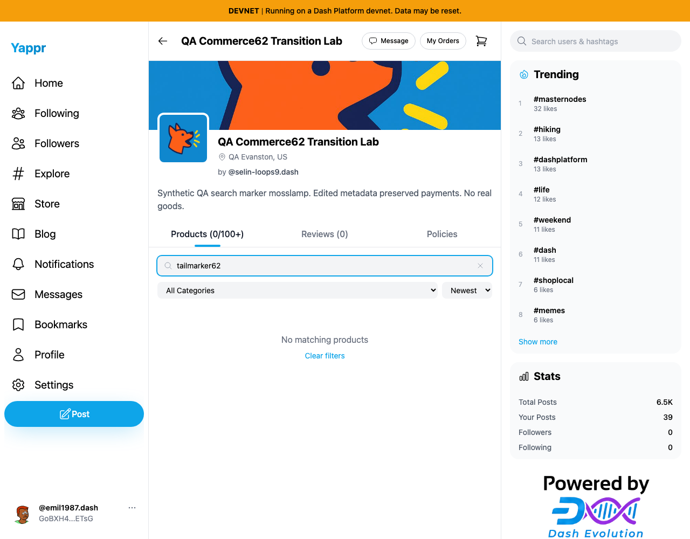
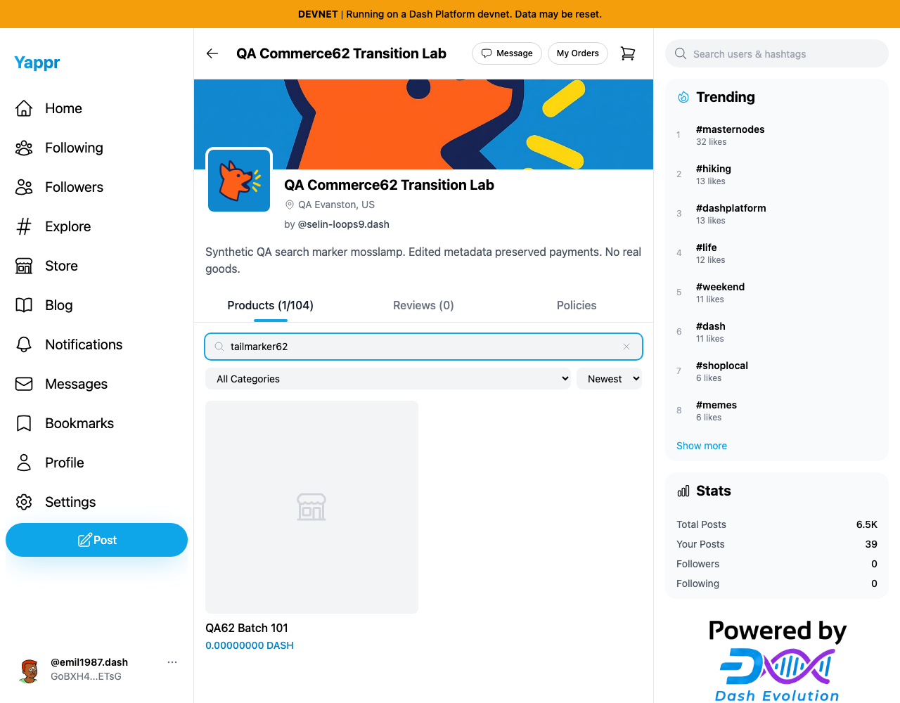
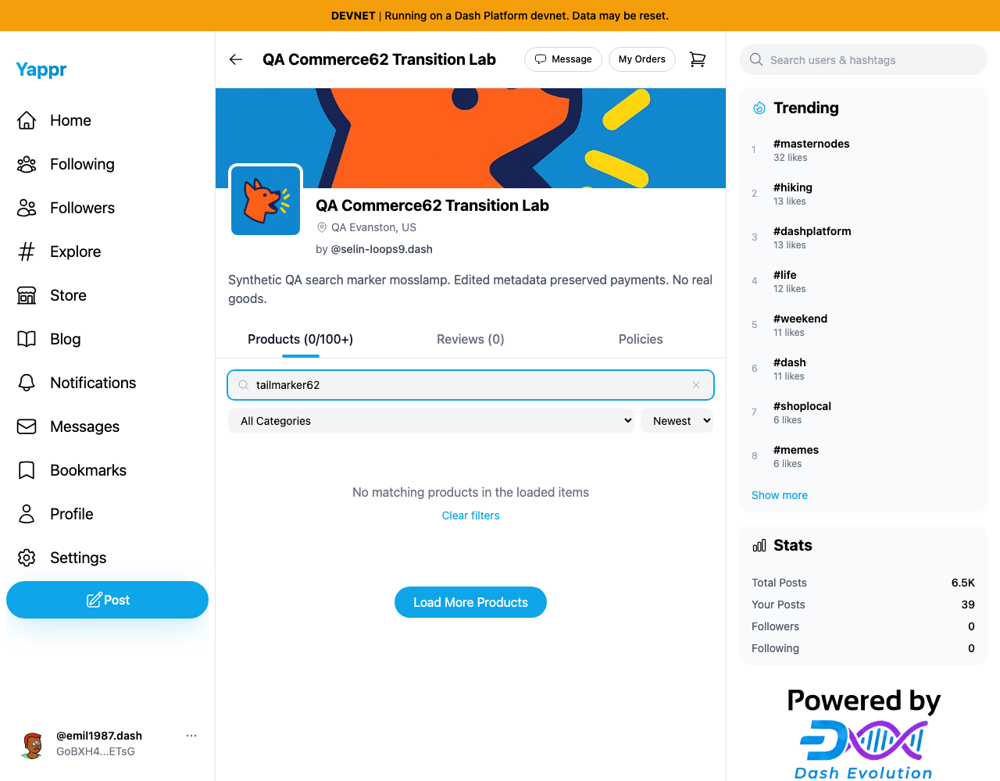

# Filtered storefront continuation

Exact base `cf0efbc10b8757137063113ebbd2061e8b87d8f7`; full signed head `030fd00978742eab3a8500262d1b7c287286b293`. Independent committed production devnet builds, unchanged Python static adapter, Chromium1280×1000, light theme. Same actual104-product store `CP3dEXrdMEbbiFNHakoRkC86DonfVftuzUyaY4ngrnQb` and buyer63. Auth fixture seeding is not login evidence; no writes or payments.

Fresh first100 loaded products do not include the actual last batch product `GA7fPnGmF6fgQfeMLQ3uetFw96GrspYRPMaJaxXGxYXr` (QA62 Batch101), whose tag is tailmarker62. Entering that search removes all visible matches. Base also removes the pagination sentinel and claims no matches. Head keeps pagination reachable and automatically discovers the actual product.

| Before — exact base | After — full head |
|---|---|
|  |  |

Head also distinguishes incomplete search from an exhausted catalog. This separate head-only capture sets Chromium offline after the first100 load, so it shows the qualified text and manual continuation while reads cannot complete:

Healthy tail recovery passed; a truly nonexistent search after all104 loaded shows definitive No matching products, and Clear filters restores all104. During the bounded offline case, existing SDK recovery issue QA77 prevented direct recovery; full page reload after returning online recovered the tail match. This PR does not claim to fix SDK recovery. No response or DOM mocks.

All three final PNGs inspected at original resolution. Targeted ESLint, full TypeScript, clean committed devnet build and independent actual-diff review passed. Original structured results included.
