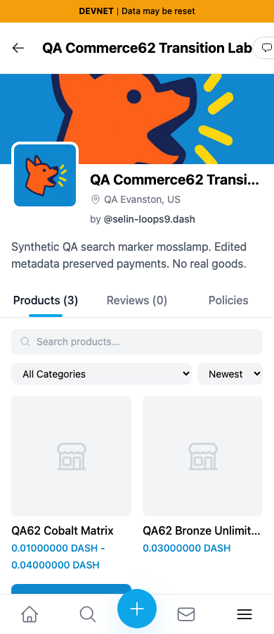
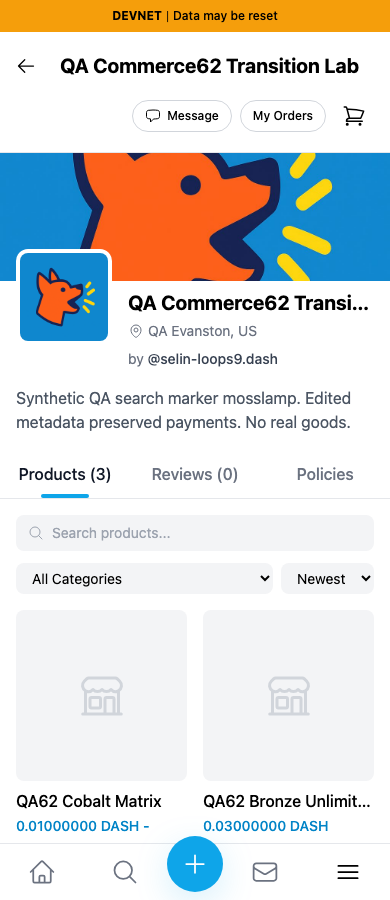
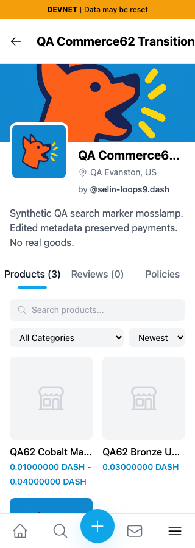
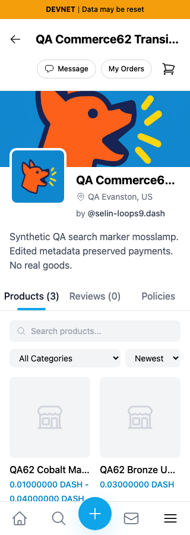
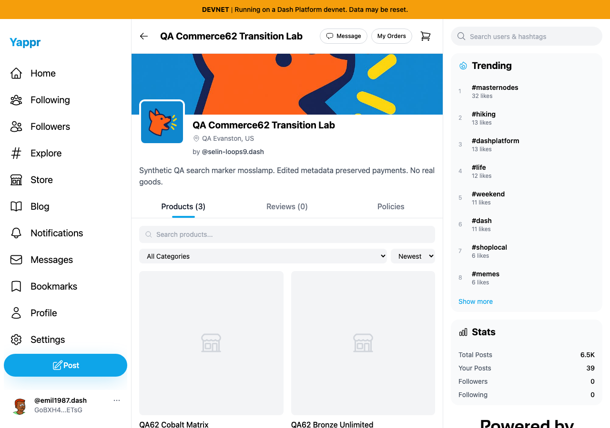
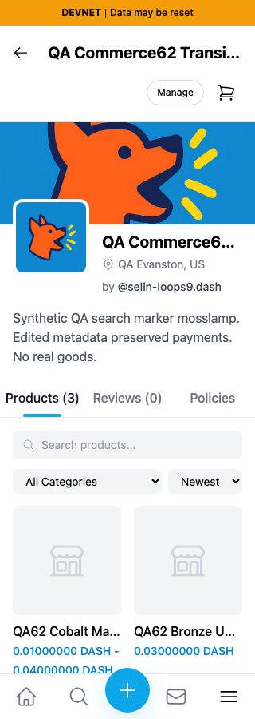

# Storefront mobile header (QA97)

A normal 28-character store title pushes Message, My Orders and cart beyond a mobile viewport. The document becomes 601 pixels wide at both 390 and 320 pixels. Give the title its own mobile row and allow it to shrink on desktop while retaining the action group.

Exact base `cf0efbc10b8757137063113ebbd2061e8b87d8f7`; full signed head `28bf071b3e777c94dfd49a3da55cd99ab22660be`. Independent committed production devnet builds use identical unchanged Python static adapter, Chromium, light theme, same actual store `CP3dEXrdMEbbiFNHakoRkC86DonfVftuzUyaY4ngrnQb`, title “QA Commerce62 Transition Lab,” and buyer63. No writes during comparison. Eight screenshots inspected at original resolution; auth uses scoped QA session fixtures, not login evidence.

| Before — exact base, 390px | After — full head, 390px |
|---|---|
|  |  |

| Before — 320px | After — 320px |
|---|---|
|  |  |

Desktop remains a single header row:

| Before1280 | After1280 |
|---|---|
|  |  |

Owner and guest variants also fit at320:

| Owner | Guest |
|---|---|
|  |  |

Nine exact-head bounds checks passed across buyer/owner/guest at320/390/1280; every header action stays within the viewport. Actual buyer Message, My Orders and cart navigation and owner Manage navigation passed. The initial harness matched both the h1 and repeated store-information h2; narrowing to h1 fixed that locator without source changes. No rendered DOM or response was mocked.

Targeted ESLint, full TypeScript, committed devnet build and independent source review passed. Structured results and PLAN record revision/fixture/control bounds. No payment or shipment involved.
