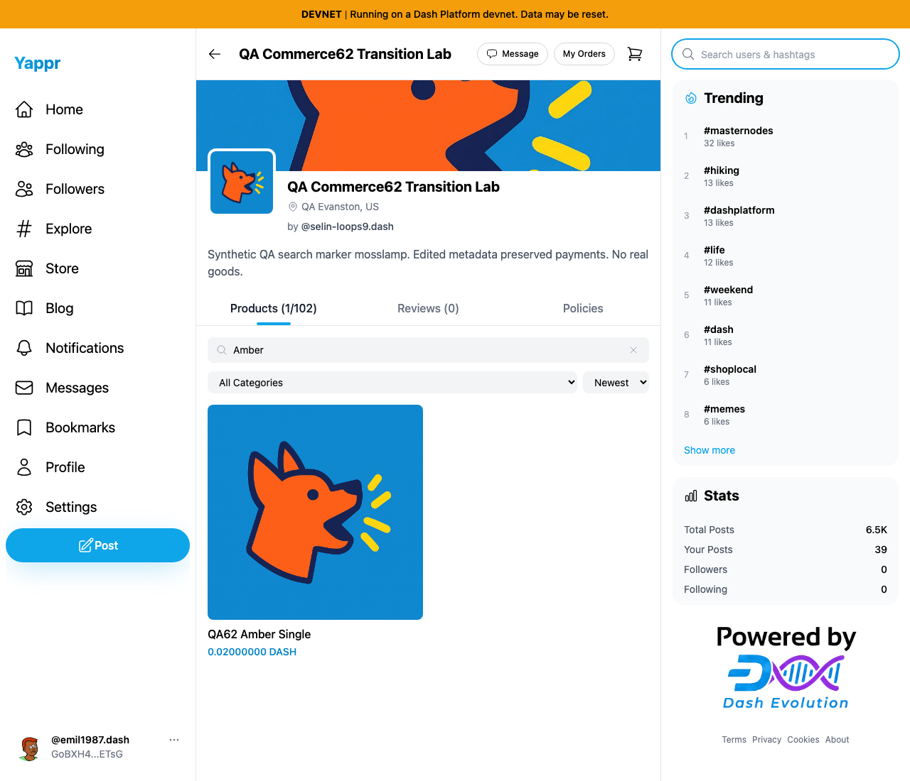
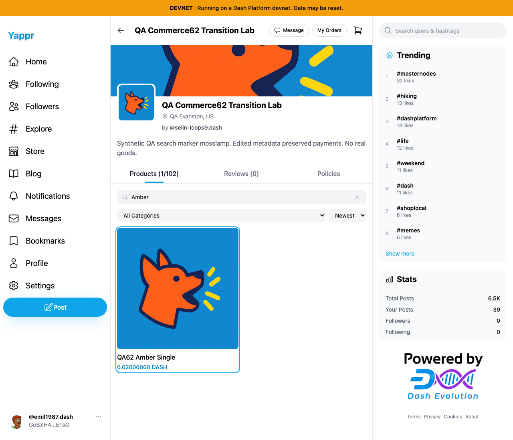

# Storefront product keyboard access

Exact base `cf0efbc10b8757137063113ebbd2061e8b87d8f7`; full signed head `99a0ad96175804fb621afaa2a43b813cbb3fa1eb`. Independent committed production devnet builds, unchanged Python static adapter, Chromium, light theme. Same actual synthetic merchant62 store `CP3dEXrdMEbbiFNHakoRkC86DonfVftuzUyaY4ngrnQb`, product `GWgJbLzxK5XfyNnVNdy7k8fyiBmUziSTSRQ5XtkExCWK`, buyer63. Session seeding is not login evidence. No data write or payment in comparisons.

Tab from Sort:

| Before — exact base | After — full head |
|---|---|
|  |  |

Actual Tab reaches card on head; Enter, Space and mouse open the exact product and Back restores search. Before Tab skips to the right sidebar search. The first draft captures caught entry animation and were rejected; final captures wait until opaque. Both images inspected at original1280×1100.

Targeted ESLint, full TypeScript, clean committed production devnet build and independent actual-diff review passed. JSON records actual procedural results; screenshots demonstrate focus/tooltips, not screen-reader speech.
